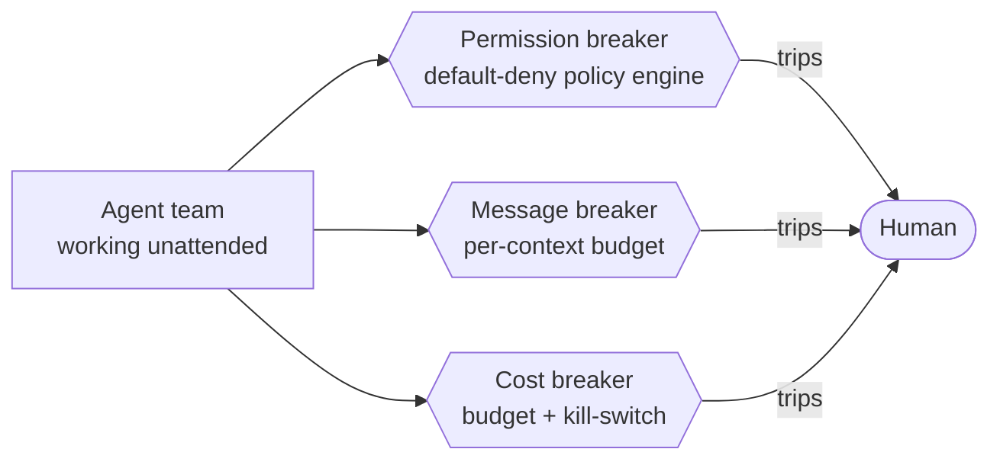
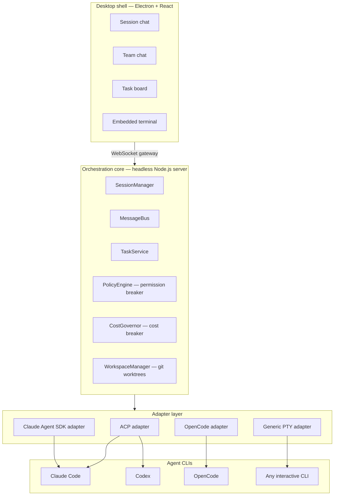
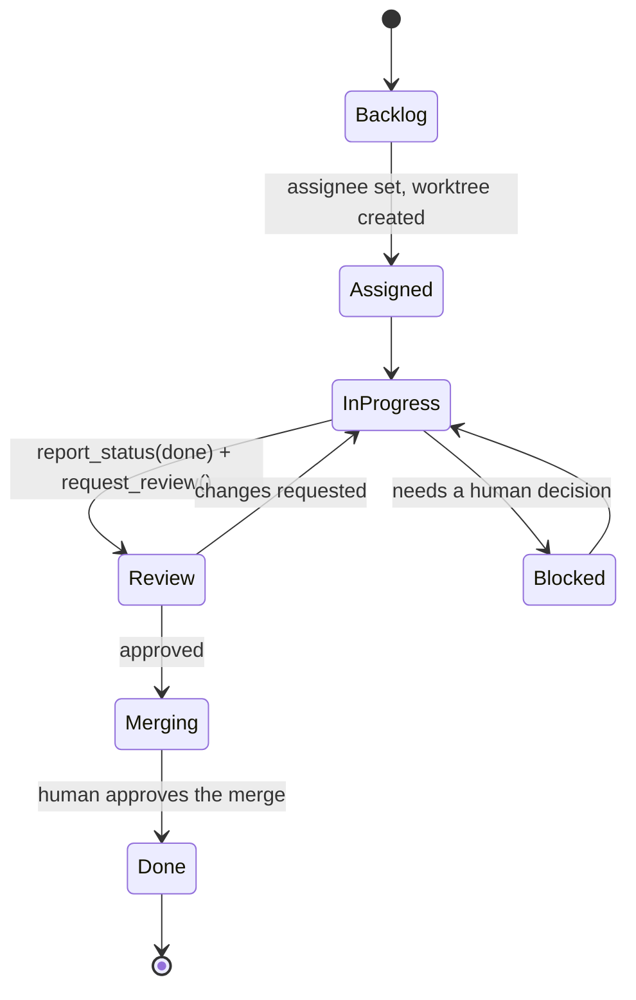

<div align="center">

# Deskmony

**A desktop control room for teams of AI coding agents — built so they can run unattended for hours without going off the rails.**


**[English](README.md)** · **[繁體中文](README.zh-Hant.md)**

</div>

---

Deskmony lets you build a **team** of AI coding agents — not just one chatbot in a sidebar. Give each member a role, a backend (Claude Code, Codex, OpenCode, or any CLI you already have), and a slice of your codebase in its own git worktree. They plan, code, review, and message each other through a built-in team chat, while you watch — or don't have to.

## Why Deskmony

Most "multi-agent coding" tools force a choice: babysit every permission prompt yourself, or flip on full auto-approve and hope nothing goes wrong. Deskmony takes a third path. It's built around one idea — a team of coding agents should be able to run **unattended for hours**, not because nobody is watching, but because the platform itself won't let things go off the rails.

It borrows the desktop-IDE feel of **Claude Code Desktop**, the multi-agent orchestration model of **Paseo**, and the session-based remote control of **OpenChamber** — and adds the piece none of them have on their own: a safety shield that sits underneath every agent, every message, and every dollar spent.

## ✨ Highlights

- 🤝 **Agent teams, not a single chatbot** — define roles (PM / Architect / Coder / Reviewer / QA), each bound to a different agent backend and model.
- 💬 **Agents talk to each other** — a built-in `team-bus` MCP server gives every agent `send_message`, `broadcast`, `request_review`, and `report_status`; humans watch from a live team-chat view and can jump in any time.
- 🖥️ **A real desktop IDE, not a text box** — streaming markdown chat, inline diffs, an embedded terminal, todo-list tracking, image tool output, and interactive question prompts.
- 🗂️ **Git-worktree isolation** — every task gets its own worktree so agents work in parallel without stepping on each other; merging back to the trunk always takes a human click.
- 🔌 **Several agent backends, one interface** — Claude Code and Codex over ACP, OpenCode over HTTP/SSE, and a raw PTY fallback for anything else.
- 🛡️ **Built to run unattended** — three independent circuit breakers (permissions, messages, cost) so a team can work for hours without a human staring at every step.
- 🌐 **Not locked to the desktop** — the core is a headless server; connect from a browser or a phone over a token-authenticated WebSocket.
- 🌍 **Localized** — English, Traditional Chinese, Japanese, and Spanish out of the box.

## 🛡️ The unattended safety shield

This is the actual thesis of the project: letting agents run unattended isn't about trusting them more, it's about **circuit breakers that don't care how much you trust the agent**.



| Breaker | Stops | How |
|---|---|---|
| **Permission** | An agent doing something destructive or out of scope — deleting files, `git push --force`, reading `~/.ssh`, calling out to an unlisted host | A **default-deny** policy engine. A narrow, per-tool/per-argument allowlist can be *learned* through normal use, but a fixed hard-deny list is never eligible for auto-approval — not even in "auto mode" |
| **Message** | Two or more agents stuck in a reply-loop, or a message storm burning through context | Every conversation context carries its own message/hop budget; blowing through it trips the breaker and escalates to the team lead or a human |
| **Cost** | A long unattended run quietly burning through your token budget overnight | Usage metering per task, a hard per-task budget, and a daily kill-switch that pauses the whole team |

All three are enforced the same way for remote clients: a phone or browser connected over the network can *watch*, send prompts, and approve or deny permission requests — but it can never turn the shield off, flip a session to full auto-approve, or edit the allowlist. Only a local, present operator can do that.

The full reasoning — including what's still open, like sandboxing the raw-PTY fallback tier — lives in [`docs/DECISIONS.md`](docs/DECISIONS.md).

## 🏗️ Architecture

Three tiers: a React/Electron **desktop shell**, a headless **orchestration core** that owns all state and business logic, and a thin **adapter layer** that maps every supported agent backend onto one common interface. The desktop shell is deliberately just one client of the core — the same WebSocket gateway is designed to be opened from a browser or a phone, too.



See [`docs/ARCHITECTURE.md`](docs/ARCHITECTURE.md) for the full component map and data model.

### One interface, several agent backends

Every backend implements the same `AgentAdapter` interface (spawn, send prompt, stream structured events, interrupt, dispose), so the rest of the platform — permissions, the message bus, the task board — never needs to know which CLI it's actually talking to.

| Adapter | How it connects | Backends today | Capability tier |
|---|---|---|---|
| `ClaudeAgentSdkAdapter` | Claude Agent SDK, embedded in-process | Claude Code | Deepest: hooks, subagents, fine-grained permission events, live model switching |
| `AcpAdapter` | [Agent Client Protocol](https://agentclientprotocol.com) over stdio JSON-RPC | Claude Code, Codex | One adapter covers multiple backends |
| `OpenCodeAdapter` | OpenCode's own HTTP + SSE server | OpenCode | Native server, works remotely too |
| `GenericPtyAdapter` | Raw `node-pty` passthrough | Any interactive CLI (Aider, …) | Fallback tier — no structured permission events, so it always runs read-only with no unattended autonomy until a real execution sandbox ships |

## 📋 How a task flows

Every task is scoped to its own git worktree the moment it's assigned, so agents never collide on the same working copy.



No agent can mark its own task `Done` — `report_status`/`request_review` can push a task to `Review` or `Merging`, but the actual `git merge` only ever runs through a human clicking "approve" on the task board.

## 🚀 Getting started

### Prerequisites

- **Node.js ≥ 20**
- **pnpm 10** (the repo pins `pnpm@10.13.1` — run `corepack enable` and pnpm will pick it up automatically)
- Windows, for the packaged installer today; the core and adapters are plain Node/TypeScript, so a build path for other platforms is mostly a packaging exercise, not a code one
- At least one agent backend to actually talk to: log into the Claude Code CLI, install Codex or OpenCode, or point a profile at any other interactive CLI through the PTY adapter — Deskmony orchestrates agents, it doesn't ship its own model access

### Install

```bash
git clone https://github.com/xing-101729/deskmony.git
cd deskmony
pnpm install
```

### Run in development

**Option A — core, Vite, and Electron in three terminals** (easiest to watch logs on both sides):

```bash
pnpm dev:core       # headless core — WebSocket gateway on :4317
pnpm dev:desktop    # Vite dev server for the desktop UI
pnpm dev:electron   # Electron shell, connects to the running Vite dev server
```

**Option B — just Electron** (the main process spawns core for you):

```bash
pnpm dev:electron
```

### Build a Windows installer

```bash
pnpm package        # NSIS installer
pnpm package:dir    # unpacked build, for quick local testing
```

### Run core headless, no desktop shell

```bash
pnpm start:core
```

Then open `http://127.0.0.1:4317/` in a browser — core serves the same UI as a static page over the same port it uses for the WebSocket gateway, so a browser or phone can drive it without installing anything.

## 🧱 Tech stack

| Layer | Choice |
|---|---|
| Language | TypeScript (strict), across every package |
| Desktop shell | Electron 33 |
| UI | React 18 + Zustand + Tailwind CSS + Vite |
| Terminal | xterm.js + node-pty |
| Chat rendering | react-markdown + remark-gfm + a custom diff-hunk viewer |
| i18n | i18next / react-i18next — en, zh-Hant, ja, es |
| Orchestration core | Node.js (headless), WebSocket gateway (`ws`) |
| Database | SQLite via better-sqlite3 + Drizzle ORM |
| Agent protocols | Agent Client Protocol (ACP), Claude Agent SDK, OpenCode HTTP/SSE, raw PTY |
| Monorepo | pnpm workspaces |

## 📁 Project layout

```
Deskmony/
├─ apps/
│  ├─ desktop/     # Electron + React desktop shell
│  └─ core/        # headless orchestration server
├─ packages/
│  ├─ adapters/    # AgentAdapter implementations (ACP, SDK, OpenCode, PTY)
│  ├─ db/          # SQLite schema + Drizzle client
│  └─ shared/      # shared types, gateway protocol, zod schemas
├─ scripts/        # e2e harness, fake agents, packaging helpers
└─ docs/           # architecture, decisions, layered design docs, dev log
```

## 📚 Documentation

| Doc | What's in it |
|---|---|
| [`docs/DECISIONS.md`](docs/DECISIONS.md) | The authoritative design-decision record — the *why* behind the safety shield, and the design trade-offs everything else follows |
| [`docs/ARCHITECTURE.md`](docs/ARCHITECTURE.md) | System architecture, component map, sequence/state diagrams, data model |
| [`docs/LAYER-3-hld/`](docs/LAYER-3-hld/) → [`docs/LAYER-4-detail-design/`](docs/LAYER-4-detail-design/) | High-level → detail design docs for every safety-shield subsystem (policy engine, cost governor, crash recovery, session sub-agents, …) |
| [`docs/DEVLOG.md`](docs/DEVLOG.md) | The round-by-round build log — what shipped, what broke, what got corrected along the way |

## 🗺️ Status

The core platform is built and end-to-end tested (`scripts/e2e-gateway.mjs`, 140+ deterministic checks): team & profile management, cross-agent messaging, the desktop IDE (chat, diff viewer, terminal, team chat, task board), git-worktree isolation, and browser/remote access with token auth.

On top of that, the full safety shield is implemented: the permission breaker (default-deny policy engine with a hard-deny list), the message breaker (per-context budgets), and the cost breaker (usage metering, per-task budgets, a daily kill-switch) — plus crash recovery, desktop/webhook notifications, a machine-verifiable "done" gate, and session sub-agents (agents that can spawn and message their own children).

Still open, by design:
- An execution sandbox for the raw-PTY fallback tier — until then, PTY-adapter agents run read-only, on purpose.
- An LLM lead/orchestrator that proposes task breakdowns automatically — decomposition is manual today.
- The fine-grained remote-capability matrix that keeps remote clients structurally unable to weaken the shield — token auth and safe bind-address defaults ship today; the rest is still being hardened.

---

<div align="center">

**[English](README.md)** · **[繁體中文](README.zh-Hant.md)**

</div>
