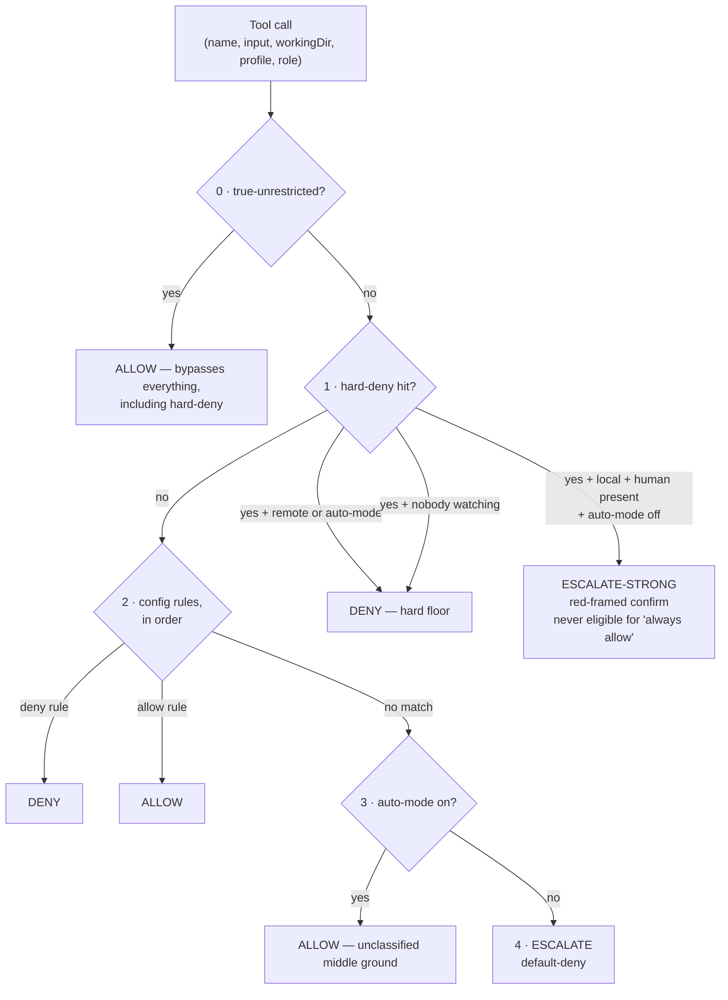
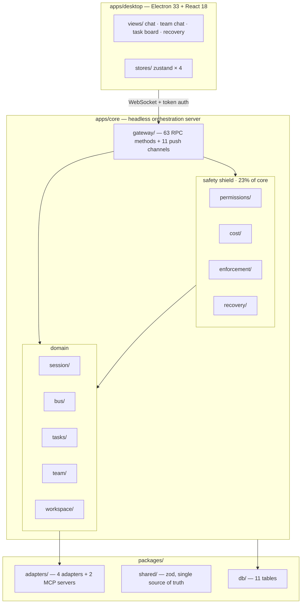
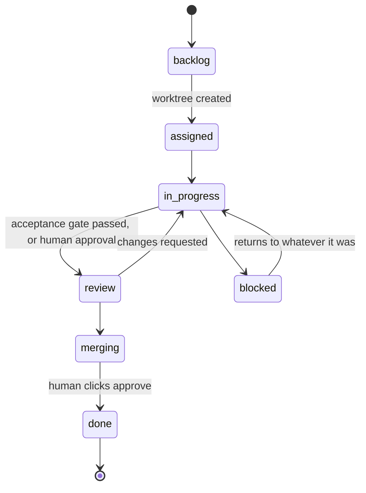

<div align="center">

# Deskmony

**A desktop control room for teams of AI coding agents — built so they can run unattended for hours without going off the rails.**


**[English](README.md)** · **[繁體中文](README.zh-Hant.md)**

</div>

---

Deskmony lets you run a **team** of AI coding agents — not one chatbot in a sidebar. Each member gets a role, a backend (Claude Code, Codex, OpenCode, or any CLI you already have), and its own git worktree. They plan, code, review, and message each other through a built-in team bus, while you watch — or don't have to.

## Why Deskmony

Most multi-agent coding tools give you two options: approve every permission prompt yourself, or switch on full auto-approve and hope. Deskmony takes a third path.

The thesis is simple: **letting agents run unattended isn't about trusting them more — it's about circuit breakers that don't care how much you trust them.** Three independent breakers sit underneath every agent, every message, and every dollar spent. Any one of them can halt a runaway on its own, and none of them can be switched off from a remote client.

That isn't a marketing line. The four directories that exist purely to serve the safety shield — `permissions/`, `cost/`, `enforcement/`, `recovery/` — are **2,268 lines, 23% of the orchestration core**, before counting the decision plumbing inside the session manager and message bus.

## ✨ Highlights

- 🛡️ **Three independent circuit breakers** — permissions, messages, and cost. Default-deny throughout, with a hard-deny list that no auto-mode can bypass — the one deliberate exception is an explicit, typed-confirmation "true-unrestricted" tier, covered below.
- 🤝 **Agent teams, not a single chatbot** — roles (PM / Architect / Coder / Reviewer / QA), each bound to a different backend and model.
- 💬 **Agents message each other** — a built-in `team-bus` MCP server gives every agent `send_message`, `broadcast`, `request_review`, `report_status`, and `list_teammates`. Humans watch the live team chat and can interject at any time.
- 🌱 **Agents can spawn sub-agents** — a second `subagent` MCP server lets a session delegate to children and collect their results. Spawning is deliberately *not* auto-approved.
- 🖥️ **A real desktop IDE** — streaming markdown, inline diffs, an embedded terminal, todo tracking, image tool output, and interactive question prompts.
- 🗂️ **Git-worktree isolation** — every task gets its own worktree; merging back to the trunk always takes a human click.
- 🔌 **Four adapters, one interface** — embedded Claude Agent SDK, ACP, OpenCode HTTP/SSE, and a raw PTY fallback for anything else.
- 🔄 **Crash recovery that doesn't guess** — orphaned sessions are reconciled on startup and triaged by a human. Nothing auto-resumes, by design.
- 🌐 **Remote-capable, with a clear line on what stays local** — connect from a browser or phone over token auth; remote now shares session control and policy edits with local (2026-08-25), but never profile management, network binding, or budget caps.
- 🌍 **Localized** — English, Traditional Chinese, Japanese, Spanish.

## 🛡️ The safety shield

### Breaker 1 — Permissions

Every tool call an agent makes runs this ladder. The order is fixed and cannot be reconfigured:



**Four hard-deny categories, not overridable by config:** writes or deletes outside the worktree · reading secret paths (`~/.ssh`, `~/.aws`, `~/.deskmony`, `**/.env*`, `**/id_rsa*`, `**/credentials`) · dangerous git (`push --force`, deleting remote branches, `branch -D`) · network calls to non-allowlisted hosts.

A few properties worth stating plainly:

- **YOLO mode differs from auto mode in exactly one way**: it additionally skips config `deny` rules. **Neither skips hard-deny.** YOLO also expires after 30 minutes.
- **Anything the engine can't classify escalates.** Never allows. That's the last line of `decide()`.
- **Timeout semantics depend on who's around.** Someone watching → a pending request times out into a deny. Nobody watching → **no timer at all**; the session sits in `waiting` until a human answers. Treating "no reply" as "denied" would throw away an entire night's work. The cost breaker is what stops that from hanging forever.
- **"Always allow" has three rules**: write the narrowest possible rule (`commandEquals` / `pathUnder`); write it to both the config file and memory so behaviour is identical before and after a restart; and hard-deny escalations are **never** eligible — the core strips `rememberRule` even if a client sends one.
- **One explicit, audited exception can cross the hard-deny floor**: a session-scoped "true-unrestricted" tier, layered on top of YOLO, gated behind a typed confirmation phrase, available locally *and* remotely since 2026-08-25 (see [`DECISIONS.md` §G](docs/DECISIONS.md)). It's the only path through `decide()` that skips hard-deny — it only arms per session, only once that session is already in YOLO, and only after a human types the confirmation phrase; enabling it fires a desktop notification and an audit-log entry.

### Breaker 2 — Messages

Two gates in front of the existing delivery strategy:

1. **The context id is derived by the core, never supplied by the agent.** It comes from whichever task the sender is currently bound to; if it can't be derived, the message is refused. Letting the thing being rate-limited declare its own bucket means it can reset the budget by renaming it.
2. **Per-context message budget.** Blow through it and the breaker trips, refusing further `send_message` / `broadcast` / `request_review` for that context.

**It severs lateral chatter, not vertical progress** — `report_status` and `list_teammates` keep working, so a tripped context can still report where it got to.

### Breaker 3 — Cost

| Component | Signal | Trips on | What it halts |
|---|---|---|---|
| **TurnLimiter** | `tool-call` events + wall clock — **no usage data needed** | 30 min or 200 tool calls in one turn | Interrupts immediately |
| **CostGovernor** (task budget) | `usage` events | Task spend over budget | Blocks further prompts; doesn't cut a finished turn |
| **CostGovernor** (daily kill-switch) | `usage` events | Team spend for the day | Interrupts every session |
| **WaitingWatchdog** T1 | Time in `waiting` | 6 hours | Notifies only — no halt |
| **WaitingWatchdog** T2 | Time in `waiting` | 72 hours | Disposes the process; task stays blocked, worktree preserved |

> **TurnLimiter matters most.** Measured against real Claude Code over ACP: the bridge reports **zero** usage — not a config problem, a structural gap. For that backend, every usage-based budget is inert, and the turn hard-cap is the only protection left.

### The remote boundary

`isLocal` is decided by the core from the connection's own address and is **never taken from the client's word for it**. Tunnelled connections (Tailscale, WireGuard) are not loopback and count as **remote** — a tunnel secures transport, it doesn't put an operator in the room.

Remote clients **can** watch, send prompts, approve or deny escalations, switch a session to auto/YOLO, edit the policy allowlist, and attach an "always allow" rule to an approval — parity with local as of 2026-08-25, a deliberate, documented reversal of the earlier remote restriction (see [`DECISIONS.md` §G](docs/DECISIONS.md)). Remote can even arm the "true-unrestricted" tier described above, through the same typed-confirmation gate as local. What remote still **cannot** do: manage agent profiles, change the network bind address, or raise budget caps. That's enforced at the dispatch layer, not by hiding buttons in the UI — a raw request bypassing the UI gets rejected the same way.

Binding to a non-loopback address without `DESKMONY_AUTH_TOKEN` **refuses to start**. The token is deliberately not a config-file field, so editing config can't widen exposure.

## 🏗️ Architecture

Three tiers. The desktop shell is deliberately just one client of the core — the same WebSocket gateway serves a browser or a phone.



**Dependency rule:** `packages/*` must never import `apps/*`. Cross-boundary needs are declared as interfaces in `packages/shared` (`TeamBusPort`, `SubagentPort`, `ClientPresencePort`, `SessionControlPort`) and injected at construction time.

### Adapters

Four adapters are registered. Every one implements the same interface, so permissions, the message bus, and the task board never need to know which CLI is on the other end.

| Adapter | Transport | Backends today | Capability tier |
|---|---|---|---|
| `ClaudeAgentSdkAdapter` | Claude Agent SDK, embedded in-process | Claude Code | Deepest — hooks, sub-agents, fine-grained permission events, live model and effort switching |
| `AcpAdapter` | [Agent Client Protocol](https://agentclientprotocol.com) over stdio JSON-RPC | Gemini CLI, Codex (via the `@agentclientprotocol/codex-acp` bridge package — the official `codex` binary doesn't speak ACP natively), other ACP-native agents | Structured events |
| `OpenCodeAdapter` | OpenCode's HTTP + SSE server | OpenCode | Native server, works remotely |
| `GenericPtyAdapter` | Raw `node-pty` passthrough | Claude Code CLI, Aider, any interactive CLI | **Fallback — no permission events** |

The user-facing layer is a **provider catalog** of seven entries, each guaranteed at the type level to map onto one of those four: `claude-agent-sdk`, `claude-cli` → PTY, `gemini` → ACP, `opencode`, `codex` → ACP (via the `@agentclientprotocol/codex-acp` bridge, not a locally installed codex CLI), `aider` → PTY, `custom-pty`.

**The PTY tier's missing permission events are a security boundary, not a to-do item.** It's raw stdin passthrough — structurally unmanageable by the policy engine. Until a real execution sandbox exists, PTY agents stay read-only with no unattended autonomy. Deskmony deliberately does **not** try to intercept shell commands: `bash -c`, `$()`, and base64 defeat that in seconds, and shipping it would be security theater.

**Capability reporting is honest about what it doesn't know.** Usage and context reporting are tri-state — `supported` / `unsupported` / `unknown` — because whether a connection reports usage is decided by the agent that got spawned, not the adapter. The same `AcpAdapter` forwards usage faithfully for one agent and never sees a single event from another. A static boolean would mean lying to the UI in one direction or the other, so consumers must converge on the truth from what a session actually observed.

## 📋 Task flow, and the three human gates



1. **Machine acceptance gate** — a task can carry acceptance commands (test / build / typecheck). `report_status(done)` has to pass them before the task can reach review.
2. **Human review gate** — with no acceptance conditions, or after repeated failures, the task holds at `in-progress` flagged `awaitingHumanReview` until a person approves.
3. **Human merge** — `task.merge` is the **only** path in the entire system that runs `git merge`, and it only fires from the task board button.

**No agent has any tool that can mark its own work done.** `report_status` and `request_review` can push a task as far as `review` or `merging`; the aliases that map to `done` are explicitly rejected at the apply step.

Merges refuse to leave half-finished state: a conflicting `git merge --no-ff` collects the conflicted paths, runs `git merge --abort` to restore the base, and throws — the task stays at `merging`. The trunk branch is detected dynamically (`origin/HEAD`, then local `main`, then `master`, then a hard error). Never guessed, never hardcoded.

## 🔄 Crash recovery

The expensive thing — an agent's accumulated reasoning and context — lives in the backend process, not the database. Replaying an event log rebuilds your ledger, not the agent's mind. So recovery here is **reconciliation plus human triage**, not replay.

On startup, before the gateway accepts a single connection, sessions that weren't closed cleanly are marked `interrupted` and written to the audit log. Then a human decides, per session: **continue** (only where the backend genuinely persists sessions to disk — re-verified by the core, never trusted from a stale client snapshot), **take over** (restart from a summary), **rerun** (refuses to run on a dirty worktree), or **abandon** (worktree and task both preserved — reclaiming isn't discarding).

Dirty worktrees get a forced decision first: keep the work on a WIP branch, or discard it — and discarding demands an explicit second confirmation. **Nothing is ever silently thrown away, and nothing auto-resumes.**

## 🚀 Getting started

### Prerequisites

- **Node.js ≥ 20** and **pnpm 10** (the repo pins `pnpm@10.13.1` — `corepack enable` picks it up)
- Windows for the packaged installer today. Core and adapters are plain Node/TypeScript, so other platforms are mostly a packaging exercise.
- At least one agent backend: log into the Claude Code CLI, set an `OPENAI_API_KEY`/`CODEX_API_KEY` (or use ChatGPT login) for Codex — it runs through a bundled `@agentclientprotocol/codex-acp` bridge, no separate codex CLI install needed — install OpenCode, or point a profile at any interactive CLI through the PTY adapter. **Deskmony orchestrates agents; it does not ship model access.**

### Install

```bash
git clone https://github.com/xing-101729/deskmony.git
cd deskmony
pnpm install
```

### Run in development

Three terminals, easiest for watching both sides:

```bash
pnpm dev:core       # headless core — WebSocket gateway on :4317
pnpm dev:desktop    # Vite dev server for the UI
pnpm dev:electron   # Electron shell
```

Or just `pnpm dev:electron` — the main process spawns core for you.

### Headless, no desktop shell

```bash
pnpm start:core
```

Then open `http://127.0.0.1:4317/`. The core serves the same UI as a static page over the same port it uses for the WebSocket gateway, so a browser or phone needs nothing installed. The static page needs no auth to download; the WebSocket behind it still does.

### Build a Windows installer

```bash
pnpm package        # NSIS installer
pnpm package:dir    # unpacked, for quick local testing
```

The packaged core runs on Electron's bundled Node with `better-sqlite3` rebuilt for that ABI, so **end users don't need Node installed**.

## 🧱 Tech stack

| Layer | Choice |
|---|---|
| Language | TypeScript (strict), every package |
| Desktop shell | Electron 33 |
| UI | React 18 + Zustand + Tailwind + Vite |
| Terminal | xterm.js + node-pty |
| Chat rendering | react-markdown + remark-gfm + react-syntax-highlighter + a custom diff-hunk viewer |
| i18n | i18next / react-i18next — en, zh-Hant, ja, es |
| Core | Node.js headless, WebSocket gateway (`ws`) |
| Database | SQLite via better-sqlite3 + Drizzle ORM, 11 tables |
| Validation | zod schemas in `packages/shared` as the single source of truth for both sides |
| Agent protocols | Claude Agent SDK, ACP, OpenCode HTTP/SSE, raw PTY |
| Monorepo | pnpm workspaces |

## 📁 Project layout

```
Deskmony/
├─ apps/
│  ├─ desktop/          # Electron + React shell
│  │  ├─ views/         # chat, team chat, task board, recovery, dialogs
│  │  ├─ stores/        # zustand × 4
│  │  ├─ ui/            # design system
│  │  └─ locales/       # en, zh-Hant, ja, es
│  └─ core/             # headless orchestration server
│     ├─ session/ bus/ tasks/ team/ workspace/     # domain
│     ├─ permissions/ cost/ enforcement/ recovery/ # safety shield
│     ├─ gateway/ http/ config/ detect/ settings/  # plumbing
├─ packages/
│  ├─ adapters/         # 4 adapters + team-bus & subagent MCP servers
│  ├─ db/               # Drizzle schema, idempotent migrations
│  └─ shared/           # types, gateway protocol, zod schemas
├─ scripts/             # 11 e2e suites, fake backends, packaging
└─ docs/                # architecture, decisions, layered design, dev log
```

## 🧪 Testing

**11 end-to-end suites, 451 assertions**, all driving a real headless core over the WebSocket gateway — **never through Electron**. The main suite splits into a *deterministic* group, which is the acceptance gate and must pass 100%, and a *model-behavior* group whose assertions depend on what a real model chose to say that run.

Three fake backends — `fake-acp-agent`, `fake-opencode-server`, `fake-pty-echo` — let the deterministic group run without real models or external CLIs. `package-smoke.mjs` is a packaging regression test that verifies the built executable resolves all its dependencies.

## 📚 Documentation

| Doc | What's in it |
|---|---|
| [`docs/ARCHITECTURE.md`](docs/ARCHITECTURE.md) | **How the system is actually built** — derived from the source tree, every section maps to real files |
| [`docs/DECISIONS.md`](docs/DECISIONS.md) | **Why** — the authoritative design-decision record behind the safety shield |
| [`docs/LAYER-3-hld/`](docs/LAYER-3-hld/) → [`docs/LAYER-4-detail-design/`](docs/LAYER-4-detail-design/) | High-level → detail design per subsystem |
| [`docs/DEVLOG.md`](docs/DEVLOG.md) | The round-by-round build log — what shipped, what broke, what got corrected |

## 🗺️ Status

Built and end-to-end tested: team and profile management, cross-agent messaging, the desktop IDE, git-worktree isolation, browser/remote access with token auth, the full three-breaker safety shield, crash recovery, desktop and webhook notifications, the machine acceptance gate, session sub-agents, a self-service policy allowlist UI, and the true-unrestricted bypass tier.

Open by design, and worth knowing before you rely on it:

- **No execution sandbox for the PTY tier.** Until there is one, PTY agents stay read-only — that's the honest consequence, not an oversight.
- **No LLM lead.** Task decomposition is manual; `TaskService` is fully deterministic.
- **No mid-turn cost cutoff.** The only adapter that emits usage does so as a turn ends, so there is no observable "usage arrived mid-turn" case to build against. Branching on it would be inventing behaviour.
- **Only Claude SDK sessions can *initiate* messages.** ACP, OpenCode, and PTY don't mount the MCP servers yet — though *receiving* injected messages works across every backend.
- **Provider secrets are masked over the wire but stored in plaintext locally**, the same trade-off Paseo makes with its config file.
- **Windows packaging only** so far.

---

<div align="center">

**[English](README.md)** · **[繁體中文](README.zh-Hant.md)**

</div>
