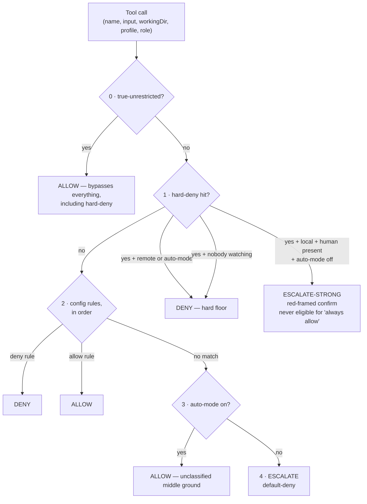
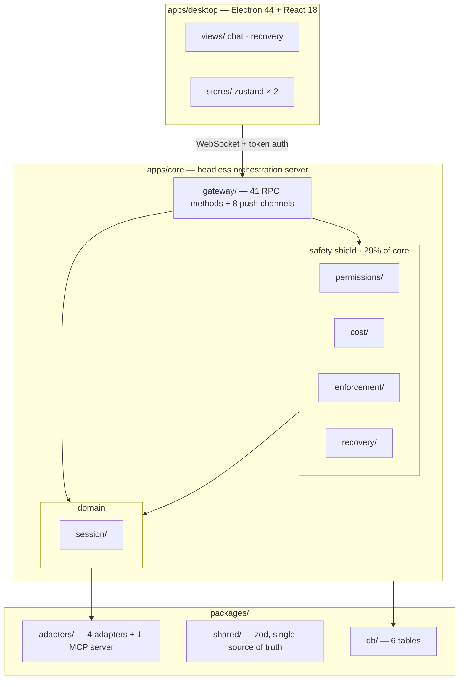

<div align="center">

# Deskmony

**A desktop control room for AI coding agents — built so they can run unattended for hours without going off the rails.**


-0078D6?style=flat-square&logo=windows&logoColor=white)


**[English](README.md)** · **[繁體中文](README.zh-Hant.md)**

</div>

---

Deskmony lets you run AI coding agents — not one chatbot in a sidebar — on a backend of your choice (Claude Code, Codex, OpenCode, or any CLI you already have), with a safety shield underneath so you can watch, or not have to.

> **2026-10-02:** the team / task board / git-worktree-per-task layer was removed to simplify the product (see [`DECISIONS.md` §H](docs/DECISIONS.md)). Sessions can still spawn sub-agents; letting any session message any other session is the next phase and is **not built yet**.

## Why Deskmony

Most multi-agent coding tools give you two options: approve every permission prompt yourself, or switch on full auto-approve and hope. Deskmony takes a third path.

The thesis is simple: **letting agents run unattended isn't about trusting them more — it's about circuit breakers that don't care how much you trust them.** Three independent breakers sit underneath every agent, every message, and every dollar spent. Any one of them can halt a runaway on its own. The cost breaker cannot be switched off remotely; the permission breaker reached remote/local parity on 2026-08-25 — a deliberate, documented reversal (see [`DECISIONS.md` §G](docs/DECISIONS.md)), spelled out under "What remote can and cannot do" below. (The message breaker is currently unbuilt: it went away with the message bus on 2026-10-02 and returns with the session-to-session messaging phase — see Breaker 2.)

The four directories that exist purely to serve the safety shield — `permissions/`, `cost/`, `enforcement/`, `recovery/` — are **1,322 lines of actual code (blanks and comments excluded), 29% of the orchestration core** (4,566 lines; it was 1,545 lines / 22% before the team and task layer was removed on 2026-10-02), before counting the decision plumbing inside the session manager.

(That figure deliberately excludes comments. This codebase is roughly 30% comments; counting them gives a nicer-looking number — but a comment has never blocked a tool call, so citing it as evidence of safety investment would be dishonest. **Line counts can't prove safety anyway**: what actually should convince you is the decision flow below, and the per-category assertions in `scripts/e2e-hard-deny.mjs`.)

## ✨ Highlights

- 🛡️ **Independent circuit breakers** — permissions and cost today (the message breaker returns with session-to-session messaging). Default-deny throughout, with a hard-deny list that no auto-mode can bypass — the one deliberate exception is an explicit, typed-confirmation "true-unrestricted" tier, covered below.
- 🌱 **Agents can spawn sub-agents** — a `subagent` MCP server lets a session delegate to children and collect their results. The tools are mounted on the `claude-agent-sdk` and `acp` transports (the latter covers Codex, Gemini, and OpenCode via `opencode acp`). Spawning is deliberately *not* auto-approved.
- 🖥️ **A real desktop IDE** — streaming markdown, inline diffs, an embedded terminal, todo tracking, image tool output, and interactive question prompts.
- 🔌 **Four adapters, one interface** — embedded Claude Agent SDK, ACP, OpenCode HTTP/SSE, and a raw PTY fallback for anything else.
- 🔄 **Crash recovery that doesn't guess** — orphaned sessions are reconciled on startup and triaged by a human. Nothing auto-resumes, by design.
- 🌐 **Remote-capable, with a clear line on what stays local** — connect from a browser or phone over token auth; remote now shares session control and policy edits with local (2026-08-25), but never profile management or network binding.
- 🌍 **Localized** — English, Traditional Chinese, Japanese, Spanish.

## 🛡️ The safety shield

### Breaker 1 — Permissions

Every tool call an agent makes runs this ladder. The order is fixed and cannot be reconfigured:


```mermaid
flowchart TB
    Req["Tool call<br/>(name, input, workingDir, profile, role)"] --> TU{"0 · true-unrestricted?"}
    TU -- yes --> Allow0["ALLOW — bypasses everything,<br/>including hard-deny"]
    TU -- no --> HD{"1 · hard-deny hit?"}
    HD -- no --> Rules{"2 · config rules,<br/>in order"}
    HD -- "yes + remote or auto-mode" --> Deny["DENY — hard floor"]
    HD -- "yes + local + human present<br/>+ auto-mode off" --> Strong["ESCALATE-STRONG<br/>red-framed confirm<br/>never eligible for 'always allow'"]
    HD -- "yes + nobody watching" --> Deny
    Rules -- "deny rule" --> Deny2["DENY"]
    Rules -- "allow rule" --> Allow["ALLOW"]
    Rules -- "no match" --> Auto{"3 · auto-mode on?"}
    Auto -- yes --> Allow2["ALLOW — unclassified middle ground"]
    Auto -- no --> Esc["4 · ESCALATE<br/>default-deny"]
```

**Four hard-deny categories, not overridable by config:** writes or deletes outside the session's working directory · reading secret paths (`~/.ssh`, `~/.aws`, `~/.deskmony`, `**/.env*`, `**/id_rsa*`, `**/credentials`) · dangerous git (`push --force`, deleting remote branches, `branch -D`) · network calls to non-allowlisted hosts.

A few properties worth stating plainly:

- **YOLO mode differs from auto mode in exactly one way**: it additionally skips config `deny` rules. **Neither skips hard-deny.** YOLO also expires after 30 minutes.
- **Anything the engine can't classify escalates.** Never allows. That's the last line of `decide()`.
- **Timeout semantics depend on who's around.** Someone watching → a pending request times out into a deny. Nobody watching → **no timer at all**; the session sits in `waiting` until a human answers. Treating "no reply" as "denied" would throw away an entire night's work. The cost breaker is what stops that from hanging forever.
- **"Always allow" has three rules**: write the narrowest possible rule (`commandEquals` / `pathUnder`); write it to both the config file and memory so behaviour is identical before and after a restart; and hard-deny escalations are **never** eligible — the core strips `rememberRule` even if a client sends one.
- **One explicit, audited exception can cross the hard-deny floor**: a session-scoped "true-unrestricted" tier, layered on top of YOLO, gated behind a typed confirmation phrase, available locally *and* remotely since 2026-08-25 (see [`DECISIONS.md` §G](docs/DECISIONS.md)). It's the only path through `decide()` that skips hard-deny — it only arms per session, only once that session is already in YOLO, and only after a human types the confirmation phrase; enabling it fires a desktop notification and an audit-log entry.

### Breaker 2 — Messages (removed 2026-10-02, to be rebuilt)

The original message budget (a core-derived context id plus a per-context message ceiling) lived in the message bus, which was removed together with teams and the task board — see [`DECISIONS.md` §H](docs/DECISIONS.md). The `messageBudget` config key is kept: the next phase rebuilds this breaker as a **per-message-chain budget** (a human prompt starts a chain; agent-to-agent messages inherit the chain of the turn that triggered them; going over the ceiling trips the breaker and notifies a human) on top of that same key. Until then agents have no sideways messaging channel, so there is no message loop to break.

### Breaker 3 — Cost

| Component | Signal | Trips on | What it halts |
|---|---|---|---|
| **TurnLimiter** | `tool-call` events + wall clock — **no usage data needed** | 30 min or 200 tool calls in one turn | Interrupts immediately |
| **CostGovernor** (daily kill-switch) | `usage` events | Spend for the day | Interrupts every session, blocks further prompts |
| **WaitingWatchdog** T1 | Time in `waiting` | 6 hours | Notifies only — no halt |
| **WaitingWatchdog** T2 | Time in `waiting` | 72 hours | Disposes the process; the conversation history is preserved |

> **TurnLimiter matters most.** Measured against real Claude Code over ACP: the bridge reports **zero** usage — not a config problem, a structural gap. For that backend, every usage-based budget is inert, and the turn hard-cap is the only protection left.

### The remote boundary

`isLocal` is decided by the core from the connection's own address and is **never taken from the client's word for it**. Tunnelled connections (Tailscale, WireGuard) are not loopback and count as **remote** — a tunnel secures transport, it doesn't put an operator in the room.

Remote clients **can** watch, send prompts, approve or deny escalations, switch a session to auto/YOLO, edit the policy allowlist, and attach an "always allow" rule to an approval — parity with local as of 2026-08-25, a deliberate, documented reversal of the earlier remote restriction (see [`DECISIONS.md` §G](docs/DECISIONS.md)). Remote can even arm the "true-unrestricted" tier described above, through the same typed-confirmation gate as local. What remote still **cannot** do: manage agent profiles or change the network bind address. That's enforced at the dispatch layer, not by hiding buttons in the UI — a raw request bypassing the UI gets rejected the same way.

Binding to a non-loopback address without `DESKMONY_AUTH_TOKEN` **refuses to start**. The token is deliberately not a config-file field, so editing config can't widen exposure — it comes only from the env var, or (desktop shell only) a value the Settings "remote access" panel keeps encrypted at rest via Electron's `safeStorage`, letting you copy a stable token to hand to a browser or phone.

The WebSocket upgrade also carries a **same-origin check independent of the token** (added 2026-09-04). Browsers are not bound by same-origin policy when opening a `ws://` connection — any web page can reach your local gateway, and its source address genuinely *is* 127.0.0.1, so it is correctly judged "local". With no token set, that makes "visit one malicious page" enough to take over. The rule now: requests with no `Origin` (non-browser clients — phone apps, scripts) pass, browser UIs same-origin with `Host` pass, `file://` and loopback origins pass **only when a token is enabled** (the desktop shell always sets one; a sandboxed iframe can't obtain it), everything else is rejected at the upgrade.

## 🏗️ Architecture

Three tiers. The desktop shell is deliberately just one client of the core — the same WebSocket gateway serves a browser or a phone.


```mermaid
flowchart TB
    subgraph SHELL["apps/desktop — Electron 44 + React 18"]
        direction LR
        Views["views/ chat · recovery"]
        Stores["stores/ zustand × 2"]
    end

    subgraph CORE["apps/core — headless orchestration server"]
        GW["gateway/ — 41 RPC methods + 8 push channels"]
        subgraph DOMAIN["domain"]
            direction LR
            Sess["session/"]
        end
        subgraph SHIELD["safety shield · 29% of core"]
            direction LR
            Perm["permissions/"]
            Cost["cost/"]
            Enf["enforcement/"]
            Rec["recovery/"]
        end
    end

    subgraph PKG["packages/"]
        direction LR
        Adapters["adapters/ — 4 adapters + 1 MCP server"]
        Shared["shared/ — zod, single source of truth"]
        Db["db/ — 6 tables"]
    end

    SHELL -- "WebSocket + token auth" --> GW
    GW --> DOMAIN
    GW --> SHIELD
    SHIELD --> DOMAIN
    DOMAIN --> Adapters
    CORE --> Db
```

**Dependency rule:** `packages/*` must never import `apps/*`. Cross-boundary needs are declared as interfaces in `packages/shared` (`SubagentPort`, `ClientPresencePort`, `SessionControlPort`) and injected at construction time.

### Adapters

Four adapters are registered. Every one implements the same interface, so permissions and the session manager never need to know which CLI is on the other end.

| Adapter | Transport | Backends today | Capability tier |
|---|---|---|---|
| `ClaudeAgentSdkAdapter` | Claude Agent SDK, embedded in-process | Claude Code | Deepest — hooks, sub-agents, fine-grained permission events, live model and effort switching |
| `AcpAdapter` | [Agent Client Protocol](https://agentclientprotocol.com) over stdio JSON-RPC | Gemini CLI, Codex (via the `@agentclientprotocol/codex-acp` bridge package — the official `codex` binary doesn't speak ACP natively), other ACP-native agents | Structured events |
| `OpenCodeAdapter` | OpenCode's HTTP + SSE server | OpenCode | Native server, works remotely |
| `GenericPtyAdapter` | Raw `node-pty` passthrough | Claude Code CLI, Aider, any interactive CLI | **Fallback — no permission events** |

The user-facing layer is a **provider catalog** of eight entries, each guaranteed at the type level to map onto one of those four: `claude-agent-sdk`, `claude-cli` → PTY, `gemini` → ACP, `opencode`, `opencode-acp` → ACP (OpenCode driven through `opencode acp`, which is what gives it the sub-agent tools), `codex` → ACP (via the `@agentclientprotocol/codex-acp` bridge, not a locally installed codex CLI), `aider` → PTY, `custom-pty`.

**The PTY tier's missing permission events are a security boundary, not a to-do item.** It's raw stdin passthrough — structurally unmanageable by the policy engine. Until a real execution sandbox exists, PTY agents stay read-only with no unattended autonomy. Deskmony deliberately does **not** try to intercept shell commands: `bash -c`, `$()`, and base64 defeat that in seconds, and shipping it would be security theater.

**Capability reporting is honest about what it doesn't know.** Usage and context reporting are tri-state — `supported` / `unsupported` / `unknown` — because whether a connection reports usage is decided by the agent that got spawned, not the adapter. The same `AcpAdapter` forwards usage faithfully for one agent and never sees a single event from another. A static boolean would mean lying to the UI in one direction or the other, so consumers must converge on the truth from what a session actually observed.

## 📋 Task flow — removed 2026-10-02

The task board (backlog → assigned → in-progress → review → merging → done), the per-task git worktree, the machine acceptance gate, the human review gate and the human-approved merge were removed together with teams — see [`DECISIONS.md` §H](docs/DECISIONS.md). Existing `tasks` / `workspaces` tables in your SQLite file are left untouched; nothing reads them any more.

## 🔄 Crash recovery

The expensive thing — an agent's accumulated reasoning and context — lives in the backend process, not the database. Replaying an event log rebuilds your ledger, not the agent's mind. So recovery here is **reconciliation plus human triage**, not replay.

On startup, before the gateway accepts a single connection, sessions that weren't closed cleanly are marked `interrupted` and written to the audit log. Then a human decides, per session: **continue** (only where the backend genuinely persists sessions to disk — re-verified by the core, never trusted from a stale client snapshot), **take over** (restart from a summary), or **abandon** (the session is closed but its history is preserved — reclaiming isn't discarding). **Nothing is ever silently thrown away, and nothing auto-resumes.**

## 🚀 Getting started

### Prerequisites

- **Node.js ≥ 20** and **pnpm 10** (the repo pins `pnpm@10.13.1` — `corepack enable` picks it up)
- Windows for the packaged desktop installer. **The core and the CLI also run on Linux** — a `ubuntu-latest` CI job builds them and runs the CLI end-to-end suite on every PR. Be precise about what that proves: the core + CLI path works there, against a fake backend that needs no credentials. It does *not* prove that every adapter drives every real backend on Linux — nobody has tested that yet.
- At least one agent backend: log into the Claude Code CLI, set an `OPENAI_API_KEY`/`CODEX_API_KEY` (or use ChatGPT login) for Codex — it runs through a bundled `@agentclientprotocol/codex-acp` bridge, no separate codex CLI install needed — install OpenCode, or point a profile at any interactive CLI through the PTY adapter. **Deskmony orchestrates agents; it does not ship model access.**

### Install

```bash
git clone https://github.com/xing-101729/deskmony.git
cd deskmony
pnpm install
```

### Run in development

Three terminals, easiest for watching both sides:

```bash
pnpm dev:core       # headless core — WebSocket gateway on :4317
pnpm dev:desktop    # Vite dev server for the UI
pnpm dev:electron   # Electron shell
```

Or just `pnpm dev:electron` — the main process spawns core for you.

### Headless, no desktop shell

```bash
pnpm start:core
```

Then open `http://127.0.0.1:4317/`. The core serves the same UI as a static page over the same port it uses for the WebSocket gateway, so a browser or phone needs nothing installed. The static page needs no auth to download; the WebSocket behind it still does.

### The `deskmony` CLI

The desktop shell was always meant to be *one* client of the core, not the only one. The CLI is the third — same WebSocket gateway, same safety shield. It runs on Linux and in Windows `cmd.exe`.

```bash
deskmony serve                 # run the headless core in the foreground
deskmony                       # interactive REPL (same as `deskmony chat`)
deskmony run "find the TODOs"  # one-shot: stream the answer, then exit
deskmony run - < prompt.txt    # read the prompt from stdin
deskmony session list --json   # NDJSON, for scripts
deskmony doctor                # detect agent backends, check the connection
```

`serve` and the clients are separate on purpose: the core owns a SQLite database, and two cores on one data directory is a real hazard. Start `serve` in one terminal (or leave the desktop app running) and point the others at it with `--url` / `DESKMONY_URL`.

Exit codes are stable enough to branch on: `0` success, `1` runtime error, `2` bad usage, `3` cannot connect or auth failed, `4` a permission request was denied. **`4` matters more than it looks** — a denied turn ends with exactly the same events as a successful one, so a CLI that only watched the event stream would report success for a turn that did nothing. `run` tracks its own denials instead.

Outside a TTY, `run` never invents permission for itself: it denies, names the tool on stderr, and exits `4`. To automate, say so explicitly with `--permission-mode auto-accept-edits`, which maps onto the core's existing `session.setPermissionMode`. There is no silent-approval path.

#### The full-screen view

```bash
deskmony tui
```

`chat` and `run` show you one session. `tui` shows every session, and that difference is the reason it exists: **a permission request raised by a session you are not currently watching is invisible in a line-oriented REPL, and unattended requests never time out.** A second agent can sit blocked for hours while you read the first one's output. The TUI puts a cross-session pending count on screen no matter which session has focus, and `a` walks the queue one request at a time — showing the tool's actual arguments, not just its name, because the name alone ("Write file") tells you nothing you could judge.

Escalations that hit the hard-deny list look different and behave differently: no "always allow", and a typed `yes` rather than a keystroke.

It needs **Node 22** (an Ink requirement, checked at startup with a clear message on older versions) and a real terminal. `deskmony chat` remains the right tool when piping, scripting, or working on a terminal that cannot do full-screen — the TUI is additive, not a replacement.

**Getting `deskmony` onto your PATH.** pnpm does not put a workspace package's `bin` in the root `node_modules/.bin`, so installing dependencies is not enough:

```bash
node apps/cli/dist/bin.js --help   # always works, no install
cd apps/cli && npm link            # puts `deskmony` on PATH
```

`npm link` is the recommended route: npm's global prefix (`%APPDATA%\npm` on Windows, `~/.npm-global` or similar elsewhere) is already on PATH in a standard Node install, so no environment changes are needed. Verified by running `deskmony --help` in a real Windows console — Chinese output and column alignment render correctly. `pnpm link --global` also exists, but it needs `pnpm setup` first on machines where `PNPM_HOME` is unset, and that rewrites your PATH.

### Build a Windows installer

```bash
pnpm package        # NSIS installer
pnpm package:dir    # unpacked, for quick local testing
```

The packaged core runs on Electron's bundled Node with `better-sqlite3` rebuilt for that ABI, so **end users don't need Node installed**.

## 🧱 Tech stack

| Layer | Choice |
|---|---|
| Language | TypeScript (strict), every package |
| Desktop shell | Electron 44 |
| UI | React 18 + Zustand + Tailwind + Vite |
| Terminal | xterm.js + node-pty |
| Chat rendering | react-markdown + remark-gfm + react-syntax-highlighter + a custom diff-hunk viewer |
| i18n | i18next / react-i18next — en, zh-Hant, ja, es |
| Core | Node.js headless, WebSocket gateway (`ws`) |
| Database | SQLite via better-sqlite3 + Drizzle ORM, 6 tables |
| Validation | zod schemas in `packages/shared` as the single source of truth for both sides |
| Agent protocols | Claude Agent SDK, ACP, OpenCode HTTP/SSE, raw PTY |
| Monorepo | pnpm workspaces |

## 📁 Project layout

```
Deskmony/
├─ apps/
│  ├─ desktop/          # Electron + React shell
│  │  ├─ views/         # chat, recovery, dialogs
│  │  ├─ stores/        # zustand × 2
│  │  ├─ ui/            # design system (incl. ErrorBoundary)
│  │  └─ locales/       # en, zh-Hant, ja, es
│  └─ core/             # headless orchestration server
│     ├─ session/                                  # domain
│     ├─ permissions/ cost/ enforcement/ recovery/ # safety shield
│     ├─ gateway/ http/ config/ detect/ settings/  # plumbing
├─ packages/
│  ├─ adapters/         # 4 adapters + the subagent MCP server
│  ├─ db/               # Drizzle schema, idempotent migrations
│  └─ shared/           # types, gateway protocol, zod schemas
├─ scripts/             # 14 e2e suites, the runner, the build-freshness guard, fake backends, packaging
├─ .github/workflows/   # CI (typecheck → build → the 13 deterministic suites)
└─ docs/                # architecture, decisions, layered design, dev log
```

## 🧪 Testing

```bash
pnpm test          # typecheck + build + the 13 deterministic suites (~7 min)
pnpm test:e2e      # just the suites (requires a current pnpm build)
pnpm test:e2e:live # e2e-gateway.mjs — needs real Claude Code credentials, spends real tokens
```

**Fourteen end-to-end suites.** Thirteen of them are *deterministic* — they drive a real headless core over the WebSocket gateway (**never through Electron**) against three fake backends (`fake-acp-agent`, `fake-opencode-server`, `fake-pty-echo`), so they reproduce identically on a machine with no credentials at all. Those thirteen are what `pnpm test` and CI run: **180 assertions, all of which must pass.** (The count dropped from 221 on 2026-10-02 when the team, task and message-bus suites were removed along with the features.)

`e2e-gateway.mjs` is excluded from the default run on purpose. It needs real Claude Code credentials, costs real money, and carries a *model-behavior* group whose assertions depend on what a model chose to say that run — the file marks those as known-flaky. A CI that goes red because a model rephrased itself is a CI people learn to ignore.

Two guards keep the suite honest:

- **Build freshness.** The suites exercise `dist/`, not `src/`. Before this was checked, forgetting `pnpm build` meant the tests would quietly validate *stale* code and pass — worse than failing. `scripts/lib/require-fresh-build.mjs` now blocks that.
- **`e2e-hard-deny.mjs`** covers all four hard-deny categories. Three of them (secret paths, dangerous git, network allowlist) had zero coverage until 2026-09-04 — and they are precisely the ones built from string and regex matching, i.e. the ones that can actually be wrong. It also pins the *known* bypasses (base64, variable splicing) as deliberate assertions, so if that behaviour ever changes the docs get updated with it.

`package-smoke.mjs` is a packaging regression test: it launches the built executable with system Node.js stripped from `PATH` and verifies the core subprocess still starts and authenticates.
## 📚 Documentation

| Doc | What's in it |
|---|---|
| [`docs/ARCHITECTURE.md`](docs/ARCHITECTURE.md) | **How the system is actually built** — derived from the source tree, every section maps to real files |
| [`docs/DECISIONS.md`](docs/DECISIONS.md) | **Why** — the authoritative design-decision record behind the safety shield |
| [`docs/LAYER-3-hld/`](docs/LAYER-3-hld/) → [`docs/LAYER-4-detail-design/`](docs/LAYER-4-detail-design/) | High-level → detail design per subsystem |
| [`docs/DEVLOG.md`](docs/DEVLOG.md) | The round-by-round build log — what shipped, what broke, what got corrected |
| [`SECURITY.md`](SECURITY.md) | **Threat model and reporting** — what counts as a vulnerability, what is knowingly accepted (no PTY sandbox, hard-deny is pattern matching, the true-unrestricted tier…), and how to harden your own install |
| [`LICENSE`](LICENSE) | MIT |

## 🗺️ Status

Built, and guarded by end-to-end tests that CI runs on every push and PR (see Testing above): profile management, the desktop IDE, browser/remote access with token auth, the permission and cost breakers of the safety shield, crash recovery, desktop and webhook notifications, session sub-agents, a self-service policy allowlist UI, and the true-unrestricted bypass tier. Removed on 2026-10-02 (see [`DECISIONS.md` §H](docs/DECISIONS.md)): teams, the task board, git-worktree-per-task isolation, the acceptance gate, and the message bus with its breaker.

Open by design, and worth knowing before you rely on it:

- **No execution sandbox for the PTY tier.** Until there is one, PTY agents stay read-only — that's the honest consequence, not an oversight.
- **No mid-turn cost cutoff.** The only adapter that emits usage does so as a turn ends, so there is no observable "usage arrived mid-turn" case to build against. Branching on it would be inventing behaviour.
- **Only Claude SDK and ACP sessions can spawn sub-agents.** ACP agents (Codex, Gemini CLI) reach the `subagent` MCP server through a bridge subprocess holding a scoped, per-session token; the `opencode` provider (bespoke HTTP/SSE) and PTY don't mount it — but the `opencode-acp` provider does, since it runs OpenCode through ACP. *Receiving* injected prompts works across every backend.
- **Provider secrets are masked over the wire but stored in plaintext locally**, the same trade-off Paseo makes with its config file.
- **Orphaned agent processes are only reclaimed on the next start.** If core is SIGKILLed, force-quit, or loses power, the graceful shutdown path never runs and spawned agents — plus the MCP grandchildren they started — keep running. Their pids are now recorded in `<dataDir>/child-pids.json` and reaped at the next start after matching the process creation time (**no match, no kill** — pid reuse must never cost you an unrelated process). Reclaiming them at the moment of death needs a Windows Job Object, which means a native dependency; this project deliberately does not require an MSVC toolchain on the packaging machine.
- **SQLite migrations can only add columns.** `packages/db/src/client.ts` is a dozen hand-rolled "check `PRAGMA table_info` → `ALTER TABLE ADD COLUMN`" functions with no version table. Type changes, renames, drops and new constraints are all out of reach; a destructive migration would need a real migration mechanism first.
- **The chat view keeps at most 2,000 items in memory.** Older ones are dropped (the full history stays in SQLite and reloads when you switch away and back). This bounds what a runaway loop can do to renderer memory; ordinary conversations never come close.
- **Windows packaging only** so far.

---

<div align="center">

**[English](README.md)** · **[繁體中文](README.zh-Hant.md)**

</div>
