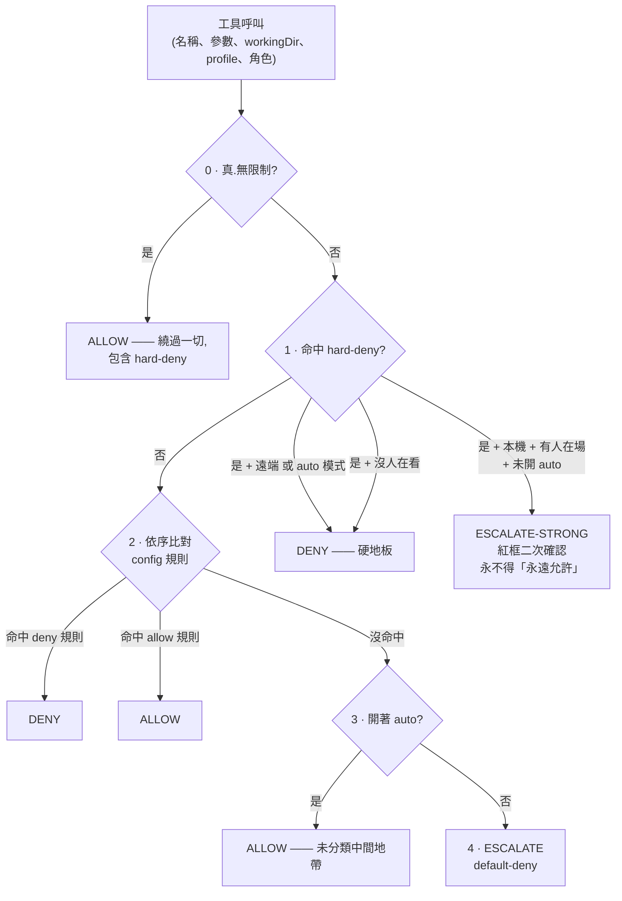
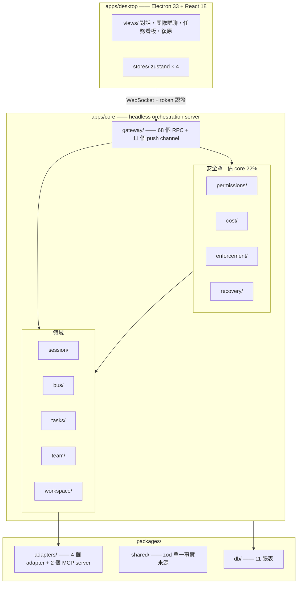
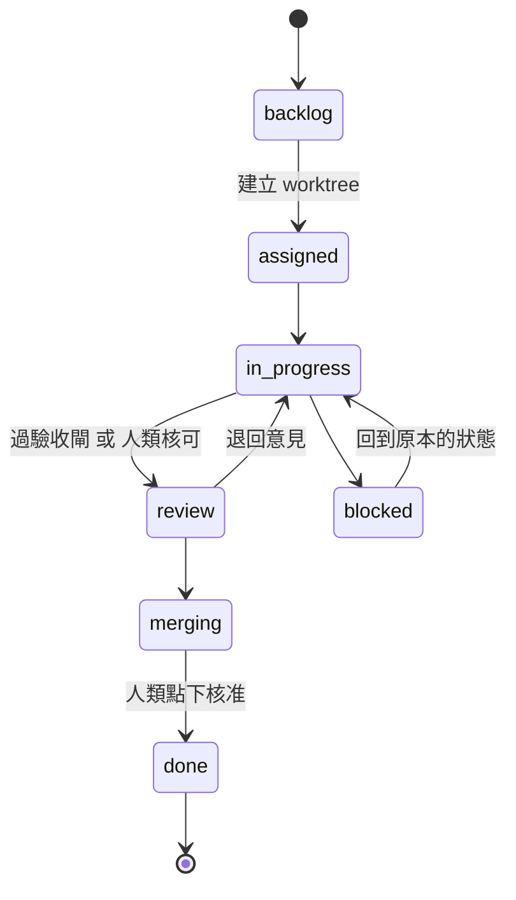

<div align="center">

# Deskmony

**一個給 AI coding agent 團隊用的桌面控制室 —— 讓一整隊 agent 能無人值守跑上好幾個小時,也不會失控。**


**[English](README.md)** ・ **[繁體中文](README.zh-Hant.md)**

</div>

---

Deskmony 讓你跑一整支 AI coding agent **團隊**,而不是側邊欄裡的一個聊天機器人。每個成員有自己的角色、自己的後端(Claude Code、Codex、OpenCode,或任何你手邊已有的 CLI)、自己的 git worktree。他們自己規劃、寫程式、互相審查,透過內建的訊息匯流排彼此傳訊 —— 你可以在旁邊看,也可以不用一直盯著。

## 為什麼是 Deskmony

多數多 agent coding 工具只給你兩個選項:每個權限彈窗都自己盯著核准,或者整組開自動核可、然後賭。Deskmony 走第三條路。

論點很簡單:**讓 agent 無人值守運作,靠的不是「更信任它」,而是不管你信不信任它、斷路器都一樣會跳。** 三個各自獨立的斷路器罩住每個 agent、每則訊息、每一分花費。任一條都能單獨叫停失控,而且**沒有一條可以從遠端關掉**。

這不是行銷話術。純粹為安全罩存在的四個目錄 —— `permissions/`、`cost/`、`enforcement/`、`recovery/` —— 合計 **2,267 行(不含空行),佔 orchestration core 的 22%**,這還沒算上散在 session manager 與 message bus 裡的決策編排。

## ✨ 亮點

- 🛡️ **三個獨立斷路器** —— 權限、訊息、成本。全程 default-deny,外加一份任何 auto 模式都繞不過的硬性 deny 清單 —— 唯一刻意留的例外是需要打字確認的「真.無限制」層,詳見下文。
- 🤝 **是一支團隊,不是一個聊天機器人** —— 角色(PM / Architect / Coder / Reviewer / QA),每個可綁不同後端與 model。
- 💬 **agent 之間互相傳訊** —— 內建 `team-bus` MCP server,提供 `send_message`、`broadcast`、`request_review`、`report_status`、`list_teammates`。人類看著即時群聊,隨時可以插話。長命成員收到訊息時若還沒有 session,會自動幫它開一條;每則注入的訊息也會直接點名該用哪個工具回覆,回話才會回到群聊,而不是卡在 agent 自己的對話紀錄裡。那句提示同時會告訴 agent「這則是專門找你的,還是發給全隊的廣播」,並明講不回覆也是正常選項——否則一則廣播給五個人就等於邀請五則回覆,那正是訊息斷路器要防的迴圈。這組工具掛在 `claude-agent-sdk` 與 `acp` 兩種傳輸上(後者涵蓋 Codex、Gemini,以及走 `opencode acp` 的 OpenCode);`pty` 直通**架構上沒有工具通道**,這類成員仍然收得到訊息,但會被如實告知「回覆傳不回去」,而不是被交付一個根本不存在的工具。
- 🌱 **agent 可以開子 agent** —— 第二個 `subagent` MCP server 讓 session 把子任務委派出去並收回結果。開子 agent **刻意不自動放行**。
- 🖥️ **貨真價實的桌面 IDE** —— 串流 markdown、行內 diff、內嵌終端機、todo 追蹤、圖片工具輸出、互動式提問元件。
- 🗂️ **git worktree 隔離** —— 每個任務一個 worktree;合併回主幹永遠需要人類親手點一下。
- 🔌 **四個 adapter,同一套介面** —— 內嵌 Claude Agent SDK、ACP、OpenCode HTTP/SSE,以及保底的原始 PTY。
- 🔄 **不靠猜的崩潰復原** —— 孤兒 session 在啟動時對帳,由人逐一分流。**刻意不做任何自動續接。**
- 🌐 **可遠端,但清楚劃出哪些事只能留在本機** —— 瀏覽器或手機經 token 認證連上;2026-08-25 起遠端在 session 控制與政策編輯上與本機同權,但 profile 管理、綁定介面、預算上限永遠只能本機動。
- 🌍 **多語系** —— 英文、繁體中文、日文、西班牙文。

## 🛡️ 安全罩

### 斷路器一 —— 權限

agent 的每一次工具呼叫都走這道階梯。**順序寫死,不可設定**:



**四類硬性 deny,config 關不掉**:worktree 外的寫入或刪除 · 讀秘密路徑(`~/.ssh`、`~/.aws`、`~/.deskmony`、`**/.env*`、`**/id_rsa*`、`**/credentials`)· 危險 git(`push --force`、刪遠端分支、`branch -D`)· 對非白名單主機的外連。

有幾個性質值得直說:

- **YOLO 跟 auto 的差別只有一個**:YOLO 額外跳過 config 的 `deny` 規則。**兩者都絕不跳過 hard-deny。** YOLO 還會在 30 分鐘後過期。
- **引擎判不出來的一律 escalate**,絕不 allow。這是 `decide()` 的最後一行。
- **逾時語意取決於現場有沒有人。** 有人看著 → 待決請求逾時後轉成 deny。沒人看著 → **完全不設計時器**,session 停在 `waiting` 等人回答。把「沒人回應」解讀成「拒絕」,等於把整晚的工作丟掉。真正防止它無限期懸著的是成本斷路器。
- **「永遠允許」有三條紀律**:寫最窄的規則(`commandEquals` / `pathUnder`);同時寫進設定檔與記憶體,讓重啟前後行為一致;hard-deny 升級來的請求**永遠**不符資格 —— 就算 client 硬塞 `rememberRule`,core 也會把它拔掉。
- **唯一能跨過 hard-deny 地板的例外,是刻意設計、有稽核的**:疊在 YOLO 之上的「真.無限制」層,需要打對一段確認字串才能啟用,2026-08-25 起本機與遠端皆可用(見 [`DECISIONS.md` §G](docs/DECISIONS.md))。這是 `decide()` 裡唯一能跳過 hard-deny 的路徑 —— 只在該 session 已經開著 YOLO 時才能開、只能逐 session 開、且一定要人打對確認字串;啟用當下會跳桌面通知,也會寫進稽核紀錄。

### 斷路器二 —— 訊息

在既有投遞策略前面加兩道閘:

1. **contextId 由 core 推導,agent 給不了。** 它來自發送者當下綁定的任務;沒有進行中的任務時,則落在 `member:<memberId>` 這個同樣由 core 推導的專屬桶。讓被管制的對象自己申報管制欄位,等於讓它換個名字就能把預算歸零。*(2026-08-28 之前推不出任務一律拒收,但那連帶擋掉了「手上沒任務的成員回覆人類或隊友」——人類插話天然有速度上限,不是同一種風險。現在無任務的情況改成獨立計費的一桶,照樣吃同一條上限,成員之間也互不相干。)*
2. **每 context 的訊息預算。** 燒完就熔斷,拒收該 context 後續的 `send_message` / `broadcast` / `request_review`。

**只切橫向閒聊,不切縱向進度** —— `report_status` 與 `list_teammates` 照常運作,已熔斷的 context 仍然回報得了自己做到哪。

### 斷路器三 —— 成本

| 元件 | 訊號 | 何時跳 | 怎麼止血 |
|---|---|---|---|
| **TurnLimiter** | `tool-call` 事件 + 時間 —— **完全不需要 usage** | 單回合超過 30 分鐘或 200 次工具呼叫 | 立即 interrupt |
| **CostGovernor**(任務預算) | `usage` 事件 | 任務累計花費超標 | 擋掉後續 prompt,不砍已結束的回合 |
| **CostGovernor**(每日 kill-switch) | `usage` 事件 | 當日團隊總花費超標 | interrupt 所有 session |
| **WaitingWatchdog** T1 | `waiting` 停留時間 | 6 小時 | 只通知,不 halt |
| **WaitingWatchdog** T2 | `waiting` 停留時間 | 72 小時 | dispose 子程序;任務留 blocked、worktree 保留 |

> **TurnLimiter 是其中最重要的一個。** 對真實 Claude Code 經 ACP 實測:bridge 回報 **0 筆** usage —— 不是設定問題,是結構性缺口。對那個後端,所有依賴 usage 的預算全部形同虛設,回合硬上限是唯一剩下的保護。

### 遠端邊界

`isLocal` 由 core 依連線本身的位址判定,**絕不採信 client 自稱**。隧道連線(Tailscale、WireGuard)不是 loopback,一律算**遠端** —— 隧道保護的是傳輸,不代表現場有個操作者。

遠端 client **可以**旁觀、送 prompt、核准或拒絕升級請求、把 session 切成 auto/YOLO、編輯政策允許清單、在核准時附帶「永遠允許」規則 —— 2026-08-25 起與本機同權,這是有意識、有記錄的翻案(見 [`DECISIONS.md` §G](docs/DECISIONS.md)),推翻了先前的遠端限制。遠端甚至能透過與本機相同的打字確認閘門,開啟上面提到的「真.無限制」層。遠端**仍然不可以**:管理 agent profile、改網路綁定位址、調高預算上限。這道閘擋在 dispatch 層,**不是靠 UI 藏按鈕** —— 繞過 UI 直接送 raw request 一樣會被擋。

綁非 loopback 位址又沒設 `DESKMONY_AUTH_TOKEN` 會**直接拒絕啟動**。token 刻意不是設定檔欄位,所以改設定檔擴大不了曝露面。

## 🏗️ 架構

三層。桌面殼刻意被設計成 core 的其中一種 client —— 同一組 WebSocket gateway 也服務瀏覽器和手機。



**依賴鐵則**:`packages/*` 絕不 import `apps/*`。跨界需求一律在 `packages/shared` 宣告介面(`TeamBusPort`、`SubagentPort`、`ClientPresencePort`、`SessionControlPort`),建構時注入。

### Adapter

註冊了四個 adapter,全部實作同一套介面,所以權限、訊息匯流排、任務看板都不需要知道對面是哪套 CLI。

| Adapter | 對接方式 | 目前涵蓋的後端 | 能力等級 |
|---|---|---|---|
| `ClaudeAgentSdkAdapter` | Claude Agent SDK,程式內嵌 | Claude Code | 最深 —— hooks、子 agent、細粒度權限事件、對話中換 model 與 effort |
| `AcpAdapter` | [Agent Client Protocol](https://agentclientprotocol.com),stdio JSON-RPC | Gemini CLI、Codex(經 `@agentclientprotocol/codex-acp` 橋接套件——官方 `codex` 執行檔本身不原生講 ACP)、其他 ACP-native agent | 結構化事件 |
| `OpenCodeAdapter` | OpenCode 的 HTTP + SSE server | OpenCode | 原生 server,遠端也適用 |
| `GenericPtyAdapter` | 原始 `node-pty` 直通 | Claude Code CLI、Aider、任意互動式 CLI | **保底 —— 沒有權限事件** |

使用者看到的那一層是七項的 **provider 目錄**,每一項在型別上保證映射到上面四者之一:`claude-agent-sdk`、`claude-cli` → PTY、`gemini` → ACP、`opencode`、`codex` → ACP(經 `@agentclientprotocol/codex-acp` 橋接套件,不是本機安裝的 codex CLI)、`aider` → PTY、`custom-pty`。

**PTY 這層缺的權限事件是安全邊界,不是待辦事項。** 它是 raw stdin 直通,**結構上**沒辦法被政策引擎管。在真正的執行沙箱做出來之前,PTY agent 一律唯讀、不給無人值守的自主權。Deskmony 刻意**不做** shell 指令攔截:`bash -c`、`$()`、base64 幾秒就能繞過,做了只是 security theater。

**能力回報對「自己不知道的事」很誠實。** usage 與 context 回報是三態 —— `supported` / `unsupported` / `unknown` —— 因為一條連線到底報不報用量,是被 spawn 出來的那個 agent 決定的,不是 adapter。同一個 `AcpAdapter`,對某個 agent 忠實轉發用量,對另一個從頭到尾收不到半個事件。靜態布林值不管填哪邊都是在對 UI 說謊,所以消費端必須靠「這條 session 實際觀察到什麼」自己收斂。

## 📋 任務流程與三道人類把關



1. **機器驗收閘** —— 任務可以帶驗收指令(test / build / typecheck)。`report_status(done)` 必須先過,任務才進得了 review。
2. **人類 review 閘** —— 沒有驗收條件、或連續失敗達上限時,任務停在 `in-progress` 並標記 `awaitingHumanReview`,等人核可。
3. **人類合併** —— `task.merge` 是整個系統裡**唯一**會執行 `git merge` 的路徑,而且只從任務看板的按鈕觸發。

**agent 沒有任何一個工具能把自己的工作標成完成。** `report_status` 與 `request_review` 最多把任務推到 `review` 或 `merging`;那些對映到 `done` 的別名會在套用階段被明確擋下。

合併不留半完成狀態:`git merge --no-ff` 衝突時,會蒐集衝突檔案清單、跑 `git merge --abort` 還原、然後拋錯 —— 任務維持在 `merging`。主幹分支是動態偵測的(`origin/HEAD` → 本機 `main` → `master` → 都沒有就明確報錯)。**不猜測,不寫死。**

## 🔄 崩潰復原

最貴的東西 —— agent 累積的推理與 context —— 活在後端行程裡,不在資料庫。replay 事件流重建的是你的帳本,不是 agent 的腦。所以這裡的復原是**對帳 + 人工分流**,不是 replay。

啟動時,在 gateway 接受第一個連線之前,沒被乾淨關閉的 session 會被標記 `interrupted` 並寫進稽核 log。接著由人逐一決定:**繼續**(只有後端真的把 session 持久化到磁碟才行 —— 由 core 重新驗證,絕不採信 client 的舊快照)、**接手**(讀摘要重啟)、**重跑**(在髒 worktree 上會拒絕執行)、**放棄**(worktree 與任務都保留 —— 回收不等於丟棄)。

髒 worktree 會先強制你做一個決定:把工作留在 WIP 分支,還是丟掉 —— 而丟掉需要明確的二次確認。**沒有東西會被默默丟棄,也沒有東西會自動續跑。**

## 🚀 快速開始

### 事前準備

- **Node.js ≥ 20** 與 **pnpm 10**(repo 釘死 `pnpm@10.13.1`,跑 `corepack enable` 就會抓到)
- 目前封裝安裝檔是 Windows 專屬。core 與 adapter 都是純 Node/TypeScript,其他平台主要是打包工程問題。
- 至少一個 agent 後端:登入 Claude Code CLI;Codex 只需設定 `OPENAI_API_KEY`/`CODEX_API_KEY`(或改用 ChatGPT 登入)——它透過內附的 `@agentclientprotocol/codex-acp` 橋接套件運作,不需要另外安裝 codex CLI;安裝 OpenCode;或把某個 profile 透過 PTY adapter 指向任何互動式 CLI。**Deskmony 負責調度 agent,不提供 model 存取本身。**

### 安裝

```bash
git clone https://github.com/xing-101729/deskmony.git
cd deskmony
pnpm install
```

### 開發模式

三個終端機,最方便同時看兩邊的 log:

```bash
pnpm dev:core       # headless core —— WebSocket gateway 監聽 :4317
pnpm dev:desktop    # UI 的 Vite dev server
pnpm dev:electron   # Electron 殼
```

或只跑 `pnpm dev:electron` —— main process 會自動幫你 spawn core。

### Headless,不開桌面殼

```bash
pnpm start:core
```

接著打開 `http://127.0.0.1:4317/`。core 把同一套 UI 當靜態頁面,透過與 WebSocket gateway 相同的 port 服務出來,瀏覽器或手機不需要裝任何東西。靜態頁面本身不需認證即可下載;它背後的 WebSocket 仍然需要。

### 打包 Windows 安裝檔

```bash
pnpm package        # NSIS 安裝檔
pnpm package:dir    # 未封裝版本,方便本機快速測試
```

打包後的 core 跑在 Electron 內建的 Node 上,`better-sqlite3` 已針對該 ABI 重編,所以**終端使用者不需要安裝 Node**。

## 🧱 技術棧

| 層 | 選擇 |
|---|---|
| 語言 | TypeScript(strict),每個 package 都是 |
| 桌面殼 | Electron 33 |
| UI | React 18 + Zustand + Tailwind + Vite |
| 終端機 | xterm.js + node-pty |
| 對話渲染 | react-markdown + remark-gfm + react-syntax-highlighter + 自製 diff-hunk viewer |
| i18n | i18next / react-i18next —— en、zh-Hant、ja、es |
| Core | Node.js headless,WebSocket gateway(`ws`) |
| 資料庫 | SQLite,better-sqlite3 + Drizzle ORM,11 張表 |
| 驗證 | `packages/shared` 的 zod schema,兩端共用的單一事實來源 |
| Agent 協議 | Claude Agent SDK、ACP、OpenCode HTTP/SSE、原始 PTY |
| Monorepo | pnpm workspaces |

## 📁 專案結構

```
Deskmony/
├─ apps/
│  ├─ desktop/          # Electron + React 殼
│  │  ├─ views/         # 對話、團隊群聊、任務看板、復原、各式對話框
│  │  ├─ stores/        # zustand × 4
│  │  ├─ ui/            # 設計系統
│  │  └─ locales/       # en、zh-Hant、ja、es
│  └─ core/             # headless orchestration server
│     ├─ session/ bus/ tasks/ team/ workspace/     # 領域
│     ├─ permissions/ cost/ enforcement/ recovery/ # 安全罩
│     ├─ gateway/ http/ config/ detect/ settings/  # 支撐
├─ packages/
│  ├─ adapters/         # 4 個 adapter + team-bus 與 subagent MCP server
│  ├─ db/               # Drizzle schema、冪等遷移
│  └─ shared/           # 型別、gateway 協議、zod schema
├─ scripts/             # 11 支 e2e、fake 後端、打包腳本
└─ docs/                # 架構、設計定案、分層設計、開發日誌
```

## 🧪 測試

**11 支端到端測試、456 個斷言**,全部直接對真實的 headless core 打 WebSocket gateway —— **從不經過 Electron**。主套件切成 *deterministic* 組(驗收閘門,必須 100% PASS)與 *model-behavior* 組(斷言依賴真實模型當輪自由選擇怎麼講)。

三個 fake 後端 —— `fake-acp-agent`、`fake-opencode-server`、`fake-pty-echo` —— 讓 deterministic 組不需要真實模型也不需要外部 CLI 就能跑。`package-smoke.mjs` 是打包迴歸測試,驗證建出來的執行檔能解析所有依賴。

## 📚 文件

| 文件 | 內容 |
|---|---|
| [`docs/ARCHITECTURE.md`](docs/ARCHITECTURE.md) | **系統實際長什麼樣** —— 依原始碼撰寫,每一節都對得上真實檔案 |
| [`docs/DECISIONS.md`](docs/DECISIONS.md) | **為什麼** —— 安全罩背後的權威設計定案紀錄 |
| [`docs/LAYER-3-hld/`](docs/LAYER-3-hld/) → [`docs/LAYER-4-detail-design/`](docs/LAYER-4-detail-design/) | 各子系統的高階設計 → 詳細設計 |
| [`docs/DEVLOG.md`](docs/DEVLOG.md) | 逐輪開發日誌 —— 做了什麼、壞了什麼、後來怎麼修 |

## 🗺️ 現況

已完成並有端到端測試把關:團隊與 profile 管理、跨 agent 傳訊、桌面 IDE、git worktree 隔離、帶 token 認證的瀏覽器/遠端存取、完整的三斷路器安全罩、崩潰復原、桌面與 webhook 通知、機器驗收閘、session 子 agent、自助式政策允許清單管理介面、真.無限制繞過層。

**刻意留白的部分,在你依賴它之前值得先知道:**

- **PTY 層沒有執行沙箱。** 在做出來之前,PTY agent 就是唯讀 —— 這是誠實的後果,不是疏忽。
- **沒有 LLM lead。** 任務拆解目前純人工,`TaskService` 是完全確定性的。
- **沒有回合中途的成本熔斷。** 唯一會發 usage 的 adapter 是在回合結束時才發,根本沒有可觀測的「回合進行中收到 usage」情境可以對著做。硬分岔只是憑空編造行為。
- **只有 Claude SDK 與 ACP 的 session 能「主動」傳訊。** ACP agent(Codex、Gemini CLI)透過一個持有 scoped、逐 session token 的橋接子行程接到同樣那兩個 MCP server;OpenCode、PTY 尚未掛載 —— 不過「接收」注入的訊息在所有後端都能運作。
- **provider 的密鑰對外遮罩,本機是明文儲存**,與 Paseo 對它的設定檔採取同一種取捨。
- **目前只支援 Windows 打包。**

---

<div align="center">

**[English](README.md)** ・ **[繁體中文](README.zh-Hant.md)**

</div>
