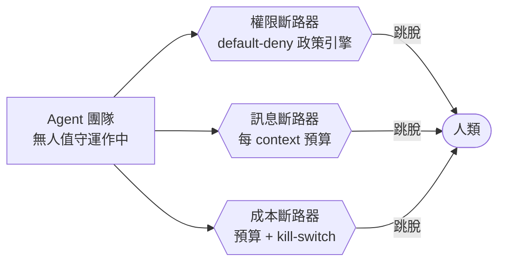
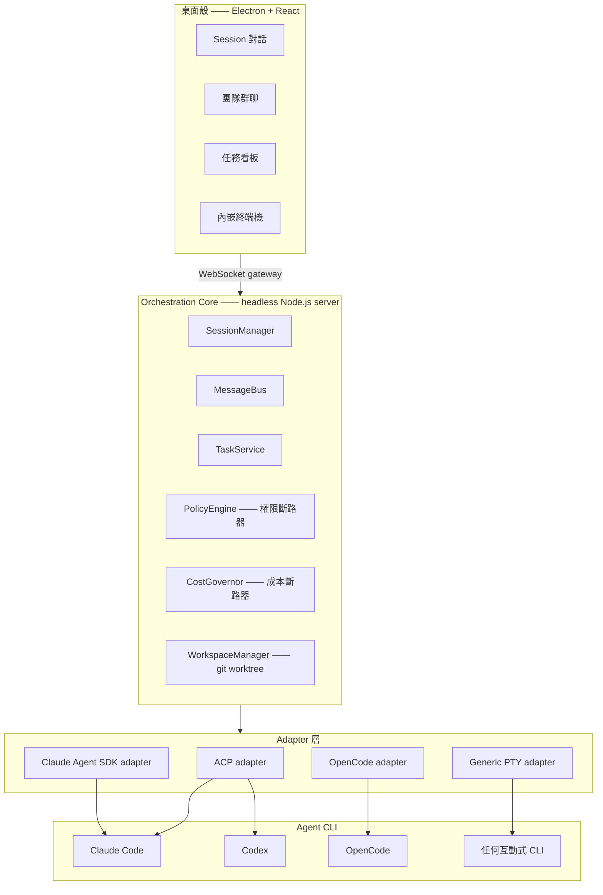
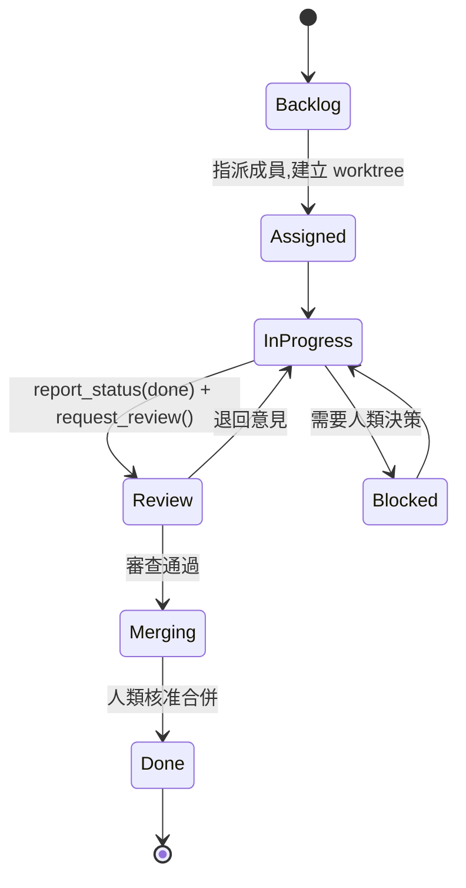

<div align="center">

# Deskmony

**一個給 AI coding agent 團隊用的桌面控制室 —— 讓一整隊 agent 能無人值守跑上好幾個小時,也不會失控。**


**[English](README.md)** ・ **[繁體中文](README.zh-Hant.md)**

</div>

---

Deskmony 讓你建立一整個 AI coding agent **團隊**,而不只是側邊欄裡的一個聊天機器人。給每個成員一個角色、一個後端(Claude Code、Codex、OpenCode,或任何你手邊已有的 CLI),以及一塊獨立 git worktree 裡的程式碼。他們會自己規劃、寫程式、互相審查,並透過內建的團隊群聊互相傳訊 —— 你可以在旁邊看,也可以不用一直盯著。

## 為什麼是 Deskmony

多數「多 agent coding」工具都逼你二選一:每個權限彈窗都自己盯著核准,或者乾脆整組開自動核可、賭它不會出事。Deskmony 走第三條路。核心理念只有一個 —— 一隊 coding agent 應該能夠**無人值守跑上好幾個小時**,不是因為沒人在看,而是因為平台本身就不會讓事情失控。

它借了 **Claude Code Desktop** 的桌面 IDE 手感、**Paseo** 的多 agent 調度模型、**OpenChamber** 的 session 化遠端操控 —— 再加上這三者都沒有的那一塊:一個罩住每個 agent、每則訊息、每一分錢花費的安全罩。

## ✨ 亮點

- 🤝 **是一支團隊,不是一個聊天機器人** —— 定義角色(PM / Architect / Coder / Reviewer / QA),每個成員可綁定不同的 agent 後端與 model。
- 💬 **agent 之間會互相傳訊** —— 內建的 `team-bus` MCP server 讓每個 agent 都拿到 `send_message`、`broadcast`、`request_review`、`report_status`;人類從即時的團隊群聊視圖旁觀,隨時可以插話。
- 🖥️ **貨真價實的桌面 IDE,不是一個輸入框** —— 串流 markdown 對話、行內 diff、內嵌終端機、todo list 追蹤、圖片工具輸出、互動式提問元件。
- 🗂️ **git worktree 隔離** —— 每個任務一開始就配到自己的 worktree,agent 平行工作互不踩腳;合併回主幹永遠需要人類親自點一下。
- 🔌 **多種 agent 後端,同一套介面** —— Claude Code 與 Codex 走 ACP,OpenCode 走 HTTP/SSE,其他任何東西則有 PTY 保底。
- 🛡️ **設計上就是為了無人值守** —— 三個各自獨立的斷路器(權限、訊息、成本),讓一整隊 agent 能工作好幾個小時,不需要人類盯著每一步。
- 🌐 **不綁死在桌面殼上** —— core 本身是一個 headless server;瀏覽器或手機都能透過 token 認證的 WebSocket 連上來操作。
- 🌍 **多語系** —— 內建英文、繁體中文、日文、西班牙文。

## 🛡️ 無人值守安全罩

這才是這個專案真正的論點:讓 agent 無人值守運作,靠的不是「更信任它」,而是**不管你信不信任這個 agent,斷路器都一樣會跳**。



| 斷路器 | 擋什麼 | 怎麼擋 |
|---|---|---|
| **權限** | agent 做出破壞性或越權的操作 —— 刪檔案、`git push --force`、讀 `~/.ssh`、對未列管主機發出連線 | **default-deny** 政策引擎。窄範圍、精確到 tool + 參數的 allowlist 可以透過日常使用慢慢「學」出來,但一份固定的**硬性 deny 清單**永遠不能被自動核可 —— 就算開了「auto mode」也一樣 |
| **訊息** | 兩個以上 agent 卡進回覆迴圈,或是一場燒光 context 的訊息風暴 | 每個對話 context 都自帶訊息數/hop 深度預算;燒完就熔斷,回報給 team lead 或人類 |
| **成本** | 一場放著不管的長時間執行,一夜之間把 token 預算燒光 | 逐任務量測用量、每個任務有硬性預算上限,還有一個能暫停整支團隊的每日 kill-switch |

這三條線對遠端 client 的執行規則完全一樣:透過網路連進來的手機或瀏覽器可以**旁觀**、送 prompt、核准或拒絕權限請求 —— 但**永遠不能**關掉安全罩、把某個 session 切成全自動核可,或修改 allowlist。只有在本機、真人在場的操作者才做得到。

完整的設計理由 —— 包含目前還沒做完的部分,例如 PTY 保底層的執行沙箱 —— 都寫在 [`docs/DECISIONS.md`](docs/DECISIONS.md)。

## 🏗️ 架構

三層式:一個 React/Electron 的**桌面殼**、一個擁有全部狀態與商業邏輯的 headless **orchestration core**、以及一層把所有支援的 agent 後端收斂成同一套介面的 **adapter 層**。桌面殼刻意被設計成 core 的其中一種 client 而已 —— 同一組 WebSocket gateway 本來就設計成也能被瀏覽器或手機打開。



完整的元件地圖與資料模型見 [`docs/ARCHITECTURE.md`](docs/ARCHITECTURE.md)。

### 同一套介面,多種 agent 後端

每個後端都實作同一個 `AgentAdapter` 介面(spawn、送 prompt、串流結構化事件、interrupt、dispose),讓平台其餘部分 —— 權限、訊息匯流排、任務看板 —— 完全不需要知道自己現在是在跟哪一套 CLI 講話。

| Adapter | 對接方式 | 目前涵蓋的後端 | 能力等級 |
|---|---|---|---|
| `ClaudeAgentSdkAdapter` | Claude Agent SDK,程式內嵌 | Claude Code | 最深:hooks、subagent、細粒度權限事件、對話中即時切換 model |
| `AcpAdapter` | [Agent Client Protocol](https://agentclientprotocol.com),stdio JSON-RPC | Claude Code、Codex | 一個 adapter 吃兩家 |
| `OpenCodeAdapter` | OpenCode 自己的 HTTP + SSE server | OpenCode | 原生 server 化,遠端也適用 |
| `GenericPtyAdapter` | 原始 `node-pty` 直通 | 任何互動式 CLI(Aider 等) | 保底層 —— 沒有結構化的權限事件,因此在真正的執行沙箱做出來之前,一律唯讀、不給無人值守的自主權 |

## 📋 任務怎麼流動

任務一旦指派出去,當下就會配到自己的 git worktree,agent 之間永遠不會共用同一份工作副本。



沒有任何 agent 能把自己的任務標成 `Done` —— `report_status`/`request_review` 最多只能把任務推到 `Review` 或 `Merging`,真正執行 `git merge` 的動作,永遠只能透過人類在任務看板上點下「核准合併」才會發生。

## 🚀 快速開始

### 事前準備

- **Node.js ≥ 20**
- **pnpm 10**(repo 釘死 `pnpm@10.13.1` —— 跑 `corepack enable`,pnpm 就會自動抓到正確版本)
- Windows —— 目前的封裝安裝檔是 Windows 專屬;但 core 與 adapter 都是純 Node/TypeScript,要支援其他平台主要是打包工程的問題,不是程式碼本身的問題
- 至少一個真的能對話的 agent 後端:登入 Claude Code CLI、安裝 Codex 或 OpenCode,或是把某個 profile 指向任何其他透過 PTY adapter 對接的互動式 CLI —— Deskmony 負責調度 agent,不負責提供 model 存取本身

### 安裝

```bash
git clone https://github.com/xing-101729/deskmony.git
cd deskmony
pnpm install
```

### 開發模式啟動

**方式一 —— core、Vite、Electron 開三個終端機**(最方便同時看兩邊的 log):

```bash
pnpm dev:core       # headless core —— WebSocket gateway,監聽 :4317
pnpm dev:desktop    # 桌面 UI 的 Vite dev server
pnpm dev:electron   # Electron 殼,會自動連上已經在跑的 Vite dev server
```

**方式二 —— 只跑 Electron**(main process 會自動幫你 spawn core):

```bash
pnpm dev:electron
```

### 打包 Windows 安裝檔

```bash
pnpm package        # NSIS 安裝檔
pnpm package:dir    # 未封裝版本,方便快速本機測試
```

### 只跑 headless core,不開桌面殼

```bash
pnpm start:core
```

接著在瀏覽器打開 `http://127.0.0.1:4317/` —— core 會把同一套 UI 當成靜態頁面,透過與 WebSocket gateway 相同的 port 服務出來,瀏覽器或手機不需要另外安裝任何東西就能操作。

## 🧱 技術棧

| 層 | 選擇 |
|---|---|
| 語言 | TypeScript(strict),每個 package 都是 |
| 桌面殼 | Electron 33 |
| UI | React 18 + Zustand + Tailwind CSS + Vite |
| 終端機 | xterm.js + node-pty |
| 對話渲染 | react-markdown + remark-gfm + 自製的 diff-hunk viewer |
| i18n | i18next / react-i18next —— en、zh-Hant、ja、es |
| Orchestration core | Node.js(headless),WebSocket gateway(`ws`) |
| 資料庫 | SQLite,透過 better-sqlite3 + Drizzle ORM |
| Agent 協議 | Agent Client Protocol(ACP)、Claude Agent SDK、OpenCode HTTP/SSE、原始 PTY |
| Monorepo | pnpm workspaces |

## 📁 專案結構

```
Deskmony/
├─ apps/
│  ├─ desktop/     # Electron + React 桌面殼
│  └─ core/        # headless orchestration server
├─ packages/
│  ├─ adapters/    # AgentAdapter 實作(ACP、SDK、OpenCode、PTY）
│  ├─ db/          # SQLite schema + Drizzle client
│  └─ shared/      # 共用型別、gateway 協議、zod schema
├─ scripts/        # e2e 測試骨架、fake agent、打包腳本
└─ docs/           # 架構文件、設計定案、分層設計文件、開發日誌
```

## 📚 文件

| 文件 | 內容 |
|---|---|
| [`docs/DECISIONS.md`](docs/DECISIONS.md) | 權威設計定案紀錄 —— 安全罩背後的「為什麼」,以及其餘一切設計取捨依循的基準 |
| [`docs/ARCHITECTURE.md`](docs/ARCHITECTURE.md) | 系統架構、元件地圖、時序/狀態圖、資料模型 |
| [`docs/LAYER-3-hld/`](docs/LAYER-3-hld/) → [`docs/LAYER-4-detail-design/`](docs/LAYER-4-detail-design/) | 每個安全罩子系統(政策引擎、成本治理、崩潰復原、session 子 agent……)的高階設計 → 詳細設計文件 |
| [`docs/DEVLOG.md`](docs/DEVLOG.md) | 逐輪開發日誌 —— 做了什麼、踩過什麼坑、後來怎麼修正 |

## 🗺️ 現況

核心平台已經完成並有端到端測試把關(`scripts/e2e-gateway.mjs`,140+ 項決定性測試):團隊/profile 管理、跨 agent 傳訊、桌面 IDE(對話、diff 檢視器、終端機、團隊群聊、任務看板)、git worktree 隔離,以及帶 token 認證的瀏覽器/遠端存取。

在這之上,完整的安全罩也已經落地:權限斷路器(default-deny 政策引擎 + 硬性 deny 清單)、訊息斷路器(每 context 預算)、成本斷路器(用量量測、每任務預算、每日 kill-switch)—— 另外還有崩潰復原、桌面/webhook 通知、機器可驗證的「完成」驗收閘,以及 session 子 agent(agent 可以自己 spawn 並傳訊給自己的子 agent)。

刻意留到之後的部分:
- PTY 保底層的真正執行沙箱 —— 在做出來之前,PTY adapter 的 agent 就是刻意維持唯讀。
- 會自動提議任務拆解的 LLM lead/orchestrator —— 目前拆解仍是人工進行。
- 讓遠端 client 在結構上就不可能削弱安全罩的細粒度遠端能力矩陣 —— token 認證與安全的預設綁定位址已經上線,其餘部分仍在加固中。

---

<div align="center">

**[English](README.md)** ・ **[繁體中文](README.zh-Hant.md)**

</div>
