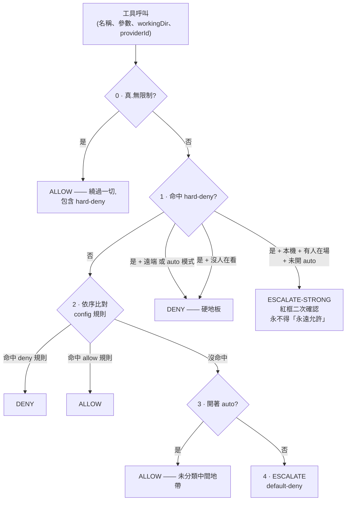
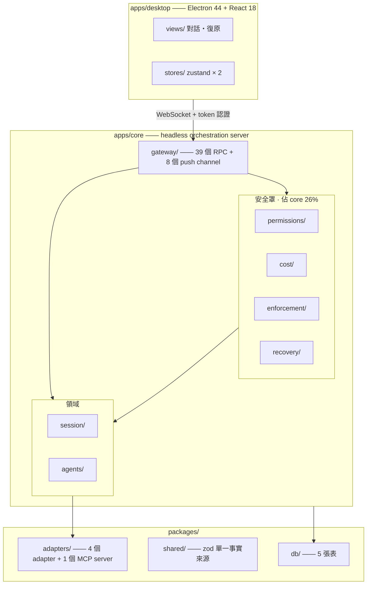

<div align="center">

# Deskmony

**一個給 AI coding agent 用的桌面控制室 —— 讓 agent 能無人值守跑上好幾個小時,也不會失控。**


-0078D6?style=flat-square&logo=windows&logoColor=white)


**[English](README.md)** ・ **[繁體中文](README.zh-Hant.md)**

</div>

---

Deskmony 讓你跑 AI coding agent —— 不是側邊欄裡的一個聊天機器人 —— 後端隨你選(Claude Code、Codex、OpenCode,或任何你手邊已有的 CLI),底下有一整套安全罩,你可以在旁邊看,也可以不用一直盯著。

> **2026-10-02:**為了簡化產品(見 [`DECISIONS.md` §H](docs/DECISIONS.md)),agent profile、team、任務看板、每任務一個 git worktree 都已移除。取而代之的是:Deskmony 直接找出你電腦上已經裝好的 agent CLI,從任何一個直接開 session;每個 session 都能找到可用的 agent、開新 session,並和任何其他 session 互傳訊息。

## 為什麼是 Deskmony

多數多 agent coding 工具只給你兩個選項:每個權限彈窗都自己盯著核准,或者整組開自動核可、然後賭。Deskmony 走第三條路。

論點很簡單:**讓 agent 無人值守運作,靠的不是「更信任它」,而是不管你信不信任它、斷路器都一樣會跳。** 三個各自獨立的斷路器罩住每個 agent、每則訊息、每一分花費。任一條都能單獨叫停失控。成本與訊息這兩條**遠端無法停用**;權限那條自 2026-08-25 起遠端與本機同權(有意識、有記錄的翻案,見 [`DECISIONS.md` §G](docs/DECISIONS.md)),詳見下方「遠端邊界」。

純粹為安全罩存在的四個目錄 —— `permissions/`、`cost/`、`enforcement/`、`recovery/` —— 合計 **1,331 行實際程式碼(不含空行與註解),佔 orchestration core 的 26%**(core 共 5,033 行;這個比重在 2026-10-02 移除 team 與任務層之前是 22%、剛移除完是 29%,之後因為 core 多了 agent 目錄與 session 網路而回落)。這還沒算上散在 session manager 裡的決策編排,以及訊息斷路器(`session/message-chain-budget.ts`)—— 它在 `session/` 底下,不在那四個目錄裡。

(這個數字刻意扣掉註解。這份 codebase 約三成是註解,把它們算進去會得到比較好看的數字 —— 但註解不會擋下任何一次工具呼叫,拿來當「安全投入」的證據是假的。**行數本來就證明不了安全性**,真正該看的是下面那張決策流程圖,以及 `scripts/e2e-hard-deny.mjs` 對四類 hard-deny 的逐條斷言。)

## ✨ 亮點

- 🛡️ **獨立的斷路器** —— 權限、訊息與成本。全程 default-deny,外加一份任何 auto 模式都繞不過的硬性 deny 清單 —— 唯一刻意留的例外是需要打字確認的「真.無限制」層,詳見下文。
- 🌱 **每個 session 都能找到可用的 agent、開新 session、和任何 session 互傳訊息** —— Deskmony 會偵測你電腦上已經裝好的 agent CLI;開新 session 只要選一個 agent、(選填)model 與工作資料夾,不必先建 profile。能跑工具的 session(內嵌 Claude Agent SDK,以及所有走 ACP 的 agent:Codex、Gemini,還有走 `opencode acp` 的 OpenCode)會從 `deskmony` MCP server 拿到五個工具 —— `list_agents`、`list_sessions`、`read_session`、`create_session`、`send_to_session`。**不做任何自動回送**:收到訊息的 agent 自己決定要不要回、回給誰。開 session 與傳訊息**刻意不放進自動放行清單** —— 它們和其他工具呼叫走同一道權限階梯 —— 而且有「每條訊息鏈」的預算擋住失控的來回對傳。
- 🖥️ **貨真價實的桌面 IDE** —— 串流 markdown、行內 diff、內嵌終端機、todo 追蹤、圖片工具輸出、互動式提問元件,以及能把任何一則 assistant 回覆「轉傳到…」另一個 session 的按鈕。
- 🔌 **四個 adapter,同一套介面** —— 內嵌 Claude Agent SDK、ACP、OpenCode HTTP/SSE,以及保底的原始 PTY。
- 🔄 **不靠猜的崩潰復原** —— 孤兒 session 在啟動時對帳,由人逐一分流。**刻意不做任何自動續接。**
- 🌐 **可遠端,但清楚劃出哪些事只能留在本機** —— 瀏覽器或手機經 token 認證連上;2026-08-25 起遠端在 session 控制與政策編輯上與本機同權,但 provider 設定(可能含 API key)與綁定介面永遠只能本機動。
- 🌍 **多語系** —— 英文、繁體中文、日文、西班牙文。

## 🛡️ 安全罩

### 斷路器一 —— 權限

agent 的每一次工具呼叫都走這道階梯。**順序寫死,不可設定**:


```mermaid
flowchart TB
    Req["工具呼叫<br/>(名稱、參數、workingDir、providerId)"] --> TU{"0 · 真.無限制?"}
    TU -- 是 --> Allow0["ALLOW —— 繞過一切,<br/>包含 hard-deny"]
    TU -- 否 --> HD{"1 · 命中 hard-deny?"}
    HD -- 否 --> Rules{"2 · 依序比對<br/>config 規則"}
    HD -- "是 + 遠端 或 auto 模式" --> Deny["DENY —— 硬地板"]
    HD -- "是 + 本機 + 有人在場<br/>+ 未開 auto" --> Strong["ESCALATE-STRONG<br/>紅框二次確認<br/>永不得「永遠允許」"]
    HD -- "是 + 沒人在看" --> Deny
    Rules -- "命中 deny 規則" --> Deny2["DENY"]
    Rules -- "命中 allow 規則" --> Allow["ALLOW"]
    Rules -- "沒命中" --> Auto{"3 · 開著 auto?"}
    Auto -- 是 --> Allow2["ALLOW —— 未分類中間地帶"]
    Auto -- 否 --> Esc["4 · ESCALATE<br/>default-deny"]
```

**四類硬性 deny,config 關不掉**:session 工作目錄外的寫入或刪除 · 讀秘密路徑(`~/.ssh`、`~/.aws`、`~/.deskmony`、`**/.env*`、`**/id_rsa*`、`**/credentials`)· 危險 git(`push --force`、刪遠端分支、`branch -D`)· 對非白名單主機的外連。

有幾個性質值得直說:

- **YOLO 跟 auto 的差別只有一個**:YOLO 額外跳過 config 的 `deny` 規則。**兩者都絕不跳過 hard-deny。** YOLO 還會在 30 分鐘後過期。
- **引擎判不出來的一律 escalate**,絕不 allow。這是 `decide()` 的最後一行。
- **OpenCode 也被強制走同一條階梯。** OpenCode 預設放行所有工具,只有它自己設定檔標成 `"ask"` 的才會詢問 —— 而多數人的設定一個都沒標,所以放著不管的話,它的 bash/edit/webfetch/MCP 呼叫根本到不了引擎。Deskmony 啟動 OpenCode(`opencode` 與 `opencode-acp` 兩個 provider)時,會注入一段 `OPENCODE_CONFIG_CONTENT`,把每個工具都設成 `ask`,並與你原本的設定合併(你的設定保留,但權限規則以 Deskmony 的為準)。看得到的影響:`always-ask` 下的 OpenCode session 現在會停下來問,以前是靜默執行;auto/YOLO 照舊。一個限制:`opencode-acp` provider 的 `task`(subagent)工具會被停用,因為 `opencode acp` 不會轉發 subagent 的權限請求,subagent 會永遠卡住。
- **逾時語意取決於現場有沒有人。** 有人看著 → 待決請求逾時後轉成 deny。沒人看著 → **完全不設計時器**,session 停在 `waiting` 等人回答。把「沒人回應」解讀成「拒絕」,等於把整晚的工作丟掉。真正防止它無限期懸著的是成本斷路器。
- **「永遠允許」有三條紀律**:寫最窄的規則(`commandEquals` / `pathUnder`);同時寫進設定檔與記憶體,讓重啟前後行為一致;hard-deny 升級來的請求**永遠**不符資格 —— 就算 client 硬塞 `rememberRule`,core 也會把它拔掉。
- **規則可以限定到某個 agent**(`providerId`,例如只對 Codex 的 session 生效)。舊 profile 時代遺留的規則 —— 在舊版 `config.json` 裡限定 profile id 或角色的 —— 已經對不到任何 session,所以一律往安全的方向收:這類 `allow` 規則不再匹配(該次呼叫改成升級給人),這類 `deny` 規則改成套用到**所有** session,避免被限定範圍的 deny 靜默失效、在 auto 模式下變成自動放行。core 啟動時會逐條記錄受影響的規則。
- **唯一能跨過 hard-deny 地板的例外,是刻意設計、有稽核的**:疊在 YOLO 之上的「真.無限制」層,需要打對一段確認字串才能啟用,2026-08-25 起本機與遠端皆可用(見 [`DECISIONS.md` §G](docs/DECISIONS.md))。這是 `decide()` 裡唯一能跳過 hard-deny 的路徑 —— 只在該 session 已經開著 YOLO 時才能開、只能逐 session 開、且一定要人打對確認字串;啟用當下會跳桌面通知,也會寫進稽核紀錄。

### 斷路器二 —— 訊息

agent 一旦能互傳訊息,要防的失控就是迴圈:A 回 B、B 回 A、永遠不停 —— 或某個 agent 不斷扇出新的 session。原本的預算(core 推導的 contextId + 每 context 的上限)隨訊息匯流排在 2026-10-02 一併移除(見 [`DECISIONS.md` §H](docs/DECISIONS.md));這條斷路器改以另一個單位重建 —— **訊息鏈**:

- 人類輸入的 prompt —— 或 UI 的轉傳 —— 開一條**新鏈**。agent 在處理某則訊息的那一輪裡呼叫 `send_to_session` / `create_session`,送出的訊息沿用觸發它那一輪的鏈。
- 一條鏈最多可承載 `messageBudget.maxMessagesPerContext` 則 agent 對 agent 的訊息(預設 50;鍵名沿用舊設計,讓既有設定檔照常解析)。達到 `warnAtPercent` 時發一次軟警告(稽核紀錄 + 通知,不 halt)。
- **超過上限的第一則訊息就熔斷**:那則訊息被拒絕,工具結果告訴 agent「這條鏈已熔斷、需要人介入」,稽核紀錄與桌面通知會記下來(每條鏈只通知一次,agent 反覆重試也不會洗版)。在已熔斷的鏈上呼叫 `create_session` 不會 spawn 任何東西。
- 熔斷只擋 **agent 對 agent** 的傳遞。你照樣可以對任何 session 輸入,輸入就會開一條新鏈;UI 轉傳是人類操作,同樣開新鏈、不計數、不會被擋。
- 計數只存記憶體(core 重啟歸零),而且這個設定不在遠端可改的子集裡 —— 遠端 client 關不掉這條斷路器。

### 斷路器三 —— 成本

| 元件 | 訊號 | 何時跳 | 怎麼止血 |
|---|---|---|---|
| **TurnLimiter** | `tool-call` 事件 + 時間 —— **完全不需要 usage** | 單回合超過 30 分鐘或 200 次工具呼叫 | 立即 interrupt |
| **CostGovernor**(每日 kill-switch) | `usage` 事件 | 當日總花費超標 | interrupt 所有 session,並擋後續 prompt |
| **WaitingWatchdog** T1 | `waiting` 停留時間 | 6 小時 | 只通知,不 halt |
| **WaitingWatchdog** T2 | `waiting` 停留時間 | 72 小時 | dispose 子程序;對話紀錄保留 |

> **TurnLimiter 是其中最重要的一個。** 對真實 Claude Code 經 ACP 實測:bridge 回報 **0 筆** usage —— 不是設定問題,是結構性缺口。對那個後端,所有依賴 usage 的預算全部形同虛設,回合硬上限是唯一剩下的保護。

### 遠端邊界

`isLocal` 由 core 依連線本身的位址判定,**絕不採信 client 自稱**。隧道連線(Tailscale、WireGuard)不是 loopback,一律算**遠端** —— 隧道保護的是傳輸,不代表現場有個操作者。

遠端 client **可以**旁觀、送 prompt、核准或拒絕升級請求、把 session 切成 auto/YOLO、編輯政策允許清單、在核准時附帶「永遠允許」規則 —— 2026-08-25 起與本機同權,這是有意識、有記錄的翻案(見 [`DECISIONS.md` §G](docs/DECISIONS.md)),推翻了先前的遠端限制。遠端甚至能透過與本機相同的打字確認閘門,開啟上面提到的「真.無限制」層。遠端**仍然不可以**:編輯 provider 設定(它的環境變數可能帶 API key,而且會併進每一個 agent 子程序)、編輯一般設定檔、改網路綁定位址。這道閘擋在 dispatch 層,**不是靠 UI 藏按鈕** —— 繞過 UI 直接送 raw request 一樣會被擋。

綁非 loopback 位址又沒設 `DESKMONY_AUTH_TOKEN` 會**直接拒絕啟動**。token 刻意不是設定檔欄位,所以改設定檔擴大不了曝露面 —— 只能來自環境變數,或(僅桌面殼)Settings「遠端存取」面板用 Electron `safeStorage` 加密保存在本機的值,讓你能複製一組穩定的 token 交給瀏覽器或手機使用。

WebSocket 升級另外有一道**與 token 獨立的同源檢查**(2026-09-04 新增):瀏覽器不受同源政策限制地對 `ws://` 發起連線 —— 任何網頁都能連上你本機的 gateway,而它的來源位址**本來就是真的 127.0.0.1**,會被正確判定為「本機」。在沒有設 token 的單機模式下,那等於「開啟一個惡意網頁」就足以接管。現在的規則是:沒有 `Origin` 的非瀏覽器 client(手機 app、腳本)放行、與 `Host` 同源的瀏覽器 UI 放行、`file://` 與 loopback 來源**在有 token 時**放行(桌面殼一定有 token,sandboxed iframe 拿不到),其餘一律在升級階段就拒絕。

## 🏗️ 架構

三層。桌面殼刻意被設計成 core 的其中一種 client —— 同一組 WebSocket gateway 也服務瀏覽器和手機。


```mermaid
flowchart TB
    subgraph SHELL["apps/desktop —— Electron 44 + React 18"]
        direction LR
        Views["views/ 對話・復原"]
        Stores["stores/ zustand × 2"]
    end

    subgraph CORE["apps/core —— headless orchestration server"]
        GW["gateway/ —— 39 個 RPC + 8 個 push channel"]
        subgraph DOMAIN["領域"]
            direction LR
            Sess["session/"]
            Agents["agents/"]
        end
        subgraph SHIELD["安全罩 · 佔 core 26%"]
            direction LR
            Perm["permissions/"]
            Cost["cost/"]
            Enf["enforcement/"]
            Rec["recovery/"]
        end
    end

    subgraph PKG["packages/"]
        direction LR
        Adapters["adapters/ —— 4 個 adapter + 1 個 MCP server"]
        Shared["shared/ —— zod 單一事實來源"]
        Db["db/ —— 5 張表"]
    end

    SHELL -- "WebSocket + token 認證" --> GW
    GW --> DOMAIN
    GW --> SHIELD
    SHIELD --> DOMAIN
    DOMAIN --> Adapters
    CORE --> Db
```

**依賴鐵則**:`packages/*` 絕不 import `apps/*`。adapter 需要 core 提供的東西,一律在 `packages/shared` 宣告介面(session 工具用的 `SessionNetworkPort`、ACP 橋接的 scoped token 用的 `McpBridgeTokenPort`),建構時注入。

### Adapter

註冊了四個 adapter,全部實作同一套介面,所以權限與 session manager 都不需要知道對面是哪套 CLI。

| Adapter | 對接方式 | 目前涵蓋的後端 | 能力等級 |
|---|---|---|---|
| `ClaudeAgentSdkAdapter` | Claude Agent SDK,程式內嵌 | Claude Code | 最深 —— hooks、in-process session 工具、細粒度權限事件、對話中換 model 與 effort |
| `AcpAdapter` | [Agent Client Protocol](https://agentclientprotocol.com),stdio JSON-RPC | Gemini CLI、Codex(經 `@agentclientprotocol/codex-acp` 橋接套件——官方 `codex` 執行檔本身不原生講 ACP)、其他 ACP-native agent | 結構化事件 |
| `OpenCodeAdapter` | OpenCode 的 HTTP + SSE server | OpenCode | 原生 server,遠端也適用 |
| `GenericPtyAdapter` | 原始 `node-pty` 直通 | Claude Code CLI、Aider、任意互動式 CLI | **保底 —— 沒有權限事件** |

使用者看到的那一層是七項的 **provider 目錄**,每一項在型別上保證映射到上面四者之一:`claude-agent-sdk`、`claude-cli` → PTY、`gemini` → ACP、`opencode`、`opencode-acp` → ACP(走 `opencode acp` 的 OpenCode,session 工具就是靠這一項)、`codex` → ACP(經 `@agentclientprotocol/codex-acp` 橋接套件,不是本機安裝的 codex CLI)、`aider` → PTY。手動輸入 command 的那一項(`custom-pty`)已於 2026-10-02 移除:session 只能從 Deskmony 自己偵測到的 agent 開出來,gateway 上也沒有任何能新增 command 的入口。

**PTY 這層缺的權限事件是安全邊界,不是待辦事項。** 它是 raw stdin 直通,**結構上**沒辦法被政策引擎管。在真正的執行沙箱做出來之前,PTY agent 一律唯讀、不給無人值守的自主權。Deskmony 刻意**不做** shell 指令攔截:`bash -c`、`$()`、base64 幾秒就能繞過,做了只是 security theater。

**能力回報對「自己不知道的事」很誠實。** usage 與 context 回報是三態 —— `supported` / `unsupported` / `unknown` —— 因為一條連線到底報不報用量,是被 spawn 出來的那個 agent 決定的,不是 adapter。同一個 `AcpAdapter`,對某個 agent 忠實轉發用量,對另一個從頭到尾收不到半個事件。靜態布林值不管填哪邊都是在對 UI 說謊,所以消費端必須靠「這條 session 實際觀察到什麼」自己收斂。

### Agent 與 session

不再有 profile。`AgentCatalog`(`apps/core/src/agents/`)是「哪些 agent 可以開 session」的唯一權威:

- **偵測。** core 啟動時在背景掃描目錄裡的 agent(不會卡住啟動);側欄或設定裡的「重新偵測」會重新掃描。設定介面仍然能停用某個 agent、調整順序、挑要開放的 model、設定各 agent 的環境變數 —— API key 就放在那裡。
- **開 session** 就是 `session.create`:帶一個 agent(`providerId`)、選填的 model 與 effort(effort 只對 Claude Agent SDK 有意義)、一個工作資料夾。桌面側欄有這四個選單加上「新對話」鈕;CLI 用 `--agent <providerId>`(預設 `claude-agent-sdk`)、`--model`、`--effort`。偵測不到任何 agent 時,側欄會說明並提供重新偵測。
- **session 自帶啟動資訊**(它的 provider,以及走 CLI 的那幾種要用的 command 與參數),所以重啟後續接它不依賴其他東西;若該 agent 已經偵測不到,就改用 session 存下來的 command。這次改版之前建立的 session,會在 core 第一次啟動時依它們原本的 profile 回填;舊的 `agent_profiles` 表只會被讀取、絕不修改。
- 每個 session 一律從 `always-ask` 開始。切到 auto/YOLO 仍然是逐 session 的操作,跟以前一樣。

### Session 網路

能跑工具的 session,會從一個 `deskmony` MCP server 拿到五個工具(在 Claude 裡顯示為 `mcp__deskmony__<name>`):

| 工具 | 做什麼 | 權限 |
|---|---|---|
| `list_agents` | 現在有哪些 agent 可以開 session(id、label、models、預設 model、該 agent 能不能用工具) | 自動放行 |
| `list_sessions` | **所有** session —— 不限自己開的子 session:id、標題、agent、model、狀態、工作資料夾、父 session、是不是你自己、對方能不能主動回話。不含對話內容 | 自動放行 |
| `read_session` | 任一 session 最近 N 則訊息(預設 20、上限 100)—— 只含 user 與 assistant 的回合,每則最多 4,000 字元 | 自動放行 |
| `create_session` | 用指定的 agent 開一個 session 並送出第一則訊息 | 走權限階梯 |
| `send_to_session` | 對任何其他 session 傳訊息。對方正忙就排進佇列,等它這一輪結束才送達;對方已關閉、出錯或不存在是明確的錯誤,絕不假裝成功 | 走權限階梯 |

有四條規則決定它的行為:

- **所有 session 互相可見。** 沒有父子限制、沒有工作資料夾限制。用 `create_session` 開出來的 session 會巢狀顯示在建立者底下 —— 只為顯示與溯源,它其實跟其他 session 平等。你也可以手動在任何 session 底下開新 session。
- **不做任何自動回送。** 訊息送達時會包一層信封,寫明是誰送的、以及「除非收到的人自己決定要回,否則不會得到回覆」。要不要回、回給誰(不一定是寄件者),是收到訊息的 agent 自己用 `send_to_session` 決定。以前「子 agent 完成、結果自動注入父 session」的行為已經不存在。
- **身分無法冒名。** 呼叫者是誰,來自 adapter(in-process)或橋接 token(ACP),絕不是工具參數。信封只在訊息送到 agent 的那一刻才加;存進歷史的是原始文字加上來源標記。
- **不是每個 agent 都能主動傳。** Claude Agent SDK(in-process)、所有走 ACP 的 agent —— Codex、Gemini CLI、走 `opencode-acp` provider 的 OpenCode —— 以及走 HTTP 的 OpenCode(`opencode` provider)都能呼叫這些工具;後兩者是透過一個持有 scoped、逐 session token 的橋接子行程(走 HTTP 的 OpenCode 是寫進 OpenCode 自己的 `mcp` 設定來掛載,它的權限確認與其他工具呼叫一樣)。PTY agent(Claude Code CLI、Aider)可以**接收**訊息、但不能傳;`list_agents` 與 `list_sessions` 會回報 `canUseTools: false`,讓寄件者知道對方回不了話。

在桌面 app 裡,收到的訊息會顯示「來自 <session>」(或「轉傳自 <session>」)標籤,每則 assistant 訊息也都有「轉傳到…」動作:選任何其他 session、附上選填的附註,對方就會收到一則來自你的訊息。agent 之間的流量由上面的斷路器二把關。

## 📋 任務流程 —— 2026-10-02 移除

任務看板(backlog → assigned → in-progress → review → merging → done)、每任務一個 git worktree、機器驗收閘、人類 review 閘、人類核可的合併,隨 team 一併移除 —— 見 [`DECISIONS.md` §H](docs/DECISIONS.md)。你 SQLite 檔案裡既有的 `tasks` / `workspaces` 等表原封不動,只是不再有程式碼讀寫它們。

## 🔄 崩潰復原

最貴的東西 —— agent 累積的推理與 context —— 活在後端行程裡,不在資料庫。replay 事件流重建的是你的帳本,不是 agent 的腦。所以這裡的復原是**對帳 + 人工分流**,不是 replay。

啟動時,在 gateway 接受第一個連線之前,沒被乾淨關閉的 session 會被標記 `interrupted` 並寫進稽核 log。接著由人逐一決定:**繼續**(只有後端真的把 session 持久化到磁碟才行 —— 由 core 重新驗證,絕不採信 client 的舊快照)、**接手**(讀摘要重啟)、或**放棄**(session 標記為已關閉,對話紀錄仍保留 —— 回收不等於丟棄)。**沒有東西會被默默丟棄,也沒有東西會自動續跑。**

## 🚀 快速開始

### 事前準備

- **Node.js ≥ 20** 與 **pnpm 10**(repo 釘死 `pnpm@10.13.1`,跑 `corepack enable` 就會抓到)
- 桌面版封裝安裝檔目前是 Windows 專屬。**core 與 CLI 也能在 Linux 上跑**——每次 PR 都有一個 `ubuntu-latest` CI job 建置它們並跑完整套 CLI e2e。這句話證明的範圍要說清楚:core + CLI 這條路徑在 Linux 上通,用的是不需要任何憑證的假後端;它**不**證明各 adapter 對真實後端在 Linux 上的行為,那還沒有人測過。
- 至少一個 Deskmony 偵測得到的 agent 後端:登入 Claude Code CLI;Codex 只需設定 `OPENAI_API_KEY`/`CODEX_API_KEY`(或改用 ChatGPT 登入)——它透過內附的 `@agentclientprotocol/codex-acp` 橋接套件運作,不需要另外安裝 codex CLI;或安裝 OpenCode、Gemini CLI、Aider。core 啟動時會自己找到它們,除了憑證之外,每個 agent 都不需要另外設定。**Deskmony 負責調度 agent,不提供 model 存取本身。**

### 安裝

```bash
git clone https://github.com/xing-101729/deskmony.git
cd deskmony
pnpm install
```

### 開發模式

三個終端機,最方便同時看兩邊的 log:

```bash
pnpm dev:core       # headless core —— WebSocket gateway 監聽 :4317
pnpm dev:desktop    # UI 的 Vite dev server
pnpm dev:electron   # Electron 殼
```

或只跑 `pnpm dev:electron` —— main process 會自動幫你 spawn core。

### Headless,不開桌面殼

```bash
pnpm start:core
```

接著打開 `http://127.0.0.1:4317/`。core 把同一套 UI 當靜態頁面,透過與 WebSocket gateway 相同的 port 服務出來,瀏覽器或手機不需要裝任何東西。靜態頁面本身不需認證即可下載;它背後的 WebSocket 仍然需要。

### `deskmony` 指令列介面

桌面殼從一開始就只是 core 的**其中一種** client,不是唯一一種。CLI 是第三種——同一個 WebSocket gateway、同一層安全罩。Linux 與 Windows `cmd.exe` 都能用。

```bash
deskmony serve                 # 在前景跑 headless core
deskmony                       # 互動 REPL(等同 deskmony chat)
deskmony run "找出所有 TODO"    # 一次性:串流輸出後退出
deskmony run - < prompt.txt    # prompt 從 stdin 讀
deskmony --agent codex run -   # 指定 agent(provider id;預設 claude-agent-sdk)
deskmony session list --json   # NDJSON,供腳本消費
deskmony doctor                # 偵測 agent 後端、檢查連線
```

`--agent <providerId>`(搭配 `--model`、`--effort`)決定新 session 跑在哪個 agent 上;`deskmony doctor` 會列出偵測到哪些 agent。

`serve` 與 client 刻意分開:core 持有一份 SQLite,同一個資料目錄上跑兩份 core 是真實的資料危害。在一個終端機跑 `serve`(或讓桌面 app 開著),其餘用 `--url` / `DESKMONY_URL` 指過去。

退出碼穩定到可以拿來做分支判斷:`0` 成功、`1` 執行期錯誤、`2` 用法錯誤、`3` 連不上或認證失敗、`4` 權限請求被拒。**`4` 比看起來重要**——被拒絕的那一輪,事件層面跟成功的一輪長得一模一樣,只看事件串流的 CLI 會把「什麼都沒做成」回報成成功。`run` 因此自己記錄拒絕紀錄,不從事件反推。

非 TTY 環境下,`run` 不會自己給自己權限:直接拒絕、把工具名印在 stderr、以 `4` 結束。要自動化就明講 `--permission-mode auto-accept-edits`(對應 core 既有的 `session.setPermissionMode`)。沒有沉默放行的路。

#### 全螢幕介面

```bash
deskmony tui
```

`chat` 和 `run` 一次只看得到一個 session。`tui` 看得到所有 session,而這個差別正是它存在的理由:**在行導向的 REPL 裡,由你當下沒在看的那個 session 跳出來的權限請求是完全看不見的,而無人值守的請求不會逾時。** 你讀著第一個 agent 的輸出時,第二個可能已經卡住好幾小時。TUI 不論焦點在哪個 session,都會把跨 session 的待決數量放在畫面上,按 `a` 逐一處理——而且顯示的是工具的實際參數,不是只有工具名稱,因為光看名稱(「Write file」)根本無從判斷。

命中硬性拒絕清單的請求會長得不一樣,行為也不一樣:不提供「永遠允許」,而且要完整打字輸入 `yes`,不接受單鍵。

它需要 **Node 22**(Ink 的要求,啟動時會檢查並在舊版給出明確訊息)與真正的終端機。要 pipe、寫腳本、或在不支援全螢幕的終端上工作時,`deskmony chat` 仍然是對的工具——TUI 是加上去的一層,不是取代。

**怎麼讓 `deskmony` 進 PATH。** pnpm 不會把 workspace 套件的 `bin` 放進根目錄的 `node_modules/.bin`,所以光裝相依是不夠的:

```bash
node apps/cli/dist/bin.js --help   # 一定能動,零安裝
cd apps/cli && npm link            # 把 deskmony 掛上 PATH
```

推薦走 `npm link`:npm 的全域 prefix(Windows 是 `%APPDATA%\npm`)在標準 Node 安裝下本來就在 PATH 上,不需要改任何環境變數。已在真實 Windows 主控台實測 `deskmony --help`,中文與欄位對齊都正常。`pnpm link --global` 也可以,但在 `PNPM_HOME` 未設定的機器上得先跑 `pnpm setup`,而那會改寫你的 PATH。

### 打包 Windows 安裝檔

```bash
pnpm package        # NSIS 安裝檔
pnpm package:dir    # 未封裝版本,方便本機快速測試
```

打包後的 core 跑在 Electron 內建的 Node 上,`better-sqlite3` 已針對該 ABI 重編,所以**終端使用者不需要安裝 Node**。

## 🧱 技術棧

| 層 | 選擇 |
|---|---|
| 語言 | TypeScript(strict),每個 package 都是 |
| 桌面殼 | Electron 44 |
| UI | React 18 + Zustand + Tailwind + Vite |
| 終端機 | xterm.js + node-pty |
| 對話渲染 | react-markdown + remark-gfm + react-syntax-highlighter + 自製 diff-hunk viewer |
| i18n | i18next / react-i18next —— en、zh-Hant、ja、es |
| Core | Node.js headless,WebSocket gateway(`ws`) |
| 資料庫 | SQLite,better-sqlite3 + Drizzle ORM,5 張表 |
| 驗證 | `packages/shared` 的 zod schema,兩端共用的單一事實來源 |
| Agent 協議 | Claude Agent SDK、ACP、OpenCode HTTP/SSE、原始 PTY |
| Monorepo | pnpm workspaces |

## 📁 專案結構

```
Deskmony/
├─ apps/
│  ├─ desktop/          # Electron + React 殼
│  │  ├─ views/         # 對話、復原、各式對話框
│  │  ├─ stores/        # zustand × 2
│  │  ├─ ui/            # 設計系統(含 ErrorBoundary)
│  │  └─ locales/       # en、zh-Hant、ja、es
│  └─ core/             # headless orchestration server
│     ├─ session/ agents/                          # 領域(session、agent 目錄)
│     ├─ permissions/ cost/ enforcement/ recovery/ # 安全罩
│     ├─ gateway/ http/ config/ detect/ settings/  # 支撐
├─ packages/
│  ├─ adapters/         # 4 個 adapter + `deskmony` session 網路 MCP server
│  ├─ db/               # Drizzle schema、冪等遷移
│  └─ shared/           # 型別、gateway 協議、zod schema
├─ scripts/             # 16 支 e2e、總跑器、建置新鮮度守門員、fake 後端、打包腳本
├─ .github/workflows/   # CI(build → typecheck → 15 支決定性測試)
└─ docs/                # 架構、設計定案、分層設計、開發日誌
```

## 🧪 測試

```bash
pnpm test          # typecheck + build + 15 支決定性測試
pnpm test:e2e      # 只跑測試(需要 pnpm build 已是最新)
pnpm test:e2e:live # e2e-gateway.mjs —— 需要真實 Claude Code 憑證,會實際消耗額度
```

**十六支端到端測試。** 其中十五支是*決定性*的 —— 直接對真實的 headless core 打 WebSocket gateway(**從不經過 Electron**),搭配三個假後端(`fake-acp-agent`、`fake-opencode-server`、`fake-pty-echo`),因此在一台完全沒有憑證的機器上也能重現同樣結果。`pnpm test` 與 CI 跑的就是這十五支:**243 個斷言,全部必須通過。**(2026-10-02 移除 team、任務與訊息匯流排的測試後,斷言數從 221 降到 180;之後新增 `e2e-agent-catalog.mjs` 與取代子 agent 測試的 `e2e-session-network.mjs`,斷言數又升上來;2026-10-03 再加上 `e2e-opencode-permissions.mjs`,釘住每個 OpenCode 工具呼叫都會進政策引擎。)session 網路那支測試也會斷言:in-process server 與 ACP 橋接子行程的工具名稱、描述、參數 schema 逐字一致。

`e2e-gateway.mjs` 刻意不在預設範圍內。它需要真實 Claude Code 憑證、會花真的錢,而且有一組 *model-behavior* 斷言依賴模型當輪自由選擇怎麼講 —— 檔案自己標註為已知 flake。一個會因為模型換句話說就變紅的 CI,很快就會被所有人忽略。

兩道守門員讓這套測試維持誠實:

- **建置新鮮度。** 測試跑的是 `dist/` 而不是 `src/`。在補上檢查之前,忘記 `pnpm build` 會讓測試安靜地驗證**過期**的程式碼並全綠 —— 那比直接失敗更糟。現在由 `scripts/lib/require-fresh-build.mjs` 擋下。
- **`e2e-hard-deny.mjs`** 涵蓋 hard-deny 全部四類。其中三類(秘密路徑、危險 git、網路白名單)在 2026-09-04 之前是零覆蓋 —— 而它們恰好就是靠字串與 regex 比對、真的可能寫錯的那三類。它也把**已知的**繞過方式(base64、變數拼接)釘成刻意的斷言,將來行為若改變,文件會一起被提醒更新。

`package-smoke.mjs` 是打包迴歸測試:把系統 Node.js 從 `PATH` 移除後啟動建出來的執行檔,驗證 core 子程序仍能啟動並完成認證。
## 📚 文件

| 文件 | 內容 |
|---|---|
| [`docs/ARCHITECTURE.md`](docs/ARCHITECTURE.md) | **系統實際長什麼樣** —— 依原始碼撰寫,每一節都對得上真實檔案 |
| [`docs/DECISIONS.md`](docs/DECISIONS.md) | **為什麼** —— 安全罩背後的權威設計定案紀錄 |
| [`docs/LAYER-3-hld/`](docs/LAYER-3-hld/) → [`docs/LAYER-4-detail-design/`](docs/LAYER-4-detail-design/) | 各子系統的高階設計 → 詳細設計 |
| [`docs/DEVLOG.md`](docs/DEVLOG.md) | 逐輪開發日誌 —— 做了什麼、壞了什麼、後來怎麼修 |
| [`SECURITY.md`](SECURITY.md) | **威脅模型與通報管道** —— 什麼算漏洞、什麼是已知且刻意接受的取捨(PTY 無沙箱、hard-deny 是 pattern 比對、真.無限制層…),以及自架時的加固建議 |
| [`LICENSE`](LICENSE) | MIT |

## 🗺️ 現況

已完成,並由 CI 上每次 push/PR 都會跑的端到端測試把關(見上方「測試」):agent 偵測與從任一偵測到的 agent 開 session、session 網路(agent 之間的工具、訊息信封、UI 轉傳)、桌面 IDE、帶 token 認證的瀏覽器/遠端存取、安全罩的三個斷路器(權限、每條訊息鏈的訊息、成本)、崩潰復原、桌面與 webhook 通知、自助式政策允許清單管理介面、真.無限制繞過層。2026-10-02 已移除(見 [`DECISIONS.md` §H](docs/DECISIONS.md)):agent profile、team、任務看板、每任務一個 git worktree、驗收閘、訊息匯流排(它的斷路器已重建給 session 之間的訊息),以及「子完成 → 結果自動注入父 session」的子 agent 行為。

**刻意留白的部分,在你依賴它之前值得先知道:**

- **PTY 層沒有執行沙箱。** 在做出來之前,PTY agent 就是唯讀 —— 這是誠實的後果,不是疏忽。
- **沒有回合中途的成本熔斷。** 唯一會發 usage 的 adapter 是在回合結束時才發,根本沒有可觀測的「回合進行中收到 usage」情境可以對著做。硬分岔只是憑空編造行為。
- **只有部分 agent 能主動傳訊息。** Claude Agent SDK 的 session(in-process)、所有走 ACP 的 agent(Codex、Gemini CLI、走 `opencode-acp` provider 的 OpenCode)與走 HTTP 的 OpenCode(`opencode` provider)能拿到那五個 session 工具 —— 後兩者透過一個持有 scoped、逐 session token 的橋接子行程。PTY agent(Claude Code CLI、Aider)沒有掛載任何工具:它們可以**接收**訊息,但不能呼叫 `send_to_session` 或 `create_session`,所以除非有人替它們轉傳,否則自己回不了話。
- **排給忙碌 session 的訊息只存在記憶體。** 若 core 在對方這一輪結束前重啟,排隊中的訊息就遺失了(寄件者當時只被告知「已排隊」,並不是「已讀」)。
- **agent 清單是固定的。** 偵測範圍是 Claude Agent SDK、Claude Code CLI、Gemini CLI、OpenCode、Codex、Aider。手動輸入 command 的入口是刻意移除的;要支援別的 agent,就得在目錄裡加一項。
- **provider 的密鑰對外遮罩,本機是明文儲存**,與 Paseo 對它的設定檔採取同一種取捨。
- **孤兒 agent 行程只能在下次啟動時回收。** core 若被 SIGKILL / 強制終止 / 斷電,優雅關機路徑完全沒機會跑,已 spawn 的 agent 與它們的 MCP 孫程序會繼續活著。現在會把 pid 記到 `<dataDir>/child-pids.json`,下次啟動時比對行程建立時間後回收(對不上就**不殺**,防 pid 重用誤傷)。真正的當下回收需要 Windows Job Object,那要多一個原生相依 —— 這個專案刻意不要求打包機器具備 MSVC 工具鏈。
- **SQLite 遷移只能加欄位。** `packages/db/src/client.ts` 是幾個「查 `PRAGMA table_info` → 沒有就 `ALTER TABLE ADD COLUMN`」的手刻函式,沒有版本表。改型別 / rename / drop / 加約束都做不到,將來要做破壞性遷移得先換成正式的 migration 機制。
- **聊天記錄在畫面上最多保留 2,000 則。** 超出會砍最舊的(完整歷史仍在 SQLite,切走再切回會重新載入)。這是為了擋住失控迴圈把 renderer 記憶體吃爆,一般對話遠遠碰不到。
- **目前只支援 Windows 打包。**

---

<div align="center">

**[English](README.md)** ・ **[繁體中文](README.zh-Hant.md)**

</div>
