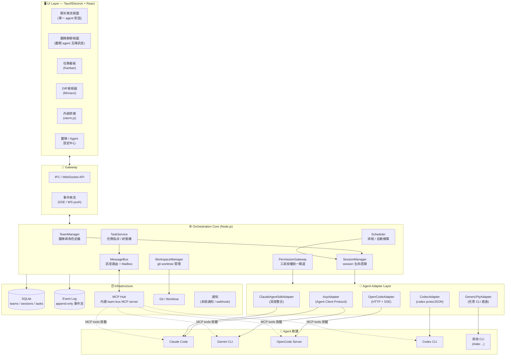
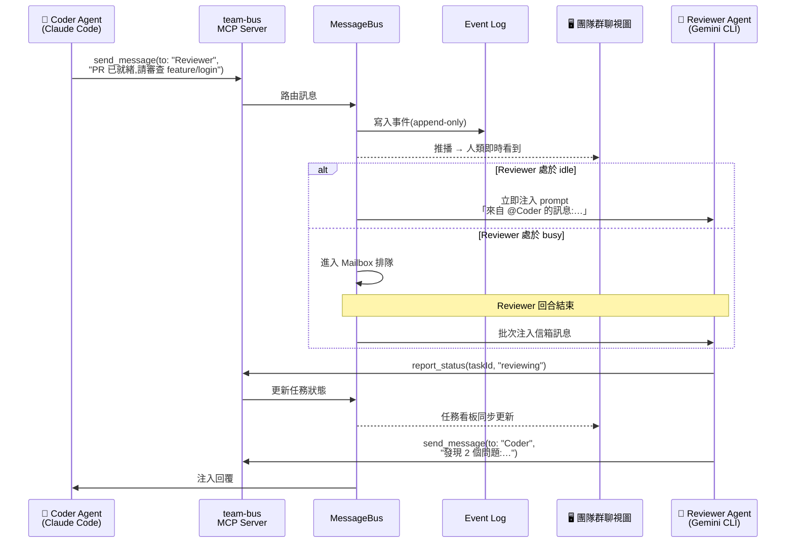
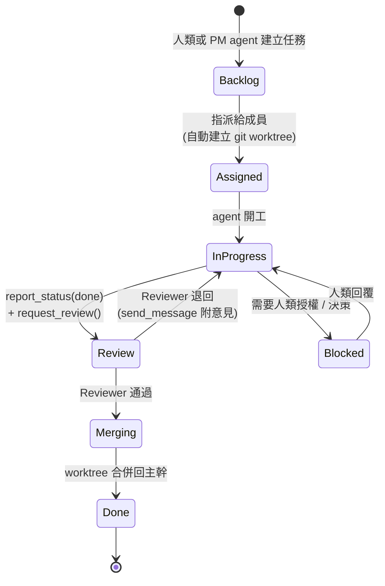
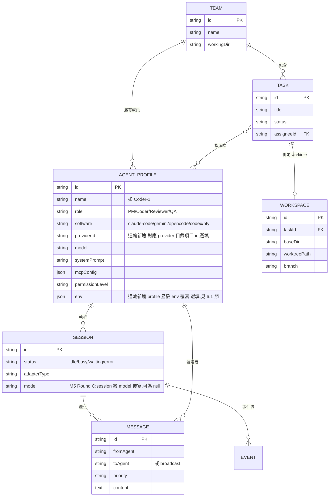

# Deskmony 系統架構(2026-07 早期版本,已封存)

> # 🛑 這份文件已被取代,不要再引用它做決策
>
> 這是 2026-07 的**早期概念草圖**,寫在大部分程式碼還不存在的時候。它描述的是
> 當時的設想,不是實際落地的系統——包含若干**從未實作**的元件(Scheduler、
> CodexAdapter、Monaco、Event Sourcing、`read_inbox`)。
>
> **請改看 [`ARCHITECTURE.md`](./ARCHITECTURE.md)** —— 依實際原始碼重寫,每一節都
> 對得上真實檔案。被更正的宣稱逐條列在該文件的「附錄 A」。
>
> 保留這份文件只有一個用途:理解某些設計**當初**為什麼那樣想。所有敘述請一律
> 假設已過時,除非在新版 ARCHITECTURE.md 或 [`DECISIONS.md`](./DECISIONS.md)
> 找得到對應的確認。

---

> 一個結合 **Claude Code Desktop**(桌面 IDE 式介面)、**Paseo**(多 agent 統一調度)、**OpenChamber**(session 化遠端管理)三者概念的 Agent Team 管理平台。

> ⚠️ **2026-07-24 定案更新**:本文件為早期概念草圖與元件地圖,部分宣稱已過時。
> **權威設計基準改以 [`DECISIONS.md`](./DECISIONS.md) 為準**,衝突時以其為準。具體被更正處:
> - ❌「Event Sourcing 可回放重建」→ 實為當前狀態 CRUD,event sourcing 不做(見 DECISIONS §D)。
> - ❌ 下方 §3.4 的 `CodexAdapter` 不存在;Codex 走 ACP。核心後端 set 收斂為 **{Claude Code, Codex, OpenCode}**,**放棄 Antigravity/Gemini**(見 §B)。
> - ⚠️ `PermissionGateway` 實為 57 行空殼,default-deny 政策引擎尚未實作(淨新增第一優先,見 §C 與 DECISIONS「淨新增工作」)。
> - ➕ 新增貫穿全局的**無人值守安全罩**(權限/訊息/成本三斷路器,見 DECISIONS §0)。

---

## 1. 產品定位與核心能力

| 能力 | 說明 | 概念來源 |
|---|---|---|
| Agent Team 管理 | 建立團隊、定義角色(PM / Architect / Coder / Reviewer / QA),每個成員可綁定不同的 agent 軟體與模型 | Paseo |
| Agent 互相傳訊 | 內建 Message Bus + 每個 agent 的 Mailbox,agent 透過 MCP 工具主動傳訊、廣播、請求審查 | 自創(核心差異化) |
| 多 agent 軟體支援 | Adapter 層抽象化,支援 Claude Code、Codex CLI、Gemini CLI、OpenCode、任意 CLI | Paseo / OpenChamber |
| 桌面 IDE 式介面 | Session 側欄、聊天串流、Diff 檢視、內嵌終端、任務看板、團隊群聊視圖 | Claude Code Desktop |
| 工作區隔離 | 每個任務可綁定獨立 git worktree,agent 平行工作互不干擾 | Claude Code Desktop |

---

## 2. 總體架構圖



---

## 3. 分層說明

### 3.1 UI Layer(桌面殼 + 前端)

- **殼**:建議 **Tauri 2**(體積小、記憶體省)搭配 Node.js sidecar 跑 Core;若想最快落地可用 **Electron**(main process 直接就是 Node,少一層 sidecar 通訊)。
- **前端**:React + TypeScript + Zustand(狀態)+ Tailwind。
- **關鍵元件**:
  - `xterm.js` — 內嵌終端(GenericPtyAdapter 直通、或查看 agent 原始輸出)
  - `Monaco Editor` — diff 檢視與檔案預覽
  - 虛擬列表(聊天串流訊息量大)
- **三種核心視圖**:
  1. **Session 視圖** — 像 Claude Code Desktop:左側 session 列表、中間對話串、右側 diff/檔案面板
  2. **團隊群聊視圖** — 把整個 team 的 agent 互傳訊息以群組聊天呈現,人類可隨時插話 @某個 agent
     (M3 Round B 已實作,見 `apps/desktop/src/views/TeamChatView.tsx`;`App.tsx`
     頂部提供 Session 視圖 ↔ 團隊群聊視圖的切換分頁)
  3. **任務看板** — Kanban:Backlog → Assigned → In Progress → Review → Merging → Done
     (+ Blocked 獨立區塊)。M4 Round B 已實作,見 `apps/desktop/src/views/TaskBoardView.tsx`;
     `App.tsx` 頂部提供 Session 視圖 ↔ 團隊群聊視圖 ↔ 任務看板的三分頁切換。
- **設定介面**(M5 Round D 新增):`App.tsx` 頂部列一個獨立的「⚙ 設定」按鈕
  (不是第四個分頁,是一個彈窗,見 `apps/desktop/src/views/SettingsDialog.tsx`)
  —— 呼叫 `env.detectAgents` 顯示本機已裝的 agent 軟體(以及內嵌的 Claude
  Agent SDK)、版本、路徑、可用 model、憑證提示,並提供「重新偵測」按鈕。
  M5 Round E 新增「啟用哪些偵測到的 Claude model」勾選區塊(`claude-agent-sdk`
  卡片下方的 `EnabledModelsEditor`),存檔呼叫 `settings.setEnabledModels`。
  詳見 3.2/3.3 節備註與 README.md「設定介面與 agent 偵測」「M5 Round E 完成度」
  章節。
- **建立 Agent Profile 對話框**(M5 Round E 改版):`ProfileCreateDialog.tsx`
  的 software 下拉改成只列出 `env.detectAgents` 偵測到、已安裝的項目(+ 內嵌
  Claude Agent SDK + 「自訂…」逃生選項),每個選項對應一組保證能建立 session
  的 `(software, command)`(見 3.4 節下方「偵測項 → 可建立目標的推導」備註);
  workingDir 欄位新增「瀏覽…」按鈕(Electron 專屬,呼叫
  `window.deskmony.pickDirectory()` 開原生選資料夾對話框,瀏覽器場景優雅降級
  為隱藏按鈕、維持手動輸入);選到 `claude-agent-sdk` 時額外顯示 model 下拉
  (選項為「設定」介面啟用的 model,見上方「設定介面」備註)。

### 3.2 Gateway

- UI 與 Core 之間走 **WebSocket(或 Electron IPC)**:指令用 request/response,agent 輸出用事件推播。
- 同一套 WS API 未來可直接開放給 **瀏覽器 / 手機遠端**(OpenChamber 的概念):Core 本身就是一個 headless server,桌面殼只是其中一種 client。

> **M5 Round A 落地備註**:上面兩句話這輪從「設計目標」變成「有安全預設把關的
> 實際行為」——`apps/core` 新增 `pnpm start:core` 正式入口、**預設只綁
> `127.0.0.1`**(要對外必須明確設定 `DESKMONY_BIND_HOST`,且對外綁定沒有同時
> 設定 `DESKMONY_AUTH_TOKEN` 時直接拒絕啟動),以及 token-based 認證(client
> 連線後第一則訊息必須是帶正確 token 的 `auth` request,未設定 token 時維持
> 免認證的本機開發預設)。完整設計取捨(token 傳輸方式為何選「連線後第一則
> 訊息」而非 `Sec-WebSocket-Protocol`/URL query string、逾時/錯誤 token 的
> 連線處理)見 README.md「認證(token-based)」章節;桌面殼(`apps/desktop`)
> 這輪也串接了自動認證(`GatewayClient` 建構子新增可選的 `authToken`,連線
> 後自動送出 `auth`),對既有 UI/store 完全透明。瀏覽器/手機 client 本身仍
> 留給之後的 round(這輪只確保 Gateway 協議與安全預設就緒)。
>
> **M5 Round B 落地備註**:上一輪留下的「瀏覽器/手機 client」這句話這輪
> 真正落地。`apps/core` 的 `WsGateway.listen()` 改成建立一個 `node:http`
> 的 `Server`,把 `WebSocketServer` 用 `{ server }` 選項掛在它上面(WS 升級
> 請求走 `upgrade` 事件、一般 HTTP GET 走 `request` 事件,兩者天生不衝突,
> 不需要手動判斷)——同一個 port 現在**同時**服務兩件事:(1) 既有的 WS
> Gateway 協議;(2) 新增的靜態網頁 server(`apps/core/src/http/
> static-server.ts`),把 `apps/desktop` 既有的 Vite build 產物(`dist/`)
> 服務出去,讓瀏覽器不需要另外架設任何東西就能載入 UI 殼。**安全邊界**:
> 靜態頁面本身不需要認證即可下載(它只是不含機敏資料的前端 UI 殼),但
> 頁面連上 WS Gateway 之後,若 core 有設定 `DESKMONY_AUTH_TOKEN`,仍必須
> 送出正確 token 才能使用——這條界線刻意分開處理(靜態檔案 server 完全不
> 檢查 token,職責單一),完整的目錄穿越三層防禦與瀏覽器連線畫面/token
> 儲存取捨見 README.md「瀏覽器存取方式與安全界線」「token 儲存取捨」章節。
> 同一輪也把 M5 Round A review 留下的兩個安全強化項目補上:token 比對改用
> `crypto.timingSafeEqual()` 常數時間比較、新增認證失敗 rate limiting(見
> README.md「安全強化」章節)。至此 ARCHITECTURE.md 第 9 節路線圖 M1~M5
> 全部完成。
>
> **M5 Round D 落地備註(agent 偵測)**:新增 `env.detectAgents` request(見
> `packages/shared/src/gateway.ts`)——`params` 是空物件、刻意不接受任何
> 呼叫端輸入,回應是 `{ agents: AgentDetectionEntry[] }`(型別定義見
> `packages/shared/src/detect.ts`)。這個方法本身是唯讀查詢(不改變任何
> 狀態、不建立/影響任何 session),因此沿用既有的認證閘門即可,沒有另外的
> 安全考量;真正的安全設計重點在 Core 端的偵測邏輯本身,見 3.3 節備註。
>
> **M5 Round E 落地備註(啟用模型偏好持久化)**:新增 `settings.getEnabledModels`
> (`params` 空物件)/`settings.setEnabledModels`(`params: { enabledModelIds:
> string[] }`)兩個 request(見 `packages/shared/src/gateway.ts`),對應
> `SettingsStore`(見 3.3 節備註)。**語意約定:空陣列 = 全部啟用**——這兩個
> 方法都改變/查詢的是「使用者偏好」而非任何 agent/session 狀態,同樣沿用既有
> 認證閘門,沒有額外授權邏輯。

### 3.3 Orchestration Core(平台心臟)

| 模組 | 職責 |
|---|---|
| **TeamManager** | 團隊 CRUD、AgentProfile(角色、系統提示、綁定的軟體/模型/工作目錄/MCP 設定) |
| **SessionManager** | 對每個 agent 成員建立/恢復/中斷 session;維護 session 狀態機(idle / busy / waiting-permission / error) |
| **MessageBus** | 核心差異化模組,見第 4 節 |
| **TaskService** | 任務建立、指派給 agent、狀態流轉、驗收流程 |
| **PermissionGateway** | 各 adapter 的權限請求統一收斂到這裡 → UI 彈窗或依 policy 自動核可(allowlist / 每 agent 授權等級) |
| **WorkspaceManager** | 為任務建立 git worktree、追蹤 diff、合併/清理 |
| **Scheduler** | 定時喚醒 agent(例如每日 standup、自動輪詢 CI) |
| **AgentDetector**(M5 Round D 新增) | 偵測本機已裝哪些已知 agent CLI(固定 allowlist:`claude`/`gemini`/`opencode`/`codex`/`aider`)+ 版本 + 路徑,以及內嵌 `claude-agent-sdk` 的憑證狀態提示;供「設定」介面與 `env.detectAgents` 使用 |
| **SettingsStore**(M5 Round E 新增) | 極簡 key/value 持久化偏好(`apps/core/src/settings/settings-store.ts`);目前唯一的 key 是「啟用哪些偵測到的 Claude model」,供 `settings.getEnabledModels`/`settings.setEnabledModels` 使用 |

> **AgentDetector 安全設計**(見 `apps/core/src/detect/agent-detector.ts` 完整
> 註解):
>   1. **固定 allowlist,不接受外部輸入** —— 偵測哪些命令完全由程式碼內寫死
>      的常數陣列決定,`env.detectAgents`(唯一對外入口)不接受任何參數,
>      呼叫端沒有辦法要求偵測任意命令。
>   2. **一律 `execFile` 陣列參數,不開 shell、不組字串**(比照
>      `WorkspaceManager` 呼叫 git 的既有寫法):先用 `where`(Windows)/
>      `which`(POSIX)找出完整路徑,才對該路徑跑 `--version`。Windows 上
>      `.cmd`/`.bat` 這類 npm 全域安裝的 shim(例如 `gemini.cmd`)在
>      `shell:false` 下 Node 會直接丟出 `EINVAL`(與 `AcpAdapter` 的
>      `resolveWindowsSpawnCommand()` 遇到的問題相同)——這裡依副檔名決定是否
>      需要 `shell:true`,且只對「解析出來的完整路徑」做必要的引號跳脫(命令
>      本身是寫死的 allowlist 字面字串,不是外部輸入,不構成 shell 注入面)。
>   3. **每次探測都有逾時**(3000ms):找執行檔、跑 `--version` 這兩步各自
>      逾時,逾時/找不到/非 0 結束一律當「未安裝或無法判定」處理,不讓任何
>      一個探測卡住整個 `detectAllAgents()`(內部 `Promise.all` 平行探測)。
>   4. **model 偵測務實降級**:只有內嵌的 `claude-agent-sdk` 有結構化 model
>      清單(直接複用 `KNOWN_CLAUDE_MODELS`);外部 CLI 只做「安裝與否 +
>      版本」,`models` 回空陣列 + `modelsNote` 說明「模型由該工具自行管理」
>      ——不臆測、不嘗試跑任何可能互動式/昂貴的「列出 model」指令。
>
> `probeCommand()` 這個底層函式額外 export 出來,供 `scripts/e2e-gateway.mjs`
> 步驟21 不經過 gateway、直接呼叫編譯產物驗證探測邏輯本身的確定性行為(`node`
> 必定存在、亂數 bogus 命令必定回報未安裝),避免在 gateway 層新增一個「可
> 指定任意命令」的方法造成不必要的攻擊面。

### 3.4 Agent Adapter Layer(多軟體支援的關鍵)

所有 adapter 實作同一個介面:

```ts
interface AgentAdapter {
  capabilities(): AdapterCapabilities;        // 是否支援串流/工具事件/權限請求/diff
  spawn(profile: AgentProfile, workspace: Workspace): Promise<AgentHandle>;
  sendPrompt(handle: AgentHandle, prompt: PromptInput): void;
  events(handle: AgentHandle): AsyncIterable<AgentEvent>;
  // AgentEvent = 訊息增量 | 工具呼叫 | 權限請求 | diff | 完成 | 錯誤
  interrupt(handle: AgentHandle): void;
  dispose(handle: AgentHandle): Promise<void>;
  // M5 Round C 新增:對話中換 model(見本節下方備註)。只有
  // ClaudeAgentSdkAdapter 真正支援,ACP/PTY 一律丟出明確錯誤。
  setModel(handle: AgentHandle, model: string): Promise<void>;
}
```

> **M5 Round C 落地備註(對話中換 model)**:`setModel()` 直接呼叫
> `@anthropic-ai/claude-agent-sdk` 的 `Query.setModel(model?: string):
> Promise<void>`(讀取 `node_modules` 內 `sdk.d.ts` 確認:「Only available
> in streaming input mode」——`ClaudeAgentSdkAdapter` 本來就一律用 streaming
> input,因此可以直接切換,不需要 dispose 現有連線或重新 spawn,對話上下文
> 原封不動保留,比「dispose + 重新 spawn」的替代方案更好)。`AcpAdapter`/
> `GenericPtyAdapter` 對應的協議本身沒有「呼叫端指定 model」這個機制,一律
> 丟出明確錯誤(見 README.md「M5 Round C 完成度」的完整調查結論與取捨)。

| Adapter | 對接方式 | 涵蓋軟體 | 功能等級 |
|---|---|---|---|
| **AcpAdapter** | [ACP(Agent Client Protocol)](https://agentclientprotocol.com) — stdio JSON-RPC | Claude Code、Gemini CLI、其他支援 ACP 者 | ★★★ 一個 adapter 吃多家,首選 |
| **ClaudeAgentSdkAdapter** | Claude Agent SDK(程式內嵌) | Claude Code | ★★★ 最深整合:hooks、subagent、細粒度權限 |
| **OpenCodeAdapter**(已實作) | OpenCode 的 HTTP + SSE server API | OpenCode | ★★★ 天生 server 化,遠端也適用 |
| **CodexAdapter** | `codex proto` / exec JSON 模式 | Codex CLI | ★★ |
| **GenericPtyAdapter** | node-pty 直通 + 終端渲染 | 任何互動式 CLI(Aider 等) | ★ 保底方案,無結構化事件,功能降級 |

> 設計原則:**能力探測(capabilities)+ 優雅降級**。UI 依 adapter 回報的能力決定顯示豐富聊天串流還是原始終端。

> **M5 Round E 落地備註(偵測項 → 可建立目標的推導)**:`AdapterRegistry`
> (`apps/core/src/index.ts`)目前只註冊了 `claude-agent-sdk`/`acp`/`pty` 三種
> adapter——`OpenCodeAdapter`/`CodexAdapter` 仍是上面表格列出的 TODO(未來 round
> 才會補上)。但 `AgentDetector` 的偵測結果會把 opencode/codex 分類標記成
> `"opencode"`/`"codex"`(純粹是分類標籤,不代表已有對應 adapter),若 UI 直接
> 照抄這個分類建 `AgentProfile`,`session.create` 會在 `AdapterRegistry.get()`
> 找不到對應 adapter 時失敗。`packages/shared/src/agent-target.ts` 的
> `deriveDefaultAgentTarget()`/`canUseAcpAdvanced()`/`deriveAcpAdvancedTarget()`
> 是這輪新增的純函式層,把「偵測到的分類」轉換成「保證能建立 session 的
> `(software, command)`」——內嵌 SDK 維持原樣;其餘所有外部 CLI 一律預設映射成
> `software="pty"` + command=偵測到的完整路徑(PTY 直通對任何互動式 CLI 都
> 保證能跑);只有偵測分類本身就是 `"acp"` 的項目(claude-code-cli/
> gemini-cli)才提供「進階:改用 ACP」的候選,給知道自己 CLI 真的講 ACP 的
> 使用者手動選用,不是預設值。`ProfileCreateDialog.tsx` 是唯一呼叫端。
>
> **修復備註(OpenCodeAdapter 落地,取代上一輪的 opencode→pty 退化)**:
> 使用者實際使用後回報,opencode 走 PTY 直通只是把它自己的整頁 TUI 塞進
> xterm 終端視圖,體驗很差。這輪依本節表格原訂計畫補上 `OpenCodeAdapter`
> (`packages/adapters/src/opencode-adapter.ts`,HTTP + SSE 對接 opencode 的
> headless server,`AdapterRegistry` 新增註冊 `"opencode"`),
> `deriveDefaultAgentTarget()` 對偵測分類為 `"opencode"` 的項目改成映射成
> `software="opencode"` 本身(不再退化成 `pty`),`DerivedAgentTarget.
> software` 型別同步擴充成
> `Extract<AgentSoftware, "claude-agent-sdk" | "acp" | "pty" | "opencode">`。
> `codex` 目前仍然沒有對應的 adapter,繼續映射成 `pty`,維持「這個型別只能
> 包含 `AdapterRegistry` 真正註冊過的 software」這條原則不變。完整的 API
> 調查結論、事件轉換設計、已知限制見 README.md「OpenCodeAdapter」章節。

### 3.5 Infrastructure

- **SQLite**(better-sqlite3 + Drizzle ORM):teams、agent_profiles、sessions、tasks、messages、settings(M5 Round E 新增,極簡 key/value 持久化偏好表)。
- **Event Log**:append-only 事件流(所有 agent 輸出、訊息、權限決策),支援 session 回放與稽核。
- **MCP Hub**:平台**內建一個 MCP server(`team-bus`)**,啟動每個 agent 時自動掛載 — 這是 agent 互傳訊息的入口(見下節)。
- **Git / Worktree**:任務級隔離。
- **通知**:系統通知(agent 需要授權、任務完成)、可選 webhook(Slack 等)。

---

## 4. Agent 互相傳訊機制(核心設計)

### 4.1 原理

每個 agent session 啟動時,自動掛載平台內建的 **`team-bus` MCP server**,取得以下工具:

| MCP Tool | 用途 |
|---|---|
| `send_message(to, content, priority)` | 傳訊給指定隊友(可標 normal / interrupt) |
| `broadcast(content)` | 對整個 team 廣播 |
| `read_inbox()` | 讀取自己的信箱 |
| `request_review(taskId, to)` | 請求隊友審查(M4 Round B 已實作,見 4.5 節) |
| `report_status(taskId, status, summary)` | 回報任務進度(同步驅動任務看板) |
| `list_teammates()` | 查詢隊友名單、角色與目前狀態 |

### 4.2 投遞策略

MessageBus 收到訊息後不會直接打斷對方,而是依目標 agent 狀態決定:

- **idle** → 立即以 prompt 注入目標 session(標明來源:「來自 @Reviewer 的訊息:…」)
- **busy** → 進入 Mailbox 排隊,該 agent 回合結束後批次注入
- **priority = interrupt** → 呼叫 adapter 的 `interrupt()` 中斷後注入(僅限授權的角色,例如 PM)
- 所有訊息同步寫入 Event Log,並推播到 UI 的**團隊群聊視圖**,人類全程可見、可插話

### 4.3 訊息流時序圖



> 用 MCP 做傳訊入口的好處:**任何支援 MCP 的 agent 軟體(Claude Code、Gemini CLI、OpenCode、Codex…)都自動獲得傳訊能力**,不需要為每套軟體客製;連 GenericPtyAdapter 跑的 CLI,只要支援 MCP 也能加入團隊。

### 4.4 M3 Round A 實作備註

第 4 節是設計層面的目標;M3 Round A 落地了核心機制,以下記錄實作與設計文字的對應關係與現況範圍(完整清單見 README.md「M3 Round A 完成度」):

- **MCP Tool 清單的實作範圍**:4.1 節表格列了 `send_message`/`broadcast`/`read_inbox`/`request_review`/`report_status`/`list_teammates` 六個工具。M3 Round A 只實作了 `send_message`、`broadcast`、`list_teammates`、`report_status` 四個(`packages/adapters/src/team-bus-mcp.ts`)。`read_inbox` 未實作:目前的投遞策略是「idle 立即注入 / busy 排隊後自動批次注入」,agent 不需要主動輪詢信箱 —— Mailbox 對 agent 是被動、自動送達的,不是拉取式的。`request_review` 未實作:語意上等同於「`send_message` + 之後由 TaskService 追蹤 review 狀態」,而 TaskService 是 M4 的範圍,這輪先不做這個語意包裝,任務相關的協作一律先用 `send_message`/`report_status` 表達。
- **投遞策略的落地位置**:4.2 節的策略由 `apps/core/src/bus/message-bus.ts` 的 `MessageBus` 類別實作,`deliverToMember()`/`flushMailbox()` 是核心邏輯,詳細設計決策(Mailbox 資料結構、注入 prompt 格式、循環依賴打破方式)見 README.md 對應章節。
- **「所有訊息同步寫入 Event Log」的現況**:M3 Round A 尚未有獨立的 append-only Event Log(那是第 3.5 節 Infrastructure 的更大範圍設計,`sessions`/`messages` 目前也還是一般 SQLite 表,不是 append-only 結構),這輪先把 `TeamMessage` 寫進 `team_messages` 表(一般 CRUD 表,支援歷史查詢 `team.messages`),語意上滿足「訊息不會遺失、可回放」,但還不是嚴格的 append-only 事件流。
- **跨軟體傳訊的現況**:4.1 節「MCP Hub」與文末的跨軟體說明是完整願景 —— 這輪只有 `ClaudeAgentSdkAdapter` 會在 `spawn()` 時掛載 team-bus MCP server(讀取 SDK 的 `createSdkMcpServer()`/`tool()` API 對接,見 `packages/adapters/src/team-bus-mcp.ts`);`AcpAdapter`/`GenericPtyAdapter` 這輪不掛(ACP 協議本身雖然也能承載 MCP,但需要另外設計「client 端如何把 MCP server 曝露給 ACP agent」的橋接,留給之後的 round)。**但投遞(接收端)本身是跨 software 的**:`MessageBus` 注入訊息只是呼叫 `SessionManager.sendPrompt()`,任何 software 的 session 都能接收到注入的 prompt(e2e 步驟 12 用兩個 `software="acp"` 的 fake agent 驗證了這一半);缺的只是「主動呼叫工具傳訊」這一端,只有 Claude Agent SDK 成員具備。
- **`priority="interrupt"` 授權判斷的擴充**:4.2 節文字「僅限授權的角色,例如 PM」對應到 `TeamMember.canInterrupt` 布林;實作上這個判斷同時服務 agent 端(透過 MCP 工具呼叫 `send_message`/`broadcast`)與人類插話(`message.send`)——人類預設不受此限制(找不到同名 `TeamMember` 時直接放行,見 README「人類插話與 agent 傳訊共用降級邏輯」的說明),只有當人類插話刻意以某個既有成員的名義發送時才會套用同一套規則。

### 4.5 M3 Round B 實作備註

M3 Round B 把上一輪留下的兩個待辦補齊:3.1 節第 2 種核心視圖(團隊群聊視圖)與團隊管理 UI 正式落地,並處理了 Round A review 指出的 interrupt 投遞時序問題。完整改動清單見 README.md「M3 Round B 完成度」,這裡只記錄與架構文件本身描述有落差、或需要額外說明的部分。

- **團隊群聊視圖與 4.2/4.3 節「訊息如何路由」的關係**:4.1/4.2 節描述的是訊息路由本身,這輪落地的是「人類如何觀察與插話」——`TeamChatView`(`apps/desktop/src/views/TeamChatView.tsx`)訂閱 `"team-message"` 推播,呈現的正是 4.3 節時序圖裡 `BUS-->>UI` 這一步;人類插話(收件對象可選某成員或廣播、可選 priority)呼叫的 `message.send` 對應 4.2 節「所有訊息…人類全程可見、可插話」這句話,實作細節(狀態管理、視覺區分規則)見 README「M3 Round B 關鍵設計決策」。
- **團隊管理 UI 與 3.3 節 TeamManager 的關係**:3.3 節表格把「團隊 CRUD、AgentProfile」列為 TeamManager 的職責,這輪的 `TeamManagementDialog`(`apps/desktop/src/views/TeamManagementDialog.tsx`)就是這個職責在 UI 層的對應——建立 team、加入/移除成員(選現有 `AgentProfile`、設定角色與 `canInterrupt`)、檢視成員目前 session 狀態。「檢視成員目前 session 狀態」這個需求原本沒有對應的 gateway 方法(`Session`/`team.list` 都沒有曝露 session↔member 對應),這輪新增 `team.teammates`(複用 M3 Round A 就已存在的 `MessageBus.listTeammates()` 邏輯,多開一個給 UI 用的入口),避免為此修改資料庫 schema。
- **4.2 節「呼叫 adapter 的 interrupt() 中斷後注入」的時序訂正**:M3 Round A 的實作裡,「中斷」與「注入」這兩步之間沒有正確等待前者真正完成——Round A review 指出這是一個時序 race(SDK 的 `interrupt()` 是非同步的,resolve 才代表真正停止處理)。M3 Round B 修正:`AgentAdapter.interrupt()` 介面改回傳 `Promise<void>`,`MessageBus.deliverToMember()` 的 interrupt 分支現在會先完整 `await` 中斷生效,才進行注入。判斷過程、修正範圍、e2e 驗證方式(步驟 14,真實忙碌中的 Claude SDK session)完整記錄在 README.md「interrupt 時序修正結論」,不在此重複——這裡只記錄一個對架構文件本身的訂正:4.2 節「呼叫 adapter 的 interrupt() 中斷後注入」這句話隱含的「先中斷、後注入」時序關係,現在才是程式碼實際保證的行為(Round A 的實作只是語意上先呼叫、但沒有真正等待完成)。

### 4.6 M4 Round B 實作備註:`request_review`

M3/M4 Round A 都明講「這輪先不做 `request_review`」(見 4.4 節、5.1 節);M4 Round B 補上:

- **語意**:`request_review(to, taskId?)` 等同 `report_status(status: "review", taskId)` +
  `send_message(to: <reviewer>, "請審查...")` 的組合,但把「請求審查」表達成一個明確意圖的
  工具,呼叫端不需要自己組出審查請求的措辭、也不需要分別呼叫兩個工具。實作
  (`apps/core/src/bus/message-bus.ts` 的 `MessageBus.requestReview()`)直接複用既有邏輯:
  帶 `taskId` 時委派給 `TaskService.tryApplyReportStatus()`(與 `report_status` 完全相同的
  規則,對映不到/不是指派人/非法轉換都只記錄原因、不報錯),通知訊息走既有的
  `persistAndPush` + `deliverToMember`(與 `send_message` 相同的持久化/推播/投遞路徑),
  固定 `priority: "normal"`(審查請求不是緊急插話)。訊息內容附上任務標題與分支名稱
  (透過新增的 `TaskService.getTaskBranch()`),讓 reviewer 不用額外去查任務看板。
- **型別落地位置**:`TeamBusPort`(`packages/shared/src/team-bus.ts`)新增
  `requestReview()` 方法與 `RequestReviewOutcome` 型別(擴充 `TeamBusSendOutcome`,多帶
  `taskUpdated`/`taskFromStatus`/`taskToStatus`/`taskSkippedReason`);
  `packages/adapters/src/team-bus-mcp.ts` 新增對應的 `request_review` MCP 工具,對接方式與
  既有四個工具完全一致(`createSdkMcpServer`/`tool()`),同樣只有 `ClaudeAgentSdkAdapter`
  掛載(這輪沒有改變 4.4 節記錄的「只有 Claude SDK 成員能主動呼叫工具」現況)。
- **gateway 對應入口**:比照 M3 Round B「`team.teammates`」與 M4 Round A「`message.reportStatus`」
  的先例,新增 `message.requestReview` 讓非 agent 呼叫端(UI、或不依賴真實模型的 e2e 決定性
  測試)也能走同一段 `MessageBus.requestReview()` 實作,不需要透過真實模型呼叫 MCP 工具才能
  測試(e2e 步驟 16c 用的正是這條路徑)。
- **與「人類批准合併」的關係**:`request_review` 只能把任務推進到 `review` 狀態(而且僅在
  發送者確實是該任務指派人、且轉換合法時才會生效),不會、也不能讓任務往後跳過
  `merging` 直接到 `done`——見第 5 節、5.2 節「人類批准合併」的把關點說明。

---

## 5. 任務協作流程



- 每個任務綁定獨立 **git worktree**,多個 agent 平行開發互不踩腳。
- Review 環節可設定「必須人類批准才能合併」(預設開啟)。

### 5.1 M4 Round A 實作備註

第 5 節是設計層面的目標;M4 Round A 落地了 `TaskService`(`apps/core/src/tasks/task-service.ts`)
與 `WorkspaceManager`(`apps/core/src/workspace/workspace-manager.ts`)這兩個 core 端模組,任務看板
UI 留給 Round B。以下記錄實作與設計文字的對應關係與現況範圍(完整清單見 README.md「M4 Round A
完成度」):

- **狀態機比 mermaid 圖多一條規則,是這輪任務描述刻意放寬的**:上面的狀態圖只畫了
  `InProgress <-> Blocked`,但 `TaskService.isValidTransition()` 允許
  `backlog/assigned/in-progress/review/merging` 這五個非終態都能進 `blocked`,離開時回到
  「進入 blocked 前的那個狀態」(不是寫死回 `in-progress`)。為此 `Task` 多了一個圖上沒有的欄位
  `blockedFrom`(只有 `status === "blocked"` 時有意義),`packages/db/src/schema.ts` 的 `tasks`
  表對應多了 `blocked_from` 欄位——這是為了讓「任意狀態 → blocked → 回原狀態」這句話在資料層有地方
  落地,而不是只在記憶體推導。
- **`report_status(done) + request_review()` 這句話目前只有 `report_status` 半邊有對應實作**:
  `request_review` 這個 MCP 工具 M3/M4 都還沒做(M3 Round A 的說明已記錄「語意上等同於
  `send_message` + TaskService 追蹤 review 狀態」);這輪把 `report_status` 擴充成可選帶
  `taskId`,對映成功且是合法轉換時會呼叫 `TaskService.updateStatus()`,間接讓 agent 可以用
  `report_status(status: "review", taskId: ...)` 把任務推進到 Review 狀態,但這是「狀態同步」不是
  「請求審查」這個動作本身(沒有指定審查者、沒有審查者的通知機制)——語意上比 mermaid 圖描述的窄。
- **`Merging --> Done : worktree 合併回主幹`這句話目前沒有自動化實作**:`merging → done` 這個狀態轉換
  本身合法(`isValidTransition` 允許),但「真的把 worktree 分支合併回主幹」是人類或 agent 在 shell/
  IDE 裡自己執行的 git 操作,`TaskService.updateStatus()` 只負責記錄狀態轉換,不會呼叫任何
  `git merge`/`git rebase`。`WorkspaceManager` 這輪只做 worktree 的建立(`assignTask` 時)與清理
  (`task.delete` 時),合併動作留給之後的 round 決定要不要自動化。
- **`Backlog --> Assigned : 指派給成員(自動建立 git worktree)`的前提**:`team.workingDir` 必須是一個
  已初始化的 git repo(`git init` 過、至少有一個 commit 不是必要條件,但至少要是合法的 git 目錄),
  `WorkspaceManager` 在建立 worktree 前會先跑 `git rev-parse --is-inside-work-tree` 確認,不是的話
  丟出明確錯誤(不靜默失敗、不退化成「不建立 worktree 但假裝指派成功」),見 README「worktree 佈局與
  命名」章節與下方第 6 節資料模型的 WORKSPACE 補充。
- **worktree 不會在任務進入 `done` 時自動清理**:刻意的設計決策——`done` 只是狀態轉換,`worktree`
  仍保留在磁碟上,讓人類事後還能用 3.1 節提到的 Diff 檢視器(Round B 才會真的接上)檢視這個任務改了
  什麼;只有明確呼叫 `task.delete` 才會觸發 `WorkspaceManager.removeWorkspace()`(`git worktree
  remove --force` + 刪除對應分支)。完整理由見 `apps/core/src/workspace/workspace-manager.ts`、
  `apps/core/src/tasks/task-service.ts` 內的程式碼註解。

### 5.2 M4 Round B 實作備註

M4 Round A 留下的三個「這輪沒做」缺口,Round B 補齊:`Merging --> Done` 的真正合併、
`request_review` 工具(見 4.6 節)、任務看板 UI。以下記錄合併流程與「人類批准合併」這個
設計決策的完整落地方式:

- **`Merging --> Done : worktree 合併回主幹` 這句話這輪才真正落地**:
  `WorkspaceManager.mergeWorkspace()`(`apps/core/src/workspace/workspace-manager.ts`)在
  `baseDir` 這個 worktree 上對 `workspace.branch` 執行 `git merge --no-ff`。**主幹分支名稱是
  動態偵測、不寫死 `master`**:優先讀 `git symbolic-ref refs/remotes/origin/HEAD`(有設定遠端
  追蹤時最準確);沒有遠端或偵測失敗時,依序檢查本機是否存在 `main`、`master` 分支,兩者都
  找不到就丟出明確錯誤,不猜測、不假設任何名字。合併前會先確認 `baseDir` 乾淨
  (`git status --porcelain` 無輸出)才進行——若 `baseDir` 目前有未 commit 的變更就切換
  分支/合併,可能弄丟使用者在主幹上還沒 commit 的工作,這輪選擇直接拒絕(丟出明確錯誤),
  不嘗試 stash 等自動化犧牲使用者資料的做法。
- **合併衝突處理:不留下半完成狀態**:`git merge --no-ff` 失敗時,`mergeWorkspace()` 會用
  `git status --porcelain` 找出真正處於「未合併」(`UU`/`AA`/`DD`/`AU`/`UA`/`UD`/`DU` 開頭)
  狀態的檔案清單,接著呼叫 `git merge --abort` 把 `baseDir` 還原成合併前的乾淨狀態,再把衝突
  檔案清單包進 `MergeConflictError` 往外丟。呼叫端(`TaskService.mergeAndComplete()`)收到
  這個錯誤後**不會**呼叫 `updateStatus()`,任務狀態維持在 `merging`,也不會 emit 任何
  `task-updated`——讓使用者可以看著錯誤訊息(含衝突檔案清單)決定下一步。e2e 步驟 16b 用
  「baseDir 與 worktree 對同一個檔案做衝突變更」重現了這個路徑,驗證 `task.merge` RPC 確實
  失敗、任務留在 `merging`、`baseDir` 的 `git status --porcelain` 事後為空、沒有殘留的
  `.git/MERGE_HEAD`。
- **人類批准合併(第 5 節「Review 環節可設定必須人類批准才能合併(預設開啟)」的具體實作,
  而且這輪把它做成唯一路徑、不是可選項)**:
  - `TaskService.mergeAndComplete()`(只被 `task.merge` gateway 方法呼叫,而 `task.merge` 是
    人類從任務看板 UI 觸發的動作)是**整個系統裡唯一真正執行 `git merge` 的入口**:要求現狀
    必須是 `merging`,先呼叫 `WorkspaceManager.mergeWorkspace()`,只有合併真的成功才呼叫既有
    的 `updateStatus(taskId, "done")`。
  - **agent 端的把關點在 `TaskService.tryApplyReportStatus()`**:`report_status`(與委派給它
    的 `request_review`)若把 `status` 對映到 `"done"`,會被明確擋下來(回傳
    `updated: false`,`skippedReason` 說明「需要人類透過 task.merge 執行實際合併」),不會
    呼叫 `updateStatus()`。`REPORT_STATUS_ALIASES` 本身仍保留 `"done"`/`"completed"` 等別名
    (`mapReportStatusToTaskStatus()` 不變)——擋在套用階段而非拿掉別名,是因為這些詞語意上
    對映到 `"done"`沒有錯,只是「report_status/request_review 這個管道不被允許把任務直接標記
    完成」,兩件事分開表達比較清楚。因此 agent 沒有任何 MCP 工具能讓任務自己變成 `done`:
    `report_status`/`request_review` 最多只能把任務推到 `review`/`merging`,真正的合併與
    `done` 轉換只能由人類經 `task.merge` 完成。e2e 步驟 16d 驗證了這個把關點(任務推進到
    `merging` 後,`report_status(status: "done", taskId)` 不會讓任務變成 `done`)。
  - 值得記錄的邊界:`task.updateStatus` 這個既有的 gateway 方法本身沒有被鎖死成只能經
    `task.merge` 才能到 `done`——理論上人類/UI 仍可以直接呼叫 `task.updateStatus(taskId,
    "done")` 讓狀態轉換,而不做真正的合併。這輪任務描述只要求擋住 **agent** 自行合併,沒有
    要求把 `task.updateStatus` 這條給人類/進階使用者用的既有路徑也鎖死,因此刻意保留(見
    `apps/core/src/tasks/task-service.ts` 頂端狀態機註解的完整說明);`TaskBoardView` UI 本身
    只在 `merging` 欄位提供「批准合併」按鈕(呼叫 `task.merge`),不提供直接把任務拖/點到
    `done` 的操作。
- **刪除時的未 commit 變更警告**:`WorkspaceManager.removeWorkspace()` 在 `git worktree remove
  --force` 之前,先用 `git status --porcelain` 檢查 worktree 是否有未 commit 的變更,回傳
  `hadUncommittedChanges` 旗標。**這個旗標不阻擋刪除**——`task.delete` 本身就是「呼叫端已經
  決定要刪」的動作,`--force` 的語意也是如此;旗標純粹讓上層/UI 能事後警告「剛才刪掉的
  worktree 裡其實還有沒存的變更,已經不可復原」。`TaskService.deleteTask()` 回傳型別從
  `Promise<void>` 改成 `Promise<{ hadUncommittedChanges: boolean }>`,`task.delete` gateway
  回應多帶這個欄位,`TaskBoardView` 刪除任務時先跳確認對話框,刪除完成後若旗標為
  `true` 則額外顯示一則警告橫幅。
- **任務看板 UI**(`apps/desktop/src/views/TaskBoardView.tsx`):對應 3.1 節第三種核心視圖。
  欄位 Backlog / Assigned / In-Progress / Review / Merging / Done 各自一欄,`blocked` 不在這
  六欄的主線上(任意可打斷狀態都能進 `blocked`,見 M4 Round A 備註的 `BLOCKABLE_STATUSES`),
  改用獨立的「封鎖」區塊呈現,卡片標示 `blockedFrom`。狀態推進一律用按鈕(只提供
  `isValidTransition()` 允許的操作),不做拖拉——按鈕最終呼叫的還是同一個
  `task.updateStatus`/`task.merge`,拖拉不會減少心智負擔,反而多引入一個 DnD 套件依賴。
  訂閱 `"task-updated"` 即時更新卡片,新增的 `"task-deleted"` 推播(`TaskService.deleteTask()`
  這輪補上的 `emit`)讓看板在任務被刪除時能把卡片從畫面上移除,而不是誤把「查不到」當成
  網路問題重試。`apps/desktop/src/stores/task-store.ts` 是對應的 zustand store,設計比照
  既有 `team-store.ts` 的慣例(獨立 store、共用同一條 WS 連線)。`App.tsx` 頂部新增第三個
  分頁「任務看板」。

---

## 6. 資料模型



> M4 Round A 落地備註:`TASK` 實際多了 `teamId`/`description`/`workspaceId`/`blockedFrom`/
> `createdAt`/`updatedAt` 幾個圖上省略的欄位(`assigneeId` 實際命名是 `assigneeMemberId`,對應
> `AGENT_PROFILE` 是透過 `TEAM_MEMBER` 間接指派,不是直接指到 `AGENT_PROFILE`);`WORKSPACE` 是這輪
> 才真正落地成資料表(`packages/db/src/schema.ts` 的 `workspaces`),完整欄位定義見
> `packages/shared/src/task.ts` 的 `TaskSchema`/`WorkspaceSchema`,不在此重複整份欄位表。

---

## 7. 建議技術棧總表

| 層 | 選擇 | 理由 |
|---|---|---|
| 桌面殼 | Tauri 2(+ Node sidecar)或 Electron | Tauri 輕量;Electron 開發最快 |
| 前端 | React + TypeScript + Zustand + Tailwind | 生態成熟 |
| 終端/Diff | xterm.js / Monaco | 業界標準 |
| Core | Node.js(TypeScript) | Claude Agent SDK、ACP、node-pty 都在 Node 生態 |
| Agent 協議 | ACP 優先,SDK/HTTP/PTY 補位 | 一次對接多家 |
| 傳訊 | 內建 MCP server(team-bus) | 跨軟體通用 |
| 儲存 | SQLite + append-only Event Log | 免部署、可回放 |
| 版控隔離 | git worktree | 平行任務不衝突 |

---

## 8. 專案目錄結構建議

```
Deskmony/
├─ apps/
│  ├─ desktop/            # Tauri/Electron 殼 + React 前端
│  │  ├─ src/views/       # ChatView, TeamChat, TaskBoard, DiffView, Terminal
│  │  └─ src/stores/      # Zustand stores
│  └─ core/               # headless orchestration server
│     ├─ gateway/         # WS/IPC API + 事件推播
│     ├─ team/            # TeamManager
│     ├─ session/         # SessionManager + 狀態機
│     ├─ bus/             # MessageBus + Mailbox + 投遞策略
│     ├─ tasks/           # TaskService
│     ├─ permissions/     # PermissionGateway
│     ├─ workspace/       # git worktree 管理
│     └─ mcp/             # 內建 team-bus MCP server
├─ packages/
│  ├─ adapters/           # AgentAdapter 介面 + 各實作
│  │  ├─ acp/
│  │  ├─ claude-sdk/
│  │  ├─ opencode/
│  │  ├─ codex/
│  │  └─ pty/
│  ├─ shared/             # 型別、事件 schema(zod)
│  └─ db/                 # Drizzle schema + migrations
└─ docs/
   └─ ARCHITECTURE.md     # 本文件
```

---

## 9. 開發路線圖

| 階段 | 目標 | 內容 |
|---|---|---|
| **M1 — 單 agent MVP** | 先跑得起來 | Electron/Tauri 殼 + ClaudeAgentSdkAdapter + 聊天視圖 + 權限彈窗 + SQLite |
| **M2 — 多軟體** | Adapter 層成型 | AcpAdapter(涵蓋 Gemini CLI 等)+ GenericPtyAdapter + 能力降級 UI |
| **M3 — 團隊與傳訊** | 核心差異化 | TeamManager + team-bus MCP + MessageBus + 團隊群聊視圖 |
| **M4 — 任務協作** | 完整工作流 | TaskBoard + git worktree 隔離 + Review 流程 + Scheduler |
| **M5 — 遠端化** | OpenChamber 化 | Core 獨立部署、瀏覽器/手機 client、認證(**已完成**:Round A 完成 Core 獨立部署正式化 + 安全預設(綁定位址/token 認證)+ e2e 套件切分為 deterministic/model-behavior 兩組;Round B 完成瀏覽器/手機 client(Core 提供靜態網頁 + 連線畫面 + 響應式)+ 安全強化(timingSafeEqual + 認證失敗 rate limiting)) |

> **路線圖總結(M5 Round B 落地)**:上面 M1~M5 五個階段至此**全部完成**。
> 從「單 agent MVP」(M1)到「多軟體 adapter」(M2)、「團隊與傳訊」(M3)、
> 「任務協作」(M4),最後在 M5 把 Core 收斂成一個可獨立部署、可被任意
> client(桌面殼、瀏覽器、未來的手機 client)連上的 headless server ——
> 第 10 節設計決策 1「Core 與殼分離」從一開始就是架構前提,M5 兩輪只是把
> 「理論上可以」變成「有安全預設把關、有 e2e 驗證的實際能力」。
>
> **M5 Round C(小版本追加,對話管理 UI 補完)**:五個階段全部完成後,補上
> 兩個 M1 Session 視圖一直缺的日常操作:UI 刪除對話(後端 `session.delete`
> 早就存在,這輪接上 `apps/desktop` 的 `SessionList`/`session-store.ts`)、
> 對話中查看/切換目前 model(`Session.model` 新欄位 + `session.setModel`
> gateway 方法 + `ChatView` 標題列的下拉選單,只對 `software=
> "claude-agent-sdk"` 的 session 啟用)。完整改動清單、SDK 換 model 能力的
> 調查結論、DB 遷移驗證方式見 README.md「M5 Round C 完成度」。
>
> **M5 Round D(小版本追加,設定介面)**:新增「設定」功能 —— 偵測本機裝了
> 哪些已知 agent CLI(固定 allowlist)、各自版本/路徑,以及(盡力而為)可用
> model,做成一個彈窗介面(`SettingsDialog.tsx`)。偵測結果同時接回 `ChatView`
> 既有的 model 切換下拉選單(以偵測結果為優先來源、`KNOWN_CLAUDE_MODELS` 為
> fallback,見 `apps/desktop/src/stores/session-store.ts` 的 `detectedAgents`),
> 確保只有一份 model 清單、不會漂移。完整安全設計見 3.3 節備註、README.md
> 「設定介面與 agent 偵測」章節。
>
> **M5 Round E(小版本追加,建立 Profile 對話框 + 啟用模型偏好)**:
> 「建立 Agent Profile」對話框改版——工作目錄改用原生「選擇資料夾」對話框
> (Electron 專屬 IPC `deskmony:pickDirectory`,瀏覽器場景優雅降級);
> software 下拉改成只列出 `env.detectAgents` 偵測到的項目,每個選項都經
> `packages/shared/src/agent-target.ts` 的純函式映射成保證能建立 session 的
> `(software, command)`(見 3.4 節備註),不再讓使用者手動打 command;選到
> `claude-agent-sdk` 時可另外選一個 model。「設定」介面新增持久化的「啟用哪些
> 偵測到的 Claude model」偏好(新的 `settings` 表 + `SettingsStore` + 兩個
> gateway 方法,見 3.2/3.3/3.5 節備註),`ProfileCreateDialog`/`ChatView` 的
> model 下拉都改成只顯示已啟用的清單(單一資料流,見
> `apps/desktop/src/stores/session-store.ts` 的 `selectEnabledClaudeModels()`)。
> 完整改動清單、映射表、e2e 驗證見 README.md「M5 Round E 完成度」。
>
> **使用者實測回報修復(OpenCodeAdapter + 建立 Profile 對話框被切掉)**:
> 兩個使用者實際使用後回報的問題:(1) opencode profile 建出來只是把它自己的
> 整頁 TUI 塞進 xterm 終端視圖,體驗差——這輪依本節 3.4 表格原訂計畫補上
> `OpenCodeAdapter`(HTTP + SSE,見 3.4 節備註、README.md「OpenCodeAdapter」
> 章節的完整 API 調查與設計決策);(2)「建立 Agent Profile」對話框在主視窗
> 內被切掉左半部——根因是 `SessionList.tsx` 的側欄 `<aside>` 帶
> `transition-transform`,而對話框當時渲染在這個帶 transform 的祖先內部,
> CSS 規範下祖先的 transform 會成為 `position: fixed` 子孫的定位基準,對話框
> 因此對齊只有 256px 寬的側欄而非整個視窗。修法:所有 `fixed inset-0` 全螢幕
> 遮罩彈窗(`ProfileCreateDialog`/`SettingsDialog`/`PermissionModal`/
> `TeamManagementDialog`)統一改用 `apps/desktop/src/views/ModalPortal.tsx`
> (`createPortal()` 掛到 `document.body`),不受任何祖先 transform 影響。
> 完整根因分析、稽核範圍、驗證方式見 README.md 對應章節。
>
> **Provider 目錄重構(對齊 [Paseo](https://paseo.dev) 的 provider 設計)**:
> 「建立 Agent Profile」的方式改成「選一個具名 provider、只覆寫差異」——
> 新增 `packages/shared/src/provider-catalog.ts`(內建 provider 目錄,含
> `claude-agent-sdk`/`claude-cli`/`gemini`/`opencode`/`codex`/`aider`/
> `custom-pty` 七項,每項的 `software` 型別上保證是 `AdapterRegistry` 已
> 註冊的四種之一,不可能是 `"codex"`)與 `resolve-providers.ts`(純函式
> `resolveProviders()`:目錄 + `env.detectAgents` 偵測結果 + 使用者偏好
> → 可直接建立 profile 的清單,含 `models` 取代/`additionalModels` 合併
> 語意)。`settings` 表擴充成 per-provider 偏好(`enabled`/`order`/`label`/
> `env`/`models`/`additionalModels`/`enabledModelIds`),既有的
> `settings.getEnabledModels`/`setEnabledModels` **完全保留、簽章不變**,
> 底層改接同一份新儲存(單一資料來源);舊版扁平 `enabledClaudeModelIds`
> 有冪等的向下相容遷移。`AgentProfile` 新增 `providerId`/`env`(DB 冪等
> 遷移,比照既有 `ensureSessionsModelColumn()` 手法),`env` 併入子程序
> 環境變數的優先順序是 `process.env < provider 層級 env < profile.env <
> *Config.env`。**安全關鍵**:provider 偏好透過 gateway 回傳時 `env` 一律
> 遮罩成 `"***"`(只回 key 名稱),絕不把明文金鑰回傳給任何連上 core 的
> client;本機 SQLite 檔案本身仍是明文(與 Paseo 把金鑰寫進
> `~/.paseo/config.json` 同一類取捨)。完整設計、與 Paseo 的對應/刻意
> 不做的部分、e2e 驗證見 README.md「Provider 目錄重構」章節。
>
> **M6 Round A(分層合併的設定檔,對齊 Paseo 的全域設定設計)**:把 core 目前
> 散落在環境變數的設定(`DESKMONY_CORE_PORT`/`DESKMONY_BIND_HOST`/
> `DESKMONY_WORKSPACE`/`DESKMONY_DATA_DIR`/`DESKMONY_STATIC_DIR`/
> `DESKMONY_PERMISSION_TIMEOUT_MS`/`DESKMONY_AUTH_RATE_LIMIT_*`)改成「分層
> 合併的設定檔」——新增 `packages/shared/src/core-config.ts`(`CoreConfigSchema`
> zod schema + 型別 + 預設值)與 `apps/core/src/config/load-config.ts`
> (合併順序 `defaults → <DESKMONY_HOME>/config.json → 環境變數`,這個專案
> 沒有 CLI flags,不需要 Paseo 的第四層)。`apps/core/src/index.ts`/`db.ts`
> 不再各處零散讀 `process.env.DESKMONY_*`,改從這個載入器取得合併後的設定
> ——**唯一例外是 `DESKMONY_AUTH_TOKEN`,永遠只從環境變數讀,設定檔完全沒有
> 任何 token 欄位**(Deskmony 的認證是共享 bearer token 用
> `timingSafeEqual` 比對,不是 Paseo 那種存 bcrypt 雜湊的模型,存雜湊會改變
> 比對模型本身;設定檔出現疑似 token 欄位一律忽略並警告)。**安全關鍵**:
> `validateBindSafety()` 這輪改看「合併後」的 `config.daemon.bindHost`,
> 防止使用者改設定檔就意外把無認證的 core 曝露到區網。gateway 新增
> `config.getEffective`(回傳合併後的有效設定,每個欄位帶
> `"default"`/`"file"`/`"env"` 來源標記,不含任何 token)與 `config.setFile`
> (只允許安全子集:`workspace.*`/`features.staticDir`/`log.level`/
> `daemon.permissionTimeoutMs`/`daemon.authRateLimit.*`,**刻意不允許**
> `daemon.port`/`daemon.bindHost`——這兩個決定 core 網路曝露面的欄位只能
> 手動編輯設定檔,不做熱重載)。`SettingsDialog` 新增「全域設定」區塊顯示
> 有效值 + 來源徽章,來源是 `env` 的欄位鎖定為唯讀。由 `CoreConfigSchema`
> 透過 `zod-to-json-schema` 產生 `docs/deskmony.config.v1.json`(`pnpm
> generate:config-schema`),對應 Paseo 發佈 `paseo.config.v1.json` 供編輯器
> 自動補全的做法。完整設計、合併優先權驗證、三條安全防線、e2e 驗證見
> README.md「全域設定」相關章節與 e2e 步驟28。

---

## 10. 關鍵設計決策摘要

1. **Core 與殼分離**:Orchestration Core 是 headless server,桌面殼只是 client → M5 遠端化零重構。**M5 Round A 驗證**:`apps/core` 全程用 `pnpm start:core`(即 `node dist/index.js`)獨立啟動,不 import 任何 `apps/desktop`/`electron` 套件;`scripts/e2e-gateway.mjs` 從 M1 起就是直接對這個獨立 process 打 WS RPC,從未經過 Electron,這輪只是把它正式化並補上對外曝露時必要的安全預設(綁定位址 + 認證,見 3.2 節備註)。**M5 Round B 驗證**:「桌面殼只是 client」這句話這輪連瀏覽器分頁都算進去了——`apps/desktop` 的 React app(`apps/desktop/src/App.tsx`)同一份程式碼在 Electron renderer 與純瀏覽器分頁下都能跑,差別只在於「連線目標從哪裡拿到」(Electron 靠 preload 的 `window.deskmony`;瀏覽器靠使用者在連線畫面手動輸入),渲染層/store/gateway 協議完全共用同一套。
2. **ACP 優先的 adapter 策略**:一個協議吃多家 agent 軟體,客製 adapter 只留給值得深整合的(Claude SDK)與保底的(PTY)。
3. **MCP 作為 agent 互通語言**:傳訊能力不綁定任何一家 agent 軟體,天然跨平台。
4. **不打斷原則**:訊息預設排隊注入,interrupt 需授權 → 避免 agent 互相打斷造成混亂。
5. **人類永遠在迴路中**:群聊視圖全透明、合併預設需人類批准、權限統一閘道。
6. **Event Sourcing**:一切皆事件,可回放、可稽核、可重建 UI 狀態。
