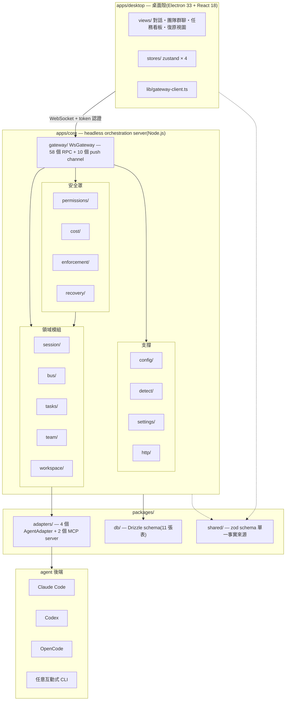
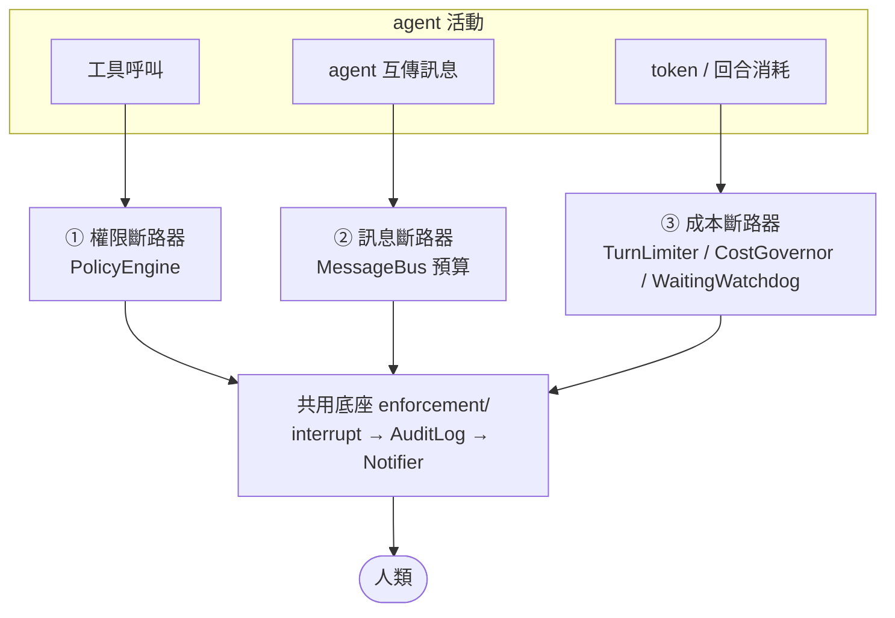
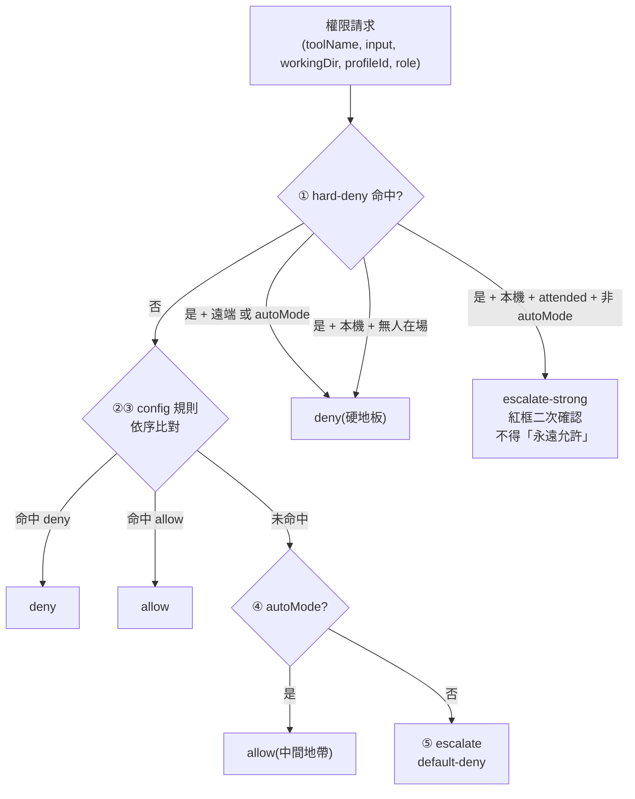
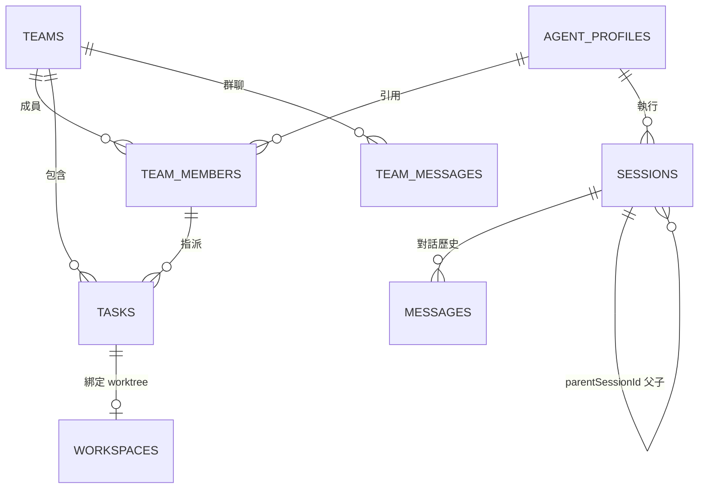
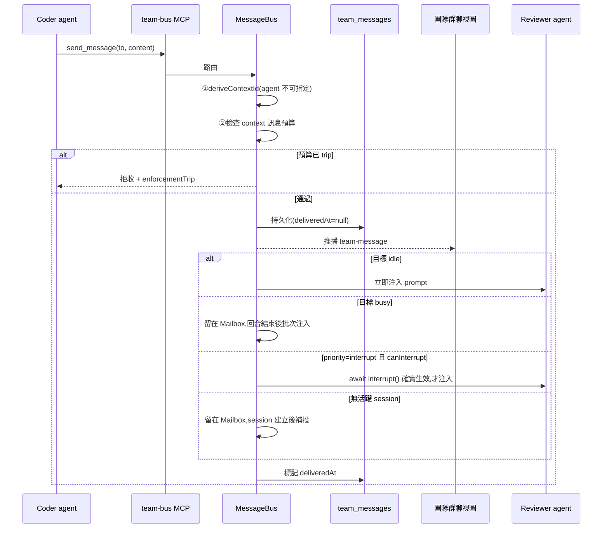
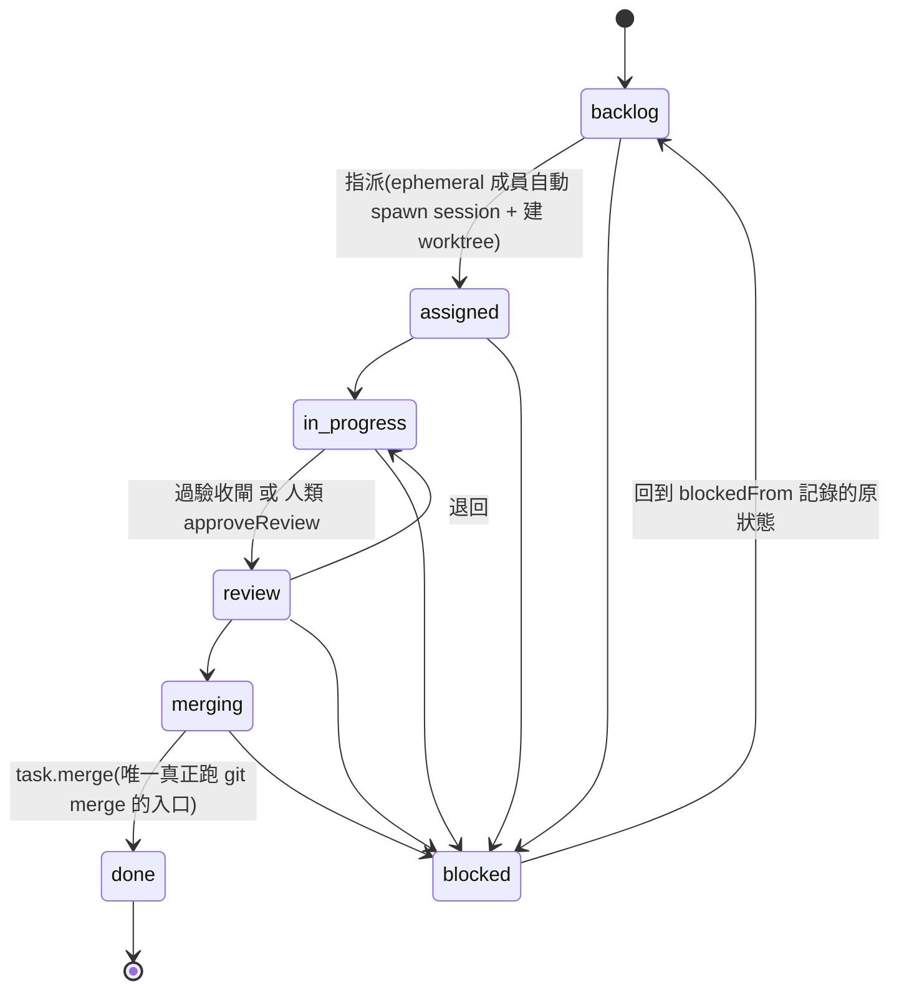

# Deskmony 系統架構

> **文件定位**:這份文件描述 **原始碼目前實際長什麼樣子**,不是願景、不是規劃。
> 每一節都可以在 `apps/`、`packages/` 底下找到對應的檔案;寫不出對應檔案的東西
> 就不寫進來。
>
> | 文件 | 回答什麼 | 權威性 |
> |---|---|---|
> | [`DECISIONS.md`](./DECISIONS.md) | **為什麼**這樣設計(2026-07-24 grilling 定案) | 設計決策的最高權威,與本文件衝突時以它為準 |
> | **本文件** | 程式碼**目前**是什麼形狀 | 實作現況的權威;每次結構性改動應同步更新 |
> | [`LAYER-2-design-spec.md`](./LAYER-2-design-spec.md) → [`LAYER-3-hld/`](./LAYER-3-hld/) → [`LAYER-4-detail-design/`](./LAYER-4-detail-design/) | 逐模組的規格 → 高階設計 → 詳細設計 | 單一模組的細節以對應的 L3/L4 文件為準 |
> | [`DEVLOG.md`](./DEVLOG.md) | 逐輪做了什麼、踩過什麼坑 | 歷史紀錄 |
> | [`ARCHITECTURE-legacy-2026-07.md`](./ARCHITECTURE-legacy-2026-07.md) | 2026-07 的早期概念草圖 | **已封存**,多處與現況不符,見文末附錄 A |

---

## 1. 這個系統在做什麼

Deskmony 讓一隊 AI coding agent **無人值守跑數小時而不失控**。

這句話決定了整個架構的重心。「多 agent 能互聊」只是功能,不是護城河;真正的主軸是
**由三個獨立斷路器組成的安全罩**(見 §5)。專門服務安全罩的四個目錄
(`permissions/`、`cost/`、`enforcement/`、`recovery/`)合計 **2,268 行,佔
`apps/core` 的 23%**;若再算上散在 `session-manager.ts` 的決策編排
(`buildExecContext()`、`checkAndExpireYolo()`、`resolvePermission()`)與
`MessageBus` 的訊息預算閘,實際比重更高。

任何新功能的設計,都必須回答一個問題:**「這條路徑上,三個斷路器分別擋在哪裡?」**

| 能力 | 落地位置 |
|---|---|
| 對話式操作單一 agent(串流、diff、工具呼叫、權限彈窗、內嵌終端) | `apps/desktop/src/views/`、`apps/core/src/session/` |
| 一隊 agent 互相傳訊、共用任務看板 | `apps/core/src/bus/`、`apps/core/src/team/`、`apps/core/src/tasks/` |
| 多種 agent 後端(Claude Code / Codex / OpenCode / 任意 CLI) | `packages/adapters/` |
| 任務級 git worktree 隔離 | `apps/core/src/workspace/` |
| **無人值守安全罩(權限 / 訊息 / 成本三斷路器)** | `apps/core/src/permissions/`、`bus/`、`cost/`、`enforcement/` |
| 崩潰復原(對帳 + 人工分流) | `apps/core/src/recovery/` |
| 遠端存取(瀏覽器/手機),且遠端不可削弱安全罩 | `apps/core/src/gateway/`、`apps/core/src/http/` |

---

## 2. 三層結構



**依賴方向鐵則**:`packages/*` **不得** import `apps/*`。跨界需求一律在
`packages/shared` 宣告介面(`TeamBusPort`、`SubagentPort`、`ClientPresencePort`、
`SessionControlPort`),由 `apps/core/src/index.ts` 在建構時注入實例。

---

## 3. 執行期形態

同一份 `apps/core` 有三種跑法,`apps/desktop` 的 React 程式碼三種情境完全共用:

| 形態 | 怎麼啟動 | Core 在哪 | UI 從哪來 |
|---|---|---|---|
| **桌面 app** | `Deskmony.exe` / `pnpm dev:electron` | Electron main process `spawn()` 的子程序(`apps/desktop/electron/main.ts` 的 `startCore()`) | Electron `loadFile()` 直接從 asar 載入,不經過 core 的 HTTP server |
| **開發模式** | `pnpm dev:core` + `pnpm dev:desktop` + `pnpm dev:electron` | 獨立 process | Vite dev server(:5173) |
| **headless + 瀏覽器/手機** | `pnpm start:core` | 獨立 process | core 自己的靜態 server,**與 WS 共用同一個 port**(`apps/core/src/http/static-server.ts`) |

打包後的 core 子程序用 `ELECTRON_RUN_AS_NODE=1` 借用 Electron 內建的 Node
執行(`better-sqlite3` 原生模組在打包時已由 `@electron/rebuild` 針對 Electron 的
ABI 重編),**終端使用者機器不需要安裝 Node.js**;dev 模式反過來優先用系統 Node
(dev 的 `node_modules` 是系統 Node 的 ABI)。

桌面殼每次啟動會產生一個隨機 `DESKMONY_AUTH_TOKEN`(記憶體 + 環境變數,不落地),
同時傳給 core 子程序與 preload,兩端自動對上。

---

## 4. `apps/core` 模組地圖

以下每一列都對應一個真實檔案。**沒有 Scheduler**(舊文件列過,從未實作)。

### 4.1 領域模組

| 模組 | 檔案 | 職責 |
|---|---|---|
| **SessionManager** | `session/session-manager.ts`(~1.9k 行,最大的單一模組) | session 生命週期與狀態機、adapter 事件消費、權限決策編排、子 agent、context checkpoint、啟動對帳、優雅關閉 |
| **TeamManager** | `team/team-manager.ts` | team / team member CRUD;member 帶 `lifecycle`(persistent / ephemeral) |
| **MessageBus** | `bus/message-bus.ts` | 訊息路由、Mailbox(DB 驅動)、投遞策略、**contextId 綁定與訊息預算斷路器** |
| **TaskService** | `tasks/task-service.ts` | 任務狀態機、指派、機器驗收閘、人類 review 閘、合併並完成 |
| **AcceptanceRunner** | `tasks/acceptance-runner.ts` | 跑任務定義的驗收指令(test / build / typecheck) |
| **WorkspaceManager** | `workspace/workspace-manager.ts` | git worktree 建立 / 合併 / 清理;主幹分支動態偵測 |
| **ProfileStore** | `profiles.ts` | AgentProfile CRUD + 冪等 seed |

### 4.2 安全罩模組

| 模組 | 檔案 | 職責 |
|---|---|---|
| **PolicyEngine** | `permissions/policy-engine.ts` | 權限決策的**唯一**判斷點,default-deny |
| **hard-deny** | `permissions/hard-deny.ts` | 四類內建、config 不可關閉的硬性拒絕 |
| **tool-input** | `permissions/tool-input.ts` | 從工具參數萃取指令 / 路徑 / host;realpath 防逃逸 |
| **PermissionGateway** | `permissions/permission-gateway.ts` | 待決請求的登記簿 + 情境相依逾時(**不做政策判斷**) |
| **TurnLimiter** | `cost/turn-limiter.ts` | 回合硬上限(時間 / 工具呼叫次數),**不依賴 usage** |
| **CostGovernor** | `cost/cost-governor.ts` | usage 權威聚合 + 任務預算 + 每日 kill-switch |
| **WaitingWatchdog** | `cost/waiting-watchdog.ts` | 掛起 session 的 T1 提醒 / T2 資源回收 |
| **AuditLog** | `enforcement/audit-log.ts` | append-only 稽核(`enforcement_audit` 表) |
| **Notifier** | `enforcement/notifier.ts` | 桌面通知 + webhook,批次彙總,靜音時段 |
| **enforcementTrip** | `enforcement/trip.ts` | 三斷路器共用的 trip 流程(interrupt → audit → notify) |
| **RecoveryService** | `recovery/recovery-service.ts` | 崩潰復原的四種人工分流(純組合層,無自動觸發) |

### 4.3 支撐模組

| 模組 | 檔案 | 職責 |
|---|---|---|
| **WsGateway** | `gateway/ws-gateway.ts` | WS 協議、token 認證、rate limiting、`isLocal` 判定、`LOCAL_ONLY_METHODS` 閘門 |
| **static-server** | `http/static-server.ts` | 瀏覽器 UI 靜態檔案(與 WS 共用 port),三層目錄穿越防禦 |
| **loadConfig** | `config/load-config.ts` | 分層合併設定(defaults → config.json → env) |
| **config-file-writer** | `config/config-file-writer.ts` | 安全子集寫回 config.json;`appendPolicyRule()` |
| **AgentDetector** | `detect/agent-detector.ts` | 偵測本機已裝的 agent CLI(固定 allowlist + `execFile` + 逾時) |
| **SettingsStore** | `settings/settings-store.ts` | per-provider 偏好(啟用 / 排序 / env / model),env 對外一律遮罩 |

---

## 5. 安全罩:三斷路器

這是目前整個系統的設計主軸。三條線各自獨立,任一條都能單獨叫停失控。



### 5.1 權限斷路器 — `PolicyEngine.decide()`

**唯一的判斷點**,優先序不可調換:



- **hard-deny 四類**(`hard-deny.ts`,config 永遠不可關閉):worktree 外寫入/刪除、
  讀秘密路徑(`~/.ssh`、`~/.aws`、`~/.deskmony`、`**/.env*`、`**/id_rsa*`、
  `**/credentials`)、危險 git(force-push / 刪遠端分支 / `branch -D`)、
  非白名單外連。
- **YOLO 與 auto 的唯一差別**:YOLO 額外跳過 config 的 `effect:"deny"` 規則。
  **hard-deny 兩者都絕不跳過**。YOLO 30 分鐘後惰性過期(不用計時器)。
- **判不出來一律 escalate**,絕不 allow(`decide()` 最底部的 fallback)。
- **逾時語意情境相依**:有人在場 → 逾時 deny;無人值守 → **不設計時器**,
  session 維持 `waiting` 等人(止損改由 WaitingWatchdog 的 T1/T2 負責)。
- **「永遠允許」的三條紀律**:①寫最窄的規則(`commandEquals` / `pathUnder`)
  ②同時寫進 config.json 與 in-memory(`PolicyEngine.addRule()`),重啟前後行為
  一致 ③escalate-strong 的請求,Core 端**強制忽略** `rememberRule`,即使 client
  硬塞。

### 5.2 訊息斷路器 — `MessageBus`

兩道閘,加在既有投遞策略之前:

1. **contextId 由 Core 推導,agent 不可指定**(`deriveContextId()`)——依發送者
   當下綁定的任務推導,推不出來(沒有進行中的任務)一律拒收。讓被管制者自己
   申報管制欄位,等於讓它換個 id 就能重置預算。
2. **每 context 的 agent 訊息數上限**——超過即 trip + 拒收該 context 後續的
   `send_message` / `broadcast` / `request_review`。

**只斷橫向訊息,不斷縱向工作進度**:`report_status` / `list_teammates` 完全不受
影響。`reportStatus()` / 人類插話產生的訊息 `contextId` 固定填哨兵值 `"legacy"`,
不參與預算。

### 5.3 成本斷路器 — 三個獨立元件

| 元件 | 訊號來源 | 觸發時 | halt 粒度 |
|---|---|---|---|
| **TurnLimiter** | `tool-call` 事件 + 時間(**不依賴 usage**) | 單回合超過 30 分鐘 或 200 次工具呼叫 | **立即 interrupt** |
| **CostGovernor**(任務預算) | `usage` 事件 | 任務累計花費超標 | **只擋後續 prompt**,不打斷已結束的回合 |
| **CostGovernor**(每日 kill-switch) | `usage` 事件 | 當日團隊總花費超標 | **全部 session interrupt** |
| **WaitingWatchdog** T1 | `waiting` 狀態時長 | 掛起 > 6 小時 | 只發提醒,**不 halt** |
| **WaitingWatchdog** T2 | 同上 | 掛起 > 72 小時 | `dispose()` 回收子程序;任務留 blocked、worktree 保留 |

> **TurnLimiter 是最重要的那一個**:實測「Claude Code 經 ACP」**完全不回報
> usage**(連 `used`/`size` 都沒有,是 bridge 的結構性缺口)。對那類後端,
> 任何依賴 usage 的預算都不會生效,回合硬上限是唯一的保護。

### 5.4 共用底座 — `enforcement/`

`enforcementTrip()` 統一處理:(需要時)`await interrupt()` → 寫 `enforcement_audit`
→ `notifier.deliver()`。`interrupt()` 有 10 秒逾時保護,逾時**不假裝已停**——
在 audit 的 `reason` 加上 `-interrupt-unconfirmed` 後綴,讓稽核看得到。

`enforcement_audit` 是系統裡**唯一**的 append-only 表:只 INSERT、永不 UPDATE/
DELETE,記錄權限決策、三斷路器 trip、啟動對帳。**這不是 event sourcing**——
它不記錄 agent 輸出,不能拿來重建狀態(見 DECISIONS D1/D5)。

### 5.5 遠端能力邊界

```
連線建立 → remoteAddress 正規化 → isLocal = 是否 loopback(終生不變)
              ↓
handleMessage() 依序:①schema 驗證 ②認證閘門 ③LOCAL_ONLY_METHODS 檢查
                                                    ↓
                              session.setPermissionMode / config.setFile
                              / profile.create / profile.delete → 遠端一律拒絕
                              permission.resolve 帶 rememberRule → 遠端一律拒絕
```

- **`isLocal` 只由 Core 依連線本身判定,絕不採信 client 自稱。**
- **隧道連線(Tailscale/WireGuard)不是 loopback,一律視為遠端**——刻意的:
  隧道只解決傳輸安全,不代表操作者在本機。
- `gateway.capabilities` 握手回傳四個布林(皆等於 `isLocal`),**只讓 UI 顯示
  正確,不是安全邊界本身**;真正的保證是每次呼叫時的 `LOCAL_ONLY_METHODS` 檢查。
- 綁定安全檢查用**合併後**的 `config.daemon.bindHost`:非 loopback 綁定且未設
  `DESKMONY_AUTH_TOKEN` → **拒絕啟動**。改設定檔一樣擋得住。
- token 用 `crypto.timingSafeEqual()` 常數時間比對;認證失敗 5 次 / 30 秒冷卻。
- **`DESKMONY_AUTH_TOKEN` 刻意不是設定檔欄位**,永遠只從環境變數讀。

---

## 6. Adapter 層

### 6.1 真實介面(`packages/adapters/src/types.ts`)

```ts
interface AgentAdapter {
  capabilities(): AdapterCapabilities;
  spawn(profile, workspace, team?: TeamSpawnContext, resume?: ResumeOptions): Promise<AgentHandle>;
  sendPrompt(handle, prompt: PromptInput): void;
  events(handle): AsyncIterable<AgentEvent>;
  interrupt(handle): Promise<void>;      // resolve = 確實停了(呼叫端必須 await)
  dispose(handle): Promise<void>;
  resolvePermission(handle, requestId, "allow" | "deny"): void;
  setModel(handle, model): Promise<void>;
  setEffort(handle, effort): Promise<void>;
  // 以下為選配 —— 只有特定 adapter 有,不是遺漏
  resolveUserDialog?(handle, requestId, result: DialogAnswer): void;  // 僅 Claude SDK
  writeInput?(handle, data): void;                                     // 僅 PTY
  resize?(handle, cols, rows): void;                                   // 僅 PTY
  getBackendSessionId?(handle): string | undefined;                    // 僅 Claude SDK
}
```

### 6.2 註冊的四個 adapter

`AdapterRegistry` 實際註冊(`apps/core/src/index.ts`)只有這四種 —— **沒有
CodexAdapter**,Codex 走 PTY:

| software | 檔案 | 對接方式 | 涵蓋後端 |
|---|---|---|---|
| `claude-agent-sdk` | `claude-sdk-adapter.ts` | `@anthropic-ai/claude-agent-sdk` 程式內嵌 | Claude Code |
| `acp` | `acp-adapter.ts` | [ACP](https://agentclientprotocol.com) stdio JSON-RPC | Gemini CLI、其他 ACP-native agent |
| `opencode` | `opencode-adapter.ts` | OpenCode headless server 的 HTTP + SSE | OpenCode |
| `pty` | `pty-adapter.ts` | `node-pty` 原始直通 | Claude Code CLI、Codex、Aider、任意互動式 CLI |

**Provider 目錄**(`packages/shared/src/provider-catalog.ts`)是使用者看到的那一層,
七項,每項在型別上保證映射到上面四種之一:

| provider | → software | 備註 |
|---|---|---|
| `claude-agent-sdk` | `claude-agent-sdk` | 內嵌,能力最完整 |
| `claude-cli` | `pty` | 本機安裝的 `claude` CLI |
| `gemini` | `acp` | |
| `opencode` | `opencode` | |
| `codex` | `pty` | **無專屬 adapter** |
| `aider` | `pty` | |
| `custom-pty` | `pty` | 手動輸入 command |

### 6.3 能力探測 — 兩個布林 + 兩個三態

```ts
{ streaming, toolEvents, permissionRequests, diff, interrupt, terminal: boolean,
  usageReporting, contextReporting: "supported" | "unsupported" | "unknown" }
```

| adapter | streaming | toolEvents | permissionRequests | terminal | usageReporting |
|---|---|---|---|---|---|
| claude-agent-sdk | ✅ | ✅ | ✅ | ❌ | `supported` |
| acp | ✅ | ✅ | ✅ | ❌ | **`unknown`** |
| opencode | ✅ | ✅ | ✅ | ❌ | `unsupported` |
| pty | ❌ | ❌ | **❌** | ✅ | `unsupported` |

- **三態存在的理由**:`AcpAdapter` 會正確轉發 `usage_update`,但**送不送由被
  spawn 的那個 agent 決定**——Gemini CLI 可能會送,Claude Code 經 bridge 實測
  一次都不送。靜態布林值表達不了,回報 `true` 是對 UI 說謊。消費端必須靠
  「這條 session 實際收到過沒有」收斂(`resolveCapabilitySupport()`),
  **收斂前不得對使用者宣稱有東西可看**。
- **`permissionRequests: false` 是安全分層,不只是功能缺失**:PTY 是 raw stdin
  直通,**結構上無法被政策引擎管**。在真正的執行沙箱做出來之前,PTY agent
  一律唯讀、不給無人值守的自主權(DECISIONS C7)。刻意**不做** shell 指令攔截
  ——`bash -c` / `$()` / base64 幾秒就能繞過,那是 security theater。

### 6.4 AgentEvent(10 種)

`message-delta` / `tool-call` / `tool-result` / `permission-request` /
`user-dialog-request` / `completed` / `error` / `terminal-data` / `usage` /
`context-usage`。

`usage`(累計計數器,可 diff)與 `context-usage`(瞬時計量表,compaction 後會
變小)**刻意拆成兩個型別**——塞進同一個事件,會讓消費端「新值 < 舊值 = 連線
重置」這條規則對 gauge 誤判。

---

## 7. Gateway 協議

`ws://` 上的 request/response + server push。**58 個 RPC 方法**,分組:

| 分組 | 方法 |
|---|---|
| 連線 | `auth`、`gateway.capabilities` |
| Profile | `profile.list` / `.create` / `.delete` 🔒 |
| Session | `session.list` / `.create` / `.sendPrompt` / `.interrupt` / `.history` / `.delete` / `.setModel` / `.setEffort` / `.setPermissionMode` 🔒 / `.spawnChild` / `.terminalInput` / `.resizeTerminal` |
| 權限 | `permission.resolve`、`dialog.resolve` |
| Team | `team.create` / `.list` / `.addMember` / `.removeMember` / `.messages` / `.teammates` |
| 訊息 | `message.send` / `.sendMessage` / `.broadcast` / `.reportStatus` / `.requestReview` / `.getContextBudget` |
| 任務 | `task.create` / `.list` / `.get` / `.assign` / `.updateStatus` / `.delete` / `.merge` / `.setAcceptance` / `.runAcceptance` / `.approveReview`、`workspace.get` |
| 成本 | `cost.getSummary` |
| 復原 | `recovery.list` / `.continue` / `.takeover` / `.rerun` / `.gitStatus` / `.resolveDirtyWorktree` / `.abandon` |
| 設定 | `settings.getEnabledModels` / `.setEnabledModels` / `.getProviderPrefs` / `.setProviderPrefs`、`config.getEffective` / `config.setFile` 🔒、`env.detectAgents`、`adapter.capabilities` |

🔒 = `LOCAL_ONLY_METHODS`,遠端一律拒絕。

**10 個 push channel**:`session-event`、`session-updated`、`session-list-updated`、
`permission-resolved`、`team-message`、`task-updated`、`task-deleted`、
`enforcement-notification`、`child-result`、`user-dialog-resolved`。

協議定義在 `packages/shared/src/gateway.ts`,zod discriminated union 是
**單一事實來源**——core 與 desktop 兩端都從這裡取型別,不會漂移。錯誤回應除了
`error` 純文字,額外帶 `errorCode`/`errorParams` 供前端 i18n(舊 core 不帶這兩個
欄位時前端退回顯示純文字,不會壞)。

**「多開一個 gateway 入口」的既有慣例**:`message.reportStatus`/`.requestReview`/
`.sendMessage`/`.broadcast`、`team.teammates` 都是「本來只有 MCP 工具能呼叫的
邏輯,多開一個非 agent 入口」——走的是**完全相同**的實作(含所有閘門),不是
繞過閘門的後門,目的是讓 UI 與不依賴真實模型的決定性 e2e 測試能走同一條路徑。

---

## 8. 資料模型(11 張表)



| 表 | 關鍵欄位 | 備註 |
|---|---|---|
| `sessions` | `status`、`model`、`effort`、`parentSessionId`、`interruptedAt`、`lastSeenAt`、`backendSessionId` | status 六態:`idle`/`busy`/`waiting`/`error`/`closed`/`interrupted` |
| `messages` | `role`、`content`、`attachments` | `attachments` 是圖片附件的 JSON,獨立欄位而非塞進 `content` |
| `agent_profiles` | `software`、`providerId`、`model`、`effort`、`env`、`acpConfig`/`ptyConfig`/`opencodeConfig` | 巢狀物件以 JSON 字串存 |
| `teams` / `team_members` | `lifecycle`(`persistent`/`ephemeral`)、`canInterrupt` | |
| `team_messages` | `deliveredAt`(null = 仍在 Mailbox)、`contextId` | **DB 是 Mailbox 的權威來源**,不是記憶體 Map |
| `tasks` | `status`、`assigneeMemberId`、`workspaceId`、`blockedFrom`、`acceptance`、`awaitingHumanReview` | |
| `workspaces` | `baseDir`、`worktreePath`、`branch` | |
| `settings` | `key` / `value`(JSON) | 通用 k/v,新增偏好不需要 schema 遷移 |
| `enforcement_audit` | `kind`、`effect`、`reason`、`payload` | **append-only**,唯一 |
| `usage_rollup` | 複合主鍵 `(scope, scopeId)`,scope ∈ session/task/day | 成本治理的權威持久層 |

**遷移策略**:`CREATE TABLE IF NOT EXISTS` + 逐欄位的冪等 `ensureXxxColumn()`
`ALTER TABLE`(`packages/db/src/client.ts`)——`CREATE TABLE IF NOT EXISTS` 對已
存在的表不會補欄位,所以每個後加的欄位都要有自己的 ensure 函式。

---

## 9. Agent 協作機制

### 9.1 兩個內建 MCP server

只掛在 `ClaudeAgentSdkAdapter`(其餘 adapter 這輪不掛;ACP 協議雖然也能承載
MCP,但需要另外設計橋接):

| MCP server | 工具 | 進 `allowedTools`(自動放行)? |
|---|---|---|
| **`team-bus`** | `send_message`、`broadcast`、`list_teammates`、`report_status`、`request_review` | ✅ 全部(只是傳訊/查詢,不碰檔案或指令) |
| **`subagent`** | `list_profiles`、`list_subagents` | ✅ 純查詢 |
| | `spawn_subagent`、`send_to_subagent` | ❌ **刻意不放**——會讓某個 session 多跑一輪,走 PolicyEngine 的 default-deny 升級給人 |

> 舊文件列過的 `read_inbox` **不存在也不需要**:投遞策略是「idle 立即注入 /
> busy 排隊後自動批次注入」,Mailbox 對 agent 是被動送達,不是拉取式的。

### 9.2 投遞策略(`MessageBus.deliverToMember()`)



**interrupt 必須先 `await` 確實生效才注入** —— `AgentAdapter.interrupt()` 回傳
Promise 的語意就是「resolve 才代表真的停了」,不 await 會與尚未停下的回合競爭。

### 9.3 Session 子 agent(獨立於 team/看板的另一條路)

`sessions.parentSessionId` + `session.spawnChild` RPC + `subagent` MCP server。
子完成時:結果**當 prompt 注入父 session**(父忙就排隊 `pendingIdleInjection`、
父不在就丟棄),同時 push `child-result` 給 UI。子完成後維持 idle,不自動 dispose。

`spawn_subagent` 的 `parentSessionId` 由閉包捕捉 `handle.id`,**agent 不可冒名**;
`send_to_subagent` 有三層檢查(存在 → 是自己的子 → runtime 還活著),任何一層
沒過都明確報錯,不讓 agent 誤以為送成功了。

---

## 10. 任務生命週期



`isValidTransition()` 是**唯一**允許改變 `status` 的判斷式。任意非終態都能進
`blocked`,離開時回到 `blockedFrom` 記錄的那個狀態(不是寫死回 `in-progress`)。

**三道人類把關**:

1. **機器驗收閘(S4)**——任務可帶 `acceptance`(test/build/typecheck/自訂指令)。
   `report_status(done)` 必須先過驗收才進得了 review。
2. **人類 review 閘(S5)**——沒有機器驗收條件、或連續驗收失敗達上限時,任務維持
   `in-progress` 並設 `awaitingHumanReview`,等人類呼叫 `task.approveReview`。
3. **人類批准合併**——`TaskService.mergeAndComplete()`(只被 `task.merge` 呼叫,
   而 `task.merge` 只從任務看板的按鈕觸發)是**整個系統唯一真正執行 `git merge`
   的入口**。`report_status`/`request_review` 對映到 `"done"` 時會被明確擋下
   (`updated: false` + `skippedReason`)。

**agent 沒有任何工具能讓任務自己變成 `done`。**

**合併衝突不留半完成狀態**:`git merge --no-ff` 失敗 → 蒐集衝突檔案清單 →
`git merge --abort` 還原 → 包成 `MergeConflictError` 丟出;任務維持 `merging`,
不 emit 任何 `task-updated`。合併前先確認 `baseDir` 乾淨(`git status --porcelain`
無輸出),髒的話直接拒絕,**不嘗試 stash 等會犧牲使用者資料的自動化**。

**主幹分支動態偵測**:優先 `git symbolic-ref refs/remotes/origin/HEAD` → 檢查本機
`main` → `master` → 都找不到就明確報錯。**不寫死、不猜測。**

**worktree 不在 `done` 時自動清理**——刻意的,讓人事後還能檢視這個任務改了什麼;
只有 `task.delete` 才會 `git worktree remove --force`,並回傳
`hadUncommittedChanges` 旗標讓 UI 事後警告。

**ephemeral 成員生命週期(S8)**:指派任務時自動 spawn session,任務進 `done`
(或被刪除)時自動 dispose。`persistent` 成員不受影響。

---

## 11. 崩潰復原

**核心立場(DECISIONS D1/D3)**:最貴的東西(agent 累積的推理與 context)活在
**後端 agent 行程裡**,不在 DB。replay 重建的是帳本,不是 agent 的腦。所以崩潰
復原的本質是「**對帳 + 人工分流**」,不是 replay。

```
core 啟動
  → reconcileOnStartup()(必須在 gateway.listen() 之前)
  → 上次沒被乾淨關閉的 session 標記 interrupted + 寫 audit
  → 人類打開復原視圖,逐一決定
```

四種分流,**全部要人主動點,RecoveryService 沒有任何背景計時器**:

| 動作 | 語意 | 前提 |
|---|---|---|
| **繼續** | 保有記憶重啟 | 後端真的支援磁碟持久化 session(目前只有 Claude SDK 的 `resume`);Core 端會重新驗證,不採信 client 舊快照 |
| **接手** | 讀摘要重啟 | 一律可用 |
| **重跑** | 從頭來 | **要求 worktree 乾淨**,髒的話明確拋錯,絕不默默在髒 worktree 上重跑 |
| **放棄** | session 標 `closed` | worktree 與任務一律保留(回收 ≠ 丟棄) |

髒 worktree 有強制前置流程:`keep`(建 wip 分支 + commit)或 `discard`
(`reset --hard` + `clean -fd`,**必須帶 `confirmDiscard: true` 二次確認**)。

優雅關閉 5 秒逾時保護:寧可留下孤兒讓下次啟動對帳抓到,也不卡住不關。

---

## 12. 設定系統

三層合併,**這個專案沒有 CLI flags,不需要第四層**:

```
defaults(packages/shared/src/core-config.ts 的 CoreConfigSchema)
  → <DESKMONY_HOME>/config.json
    → 環境變數
```

區塊:`daemon`(port / bindHost / permissionTimeoutMs / authRateLimit)、
`workspace`、`data`、`features`、`log`、`policy`(rules / allowedHosts)、
`notification`、`budget`(task / daily / turn / modelPricing)、`messageBudget`。

**三條安全線**:

1. **`DESKMONY_AUTH_TOKEN` 完全不是設定檔欄位**——設定檔出現疑似 token 欄位一律
   忽略並警告。
2. **`config.setFile` 只允許安全子集**:`workspace.*` / `features.staticDir` /
   `log.level` / `daemon.permissionTimeoutMs` / `daemon.authRateLimit.*`。
   **刻意不允許 `daemon.port` / `daemon.bindHost`**(決定網路曝露面)與 `policy`
   (F4:遠端不可改安全罩)——這些只能手動編輯設定檔。
3. **`validateBindSafety()` 看合併後的值**,防止改設定檔就意外把無認證的 core
   曝露到區網。

寫入後**不做熱重載**,回應明講 `requiresRestart: true`。
`config.getEffective` 回傳每個欄位的來源標記(`default`/`file`/`env`),UI 對
來源是 `env` 的欄位鎖成唯讀(改設定檔不會生效)。

`pnpm generate:config-schema` 由 zod schema 產生 `docs/deskmony.config.v1.json`,
供編輯器自動補全。

**四個獨立的路徑環境變數**(互不連動,本機隔離驗證時必須一起設):
`DESKMONY_HOME`(config.json)、`DESKMONY_DATA_DIR`(SQLite)、
`DESKMONY_WORKSPACE`(預設工作目錄)、`DESKMONY_CORE_PORT`。

---

## 13. 桌面前端

```
apps/desktop/src/
├─ App.tsx              # ViewMode = "session" | "team-chat" | "task-board" 三分頁
├─ i18n.ts              # i18next,4 語系
├─ locales/{en,zh-Hant,ja,es}/   # 每語系約 20 個 namespace
├─ stores/              # zustand × 4:session / team / task / recovery
├─ lib/                 # gateway-client、connection-config、error-i18n、agent-override…
├─ ui/                  # 設計系統:Button / Dialog / Field / Badge / Feedback / icons / theme / hotkeys
└─ views/
   ├─ SessionView + ChatView + chat/{MarkdownMessage,DiffHunkView,CodeBlock,
   │                                 TodoListView,ToolImage,AskUserQuestionWidget}
   ├─ TeamChatView / TaskBoardView / RecoveryView / TerminalView
   ├─ SessionList / CommandPalette(Ctrl+K)/ AutoModeControl
   └─ PermissionModal / ProfileCreateDialog / SettingsDialog / TeamManagementDialog
      └─ 全部經 ModalPortal(createPortal 到 document.body)
```

- **所有全螢幕遮罩彈窗必須經 `ModalPortal`**:CSS 規範下,帶 `transform` 的祖先
  會成為 `position: fixed` 子孫的定位基準——側欄的 `transition-transform` 曾讓
  對話框對齊 256px 寬的側欄而非整個視窗。
- **沒有 Monaco**:diff 是自製的 `DiffHunkView.tsx`,程式碼高亮用
  `react-syntax-highlighter`,markdown 用 `react-markdown` + `remark-gfm`。
- **同一份程式碼跑 Electron 與純瀏覽器**:差別只在連線目標從哪來——Electron 靠
  preload 的 `window.deskmony`,瀏覽器靠 `ConnectScreen` 手動輸入。
- Electron 專屬能力優雅降級:`pickDirectory`(原生選資料夾)、`notify`(原生系統
  通知)、`focusWindow`(OS 層級焦點,`element.focus()` 在 renderer 拿不回被 OS
  拿走的焦點)在瀏覽器一律是 `undefined`,呼叫端已處理。

---

## 14. 建置、打包、測試

| 指令 | 做什麼 |
|---|---|
| `pnpm build` / `pnpm typecheck` | 全 workspace 遞迴 |
| `pnpm dev:core` / `dev:desktop` / `dev:electron` | 開發 |
| `pnpm start:core` | headless 正式啟動 |
| `pnpm package` / `package:dir` | `bundle-core.mjs`(含 `@electron/rebuild`)→ vite build → electron-builder NSIS |

**11 支 e2e 腳本**(`scripts/e2e-*.mjs`),全部直接對獨立的 core process 打 WS
RPC,**從不經過 Electron**:`gateway`(主套件,140+ 項決定性測試)、
`policy-engine`、`auto-mode-yolo`、`message-budget`、`cost-governor`、
`crash-recovery`(+ `graceful-bootstrap`)、`notification`、`agent-lifecycle`、
`lead-gate`、`session-subagents`。

**三個 fake 後端**讓測試不依賴真實模型也不依賴外部 CLI:`fake-acp-agent.mjs`、
`fake-opencode-server.mjs`、`fake-pty-echo.mjs`。e2e 套件切分成
`deterministic` / `model-behavior` 兩組,前者可無條件在 CI 跑。

`package-smoke.mjs` 是打包迴歸測試(驗證 packaged exe 能解析所有依賴)。

---

## 15. 已知缺口(誠實列出)

| 缺口 | 現況 | 影響 |
|---|---|---|
| **PTY 執行沙箱** | 未實作 | PTY tier 結構上無法執行權限政策,因此一律唯讀、不給無人值守自主權(DECISIONS C7) |
| **LLM lead / orchestrator** | 未實作 | 任務拆解目前純人工;`TaskService` 是確定性的,沒有會提議拆解的 LLM |
| **mid-turn 成本熔斷** | 未實作 | 目前唯一會發 `usage` 的 adapter 在回合結束前才發一次,沒有可觀測的「回合進行中收到 usage」情境可驗證,強行分岔只是憑空編造行為 |
| **ACP / OpenCode / PTY 掛載 MCP** | 未實作 | 只有 Claude SDK 成員能**主動**呼叫傳訊工具;但**接收端是跨 software 的**(注入 prompt 對任何 session 都有效) |
| **`session ↔ team member` 持久化** | 只在記憶體 | `sessions` 表沒有欄位記錄這條 session 屬於哪個 team member,崩潰重啟後 `RecoveryService` 只能用 `agentProfileId` 盡力反查(假設一個 profile 只被一個 member 引用) |
| **遠端能力矩陣的細粒度版本** | 部分 | `LOCAL_ONLY_METHODS` 已擋住 auto/YOLO/policy/profile;DECISIONS F3 列的其餘項目(改預算上限、改綁定介面)尚未有對應的可遠端呼叫方法,因此暫時無需額外閘門 |
| **`profile.update`** | 未實作 | 只能建立/刪除;實作後必須同步加進 `LOCAL_ONLY_METHODS` |
| **provider env 的靜態加密** | 未做 | 對外(gateway)一律遮罩成 `"***"`,但本機 SQLite 檔案本身是明文(與 Paseo 把金鑰寫進 `~/.paseo/config.json` 同一類取捨) |
| **非 Windows 打包** | 未做 | core 與 adapters 是純 Node/TypeScript,主要是打包工程而非程式碼問題 |

---

## 附錄 A:舊版 ARCHITECTURE.md 被更正的宣稱

封存於 [`ARCHITECTURE-legacy-2026-07.md`](./ARCHITECTURE-legacy-2026-07.md)。
以下是它與現況不符之處,列出來避免有人再引用:

| 舊文件的宣稱 | 實際情況 |
|---|---|
| 「Event Sourcing:一切皆事件,可回放、可重建 UI 狀態」 | ❌ 當前狀態 CRUD。唯一的 append-only 是 `enforcement_audit`,只記權限決策/trip/對帳,**不記 agent 輸出、不能重建狀態**(DECISIONS D1/D5) |
| `Scheduler`(排程/自動循環)列在核心模組表與架構圖 | ❌ **從未實作**,沒有任何對應檔案 |
| `CodexAdapter`(`codex proto` / exec JSON) | ❌ 不存在。Codex 映射到 `pty` |
| 「殼:建議 Tauri 2…或 Electron」 | ✅ 已定案 **Electron 33**,沒有 Tauri 程式碼 |
| 「Monaco Editor — diff 檢視與檔案預覽」 | ❌ 無 Monaco。自製 `DiffHunkView` + `react-syntax-highlighter` |
| 「虛擬列表(聊天串流訊息量大)」 | ❌ 未實作 |
| `read_inbox` MCP 工具 | ❌ 不存在也不需要(投遞是推播式,不是拉取式) |
| 「ACP 優先,一個協議吃多家,省下逐家客製」 | ⚠️ DECISIONS B3 明確推翻:最肥的 adapter(OpenCode)是全客製;ACP 只是剛好覆蓋兩家的其中一個 adapter |
| adapter set 含 Gemini CLI / Antigravity 為核心 | ⚠️ 核心 set 收斂為 {Claude Code, Codex, OpenCode},**放棄 Antigravity**(DECISIONS B1) |
| 「PermissionGateway:UI 彈窗或依 policy 自動核可」 | ⚠️ 職責已拆:`PermissionGateway` 只是待決登記簿 + 逾時(96 行);政策判斷在 `PolicyEngine` |
| SQLite「teams、agent_profiles、sessions、tasks、messages、settings」 | ⚠️ 實際 **11 張表**,另有 `team_members`、`team_messages`、`workspaces`、`enforcement_audit`、`usage_rollup` |
| SESSION status「idle/busy/waiting/error」 | ⚠️ 實際六態,另有 `closed`、`interrupted`(S6 崩潰對帳需要) |
| 路線圖只到 M5 | ⚠️ M6 與 S1–S12 系列(安全罩全部)皆已完成 |
| §1「核心能力」表完全沒提安全罩 | ⚠️ 安全罩現在是**主軸**,佔 `apps/core` 一半以上程式碼 |

---

## 附錄 B:舊章節編號對照表

原始碼裡約有 **99 處註解**引用舊版的章節編號(例如「見 ARCHITECTURE.md 3.3 節」)。
**刻意不去改那 99 處程式碼**——為了一次文件重編號而動生產程式碼,風險遠大於效益。
改用這張對照表:看到舊編號,查這裡即可對應到本文件的新章節。

| 舊編號 | 舊標題 | → 本文件 | 引用次數 |
|---|---|---|---|
| 3.1 節 | UI Layer(桌面殼 + 前端) | [§13 桌面前端](#13-桌面前端) | 4 |
| 3.2 節 | Gateway | [§7 Gateway 協議](#7-gateway-協議) | 9 |
| 3.3 節 | Orchestration Core | [§4 模組地圖](#4-appscore-模組地圖) | 49 |
| 3.4 節 | Agent Adapter Layer | [§6 Adapter 層](#6-adapter-層) | 37 |
| 3.5 節 | Infrastructure | [§8 資料模型](#8-資料模型11-張表) + [§9.1 MCP server](#91-兩個內建-mcp-server) | 6 |
| 4.1 節 | team-bus MCP 工具清單 | [§9.1 兩個內建 MCP server](#91-兩個內建-mcp-server) | 28 |
| 4.2 節 | 訊息投遞策略 | [§9.2 投遞策略](#92-投遞策略messagebusdelivertomember) | 21 |
| 4.3 節 | 訊息流時序圖 / `AgentAdapter` 介面 / `AgentEvent` | [§6.1 真實介面](#61-真實介面packagesadapterssrctypests) + [§6.4 AgentEvent](#64-agentevent10-種) + [§9.2](#92-投遞策略messagebusdelivertomember) | 24 |
| 第 5 節 | 任務協作流程 | [§10 任務生命週期](#10-任務生命週期) | 6 |
| 第 6 節 | 資料模型 ERD | [§8 資料模型](#8-資料模型11-張表) | — |
| 第 8 節 | 專案目錄結構 | [§4 模組地圖](#4-appscore-模組地圖) + [§13 桌面前端](#13-桌面前端) | — |
| 第 9 節 | 開發路線圖 | **已移除** —— 路線圖不屬於架構文件,歷史見 [`DEVLOG.md`](./DEVLOG.md) | — |
| 第 10 節 | 關鍵設計決策摘要 | **已移除** —— 設計決策的權威是 [`DECISIONS.md`](./DECISIONS.md),不再在兩處各自表述 | — |

> **新增註解時請直接引用新章節**(例如「見 ARCHITECTURE.md §5.1」),不要沿用舊編號。
