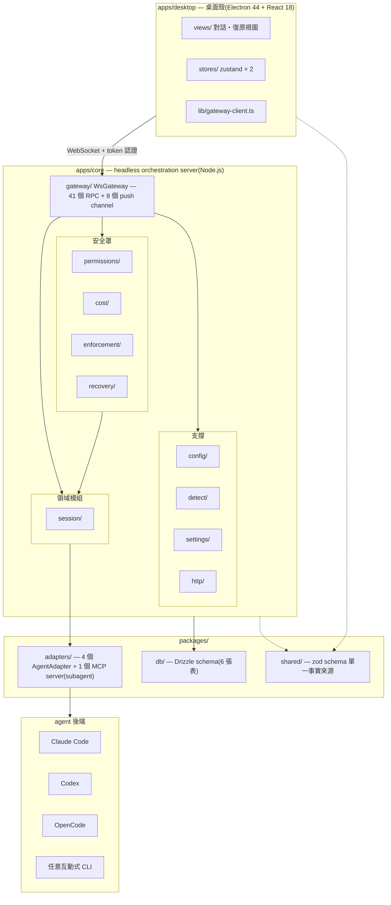
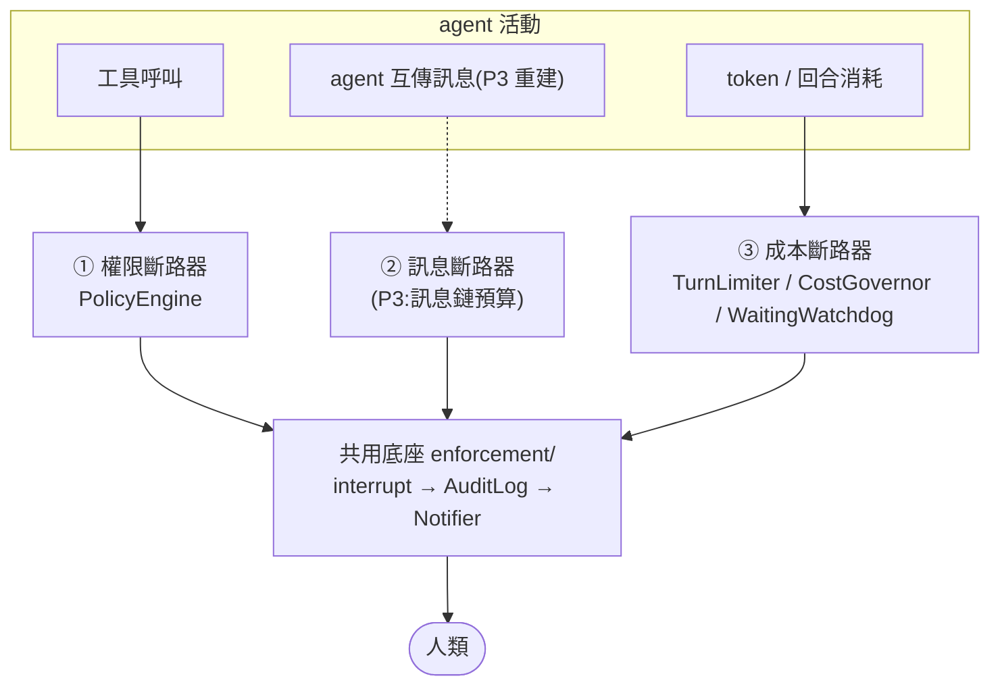
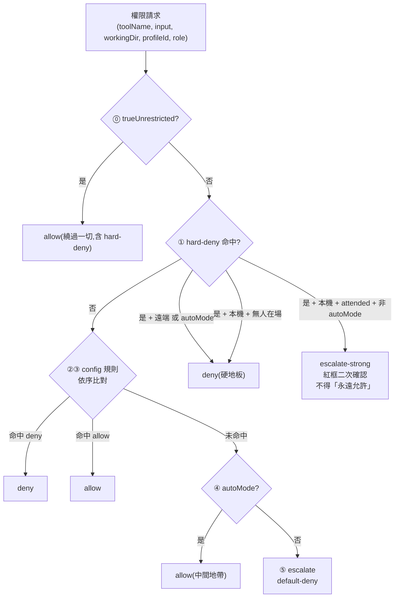
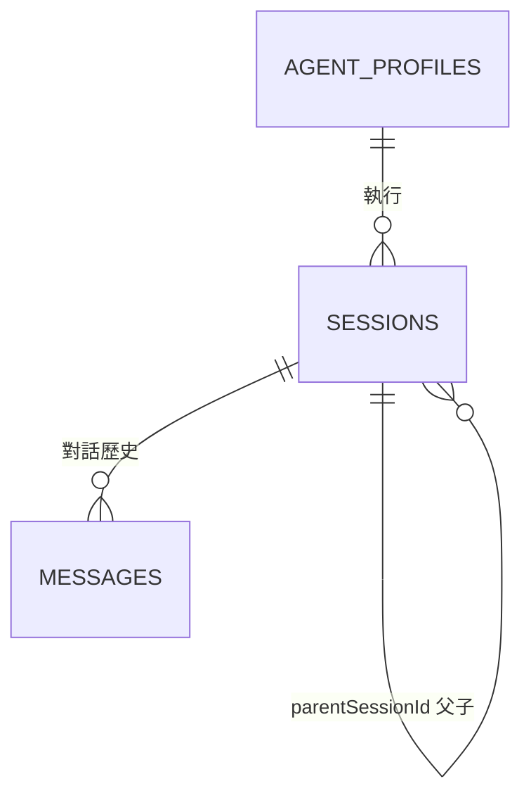

# Deskmony 系統架構

> **文件定位**:這份文件描述 **原始碼目前實際長什麼樣子**,不是願景、不是規劃。
> 每一節都可以在 `apps/`、`packages/` 底下找到對應的檔案;寫不出對應檔案的東西
> 就不寫進來。
>
> | 文件 | 回答什麼 | 權威性 |
> |---|---|---|
> | [`DECISIONS.md`](./DECISIONS.md) | **為什麼**這樣設計(2026-07-24 grilling 定案) | 設計決策的最高權威,與本文件衝突時以它為準 |
> | **本文件** | 程式碼**目前**是什麼形狀 | 實作現況的權威;每次結構性改動應同步更新 |
> | [`LAYER-2-design-spec.md`](./LAYER-2-design-spec.md) → [`LAYER-3-hld/`](./LAYER-3-hld/) → [`LAYER-4-detail-design/`](./LAYER-4-detail-design/) | 逐模組的規格 → 高階設計 → 詳細設計 | 單一模組的細節以對應的 L3/L4 文件為準 |
> | [`DEVLOG.md`](./DEVLOG.md) | 逐輪做了什麼、踩過什麼坑 | 歷史紀錄 |
> | [`ARCHITECTURE-legacy-2026-07.md`](./ARCHITECTURE-legacy-2026-07.md) | 2026-07 的早期概念草圖 | **已封存**,多處與現況不符,見文末附錄 A |
>
> ⚠️ **2026-10-02(P1)**:team / 任務 / 看板 / lead / 驗收閘 / message-bus / 任務
> worktree **已整套移除**(見 [`DECISIONS.md` §H](./DECISIONS.md)與
> [`simplify-agents-sessions_detail.md`](./LAYER-4-detail-design/simplify-agents-sessions_detail.md)
> §P1)。本文件已改成現況;原本描述這些功能的章節(§5.2、§9.2、§10)只留一句
> 移除說明,章節編號不變(程式碼註解與附錄 B 仍引用這些編號)。profile 移除與
> session 互傳訊息是後續階段(P2/P3),**尚未實作**,所以 profile、子 agent 工具
> 在本文件裡仍照現況描述。

---

## 1. 這個系統在做什麼

Deskmony 讓一隊 AI coding agent **無人值守跑數小時而不失控**。

這句話決定了整個架構的重心。「多 agent 能互聊」只是功能,不是護城河;真正的主軸是
**由三個獨立斷路器組成的安全罩**(見 §5)。專門服務安全罩的四個目錄
(`permissions/`、`cost/`、`enforcement/`、`recovery/`)合計 **1,322 行實際
程式碼(不含空行與註解),佔 `apps/core` 的 29%**(2026-10-02 移除 team/任務/
訊息匯流等模組後重新計算,`apps/core` 實際程式碼共 4,566 行;移除前是 1,545 行、
22%);若再算上
`session-permission-coordinator.ts`(`buildExecContext()`、`checkAndExpireYolo()`)與
`session-manager.ts` 的 `resolvePermission()`,實際比重更高。

> ⚠️ 這個數字刻意扣掉註解。這份 codebase 有約三成是註解,算進去會得到比較好看的
> 數字 —— 但註解擋不下任何一次工具呼叫。**行數本身證明不了安全性**,
> 真正的證據是 §5 的決策流程與 `scripts/e2e-hard-deny.mjs` 對四類 hard-deny 的
> 逐條斷言(那支測試是 2026-09-04 新增的,在此之前四類裡有三類零覆蓋)。

任何新功能的設計,都必須回答一個問題:**「這條路徑上,三個斷路器分別擋在哪裡?」**

| 能力 | 落地位置 |
|---|---|
| 對話式操作單一 agent(串流、diff、工具呼叫、權限彈窗、內嵌終端) | `apps/desktop/src/views/`、`apps/core/src/session/` |
| 子 agent(一個 session 底下開另一個 session) | `apps/core/src/session/`、`packages/adapters/src/subagent-mcp.ts` |
| 多種 agent 後端(Claude Code / Codex / OpenCode / 任意 CLI) | `packages/adapters/` |
| ~~一隊 agent 互相傳訊、共用任務看板、任務級 git worktree 隔離~~ | **已於 2026-10-02 移除**,見 [`DECISIONS.md` §H](./DECISIONS.md);session 互傳訊息由 P3 重新設計 |
| **無人值守安全罩(權限 / 成本斷路器;訊息斷路器待 P3 重建)** | `apps/core/src/permissions/`、`cost/`、`enforcement/` |
| 崩潰復原(對帳 + 人工分流) | `apps/core/src/recovery/` |
| 遠端存取(瀏覽器/手機)——安全罩機制本身遠端關不掉,但 2026-08-25 起遠端可與本機同權操作 auto/YOLO 與允許清單(見 §5.5) | `apps/core/src/gateway/`、`apps/core/src/http/` |

---

## 2. 三層結構


```mermaid
flowchart TB
    subgraph SHELL["apps/desktop — 桌面殼(Electron 44 + React 18)"]
        direction LR
        Views["views/ 對話・復原視圖"]
        Stores["stores/ zustand × 2"]
        GWC["lib/gateway-client.ts"]
    end

    subgraph CORE["apps/core — headless orchestration server(Node.js)"]
        direction TB
        GW["gateway/ WsGateway — 41 個 RPC + 8 個 push channel"]
        subgraph DOMAIN["領域模組"]
            direction LR
            Sess["session/"]
        end
        subgraph SHIELD["安全罩"]
            direction LR
            Perm["permissions/"]
            Cost["cost/"]
            Enf["enforcement/"]
            Rec["recovery/"]
        end
        subgraph SUPPORT["支撐"]
            direction LR
            Cfg["config/"]
            Det["detect/"]
            Set["settings/"]
            Http["http/"]
        end
    end

    subgraph PKG["packages/"]
        Adapters["adapters/ — 4 個 AgentAdapter + 1 個 MCP server(subagent)"]
        Shared["shared/ — zod schema 單一事實來源"]
        Db["db/ — Drizzle schema(6 張表)"]
    end

    subgraph BACKENDS["agent 後端"]
        direction LR
        CC["Claude Code"]
        CDX["Codex"]
        OCS["OpenCode"]
        ANY["任意互動式 CLI"]
    end

    SHELL -- "WebSocket + token 認證" --> GW
    GW --> DOMAIN
    GW --> SHIELD
    GW --> SUPPORT
    DOMAIN --> Adapters
    SHIELD --> DOMAIN
    CORE --> Db
    Adapters --> BACKENDS
    SHELL -.-> Shared
    CORE -.-> Shared
```

**依賴方向鐵則**:`packages/*` **不得** import `apps/*`。跨界需求一律在
`packages/shared` 宣告介面(`SubagentPort`、`ClientPresencePort`、
`SessionControlPort`),由 `apps/core/src/index.ts` 在建構時注入實例。

---

## 3. 執行期形態

同一份 `apps/core` 有三種跑法,`apps/desktop` 的 React 程式碼三種情境完全共用:

| 形態 | 怎麼啟動 | Core 在哪 | UI 從哪來 |
|---|---|---|---|
| **桌面 app** | `Deskmony.exe` / `pnpm dev:electron` | Electron main process `spawn()` 的子程序(`apps/desktop/electron/main.ts` 的 `startCore()`) | Electron `loadFile()` 直接從 asar 載入,不經過 core 的 HTTP server |
| **開發模式** | `pnpm dev:core` + `pnpm dev:desktop` + `pnpm dev:electron` | 獨立 process | Vite dev server(:5173) |
| **headless + 瀏覽器/手機** | `pnpm start:core` | 獨立 process | core 自己的靜態 server,**與 WS 共用同一個 port**(`apps/core/src/http/static-server.ts`) |

打包後的 core 子程序用 `ELECTRON_RUN_AS_NODE=1` 借用 Electron 內建的 Node
執行(`better-sqlite3` 原生模組在打包時已由 `@electron/rebuild` 針對 Electron 的
ABI 重編),**終端使用者機器不需要安裝 Node.js**;dev 模式反過來優先用系統 Node
(dev 的 `node_modules` 是系統 Node 的 ABI)。

桌面殼啟動時依序解析 `DESKMONY_AUTH_TOKEN`:環境變數 → 本機以 Electron
`safeStorage` 加密保存的值 → 現生成的隨機值(三選一,**必有其一**,見
`electron/main.ts` 的 `resolveAuthToken()`)。加密保存那條是 2026-09-02 新增的
(Settings「遠端存取」面板可複製 / 自訂 / 重新產生),讓遠端 client 有一組穩定的
token 可用;它落在獨立的加密檔案,**不會**進 `~/.deskmony/config.json`。
決定出來的 token
同時傳給 core 子程序與 preload,兩端自動對上。

---

## 4. `apps/core` 模組地圖

以下每一列都對應一個真實檔案。**沒有 Scheduler**(舊文件列過,從未實作)。

### 4.1 領域模組

| 模組 | 檔案 | 職責 |
|---|---|---|
| **SessionManager** | `session/session-manager.ts`(~1.8k 行,仍是最大的單一模組) | session 生命週期與狀態機、adapter 事件消費、子 agent、啟動對帳、優雅關閉 |
| **SessionPermissionCoordinator** | `session/session-permission-coordinator.ts` | 每個 session 的暫態權限模式(auto / YOLO / 真.無限制)、政策規則 CRUD、`ExecContext` 組裝、YOLO 惰性過期。2026-09-04 從 SessionManager 抽出的第一塊(見該檔案頂端說明);SessionManager 保留同名的薄委派,gateway 呼叫端不受影響 |
| **ProfileStore** | `profiles.ts` | AgentProfile CRUD + 冪等 seed(P2 會移除) |

> 2026-10-02 已移除:`TeamManager`(`team/`)、`MessageBus`(`bus/`)、`TaskService` 與
> `AcceptanceRunner`(`tasks/`)、`WorkspaceManager`(`workspace/`)——見
> [`DECISIONS.md` §H](./DECISIONS.md)。SessionManager 原有的 persistent 成員
> context checkpoint 重啟也因此失去觸發條件,一併移除。

### 4.2 安全罩模組

| 模組 | 檔案 | 職責 |
|---|---|---|
| **PolicyEngine** | `permissions/policy-engine.ts` | 權限決策的**唯一**判斷點,default-deny |
| **hard-deny** | `permissions/hard-deny.ts` | 四類內建、config 不可關閉的硬性拒絕 |
| **tool-input** | `permissions/tool-input.ts` | 從工具參數萃取指令 / 路徑 / host;realpath 防逃逸 |
| **PermissionGateway** | `permissions/permission-gateway.ts` | 待決請求的登記簿 + 情境相依逾時(**不做政策判斷**) |
| **TurnLimiter** | `cost/turn-limiter.ts` | 回合硬上限(時間 / 工具呼叫次數),**不依賴 usage** |
| **CostGovernor** | `cost/cost-governor.ts` | usage 權威聚合 + 每日 kill-switch |
| **WaitingWatchdog** | `cost/waiting-watchdog.ts` | 掛起 session 的 T1 提醒 / T2 資源回收 |
| **AuditLog** | `enforcement/audit-log.ts` | append-only 稽核(`enforcement_audit` 表) |
| **Notifier** | `enforcement/notifier.ts` | 桌面通知 + webhook,批次彙總,靜音時段 |
| **enforcementTrip** | `enforcement/trip.ts` | 三斷路器共用的 trip 流程(interrupt → audit → notify) |
| **RecoveryService** | `recovery/recovery-service.ts` | 崩潰復原的三種人工分流:繼續 / 接手 / 放棄(純組合層,無自動觸發) |

### 4.3 支撐模組

| 模組 | 檔案 | 職責 |
|---|---|---|
| **WsGateway** | `gateway/ws-gateway.ts` | WS 協議、token 認證、rate limiting、`isLocal` 判定、`LOCAL_ONLY_METHODS` 閘門 |
| **static-server** | `http/static-server.ts` | 瀏覽器 UI 靜態檔案(與 WS 共用 port),三層目錄穿越防禦 |
| **loadConfig** | `config/load-config.ts` | 分層合併設定(defaults → config.json → env) |
| **config-file-writer** | `config/config-file-writer.ts` | 安全子集寫回 config.json;`appendPolicyRule()` |
| **AgentDetector** | `detect/agent-detector.ts` | 偵測本機已裝的 agent CLI(固定 allowlist + `execFile` + 逾時) |
| **child-registry** | `packages/adapters/src/child-registry.ts` | 跨 core 重啟的孤兒**行程**回收(pid + 建立時間記錄,下次啟動比對後才殺)|
| **SettingsStore** | `settings/settings-store.ts` | per-provider 偏好(啟用 / 排序 / env / model),env 對外一律遮罩 |

---

## 5. 安全罩:三斷路器

這是目前整個系統的設計主軸。三條線各自獨立,任一條都能單獨叫停失控。

> ⚠️ **現況(2026-10-02,P1 之後、P3 之前)**:② 訊息斷路器隨 `MessageBus` 移除,
> 目前**沒有實作**——P3 會以「每條訊息鏈」的預算重建(沿用 `messageBudget` 設定鍵,
> 見 [`DECISIONS.md` §H](./DECISIONS.md))。在那之前 agent 之間沒有任何自動傳訊
> 通道(子 agent 的 `spawn_subagent`/`send_to_subagent` 走權限流程,不算橫向
> 訊息),所以沒有可失控的訊息迴圈。


```mermaid
flowchart TB
    subgraph AGENTS["agent 活動"]
        Tool["工具呼叫"]
        Msg["agent 互傳訊息(P3 重建)"]
        Usage["token / 回合消耗"]
    end

    Tool --> P["① 權限斷路器<br/>PolicyEngine"]
    Msg -.-> M["② 訊息斷路器<br/>(P3:訊息鏈預算)"]
    Usage --> C["③ 成本斷路器<br/>TurnLimiter / CostGovernor / WaitingWatchdog"]

    P --> BASE["共用底座 enforcement/<br/>interrupt → AuditLog → Notifier"]
    M --> BASE
    C --> BASE
    BASE --> H(["人類"])
```

### 5.1 權限斷路器 — `PolicyEngine.decide()`

**唯一的判斷點**,優先序不可調換:


```mermaid
flowchart TB
    Req["權限請求<br/>(toolName, input, workingDir, profileId, role)"] --> TU{"⓪ trueUnrestricted?"}
    TU -- 是 --> Allow0["allow(繞過一切,含 hard-deny)"]
    TU -- 否 --> HD{"① hard-deny 命中?"}
    HD -- 否 --> Rules{"②③ config 規則<br/>依序比對"}
    HD -- "是 + 遠端 或 autoMode" --> Deny["deny(硬地板)"]
    HD -- "是 + 本機 + attended + 非 autoMode" --> Strong["escalate-strong<br/>紅框二次確認<br/>不得「永遠允許」"]
    HD -- "是 + 本機 + 無人在場" --> Deny
    Rules -- "命中 deny" --> Deny2["deny"]
    Rules -- "命中 allow" --> Allow["allow"]
    Rules -- "未命中" --> Auto{"④ autoMode?"}
    Auto -- 是 --> Allow2["allow(中間地帶)"]
    Auto -- 否 --> Esc["⑤ escalate<br/>default-deny"]
```

- **hard-deny 四類**(`hard-deny.ts`,config 永遠不可關閉):worktree 外寫入/刪除、
  讀秘密路徑(`~/.ssh`、`~/.aws`、`~/.deskmony`、`**/.env*`、`**/id_rsa*`、
  `**/credentials`)、危險 git(force-push / 刪遠端分支 / `branch -D`)、
  非白名單外連。
- **YOLO 與 auto 的唯一差別**:YOLO 額外跳過 config 的 `effect:"deny"` 規則。
  **hard-deny 兩者都絕不跳過**。YOLO 30 分鐘後惰性過期(不用計時器)。
- **判不出來一律 escalate**,絕不 allow(`decide()` 最底部的 fallback)。
- **逾時語意情境相依**:有人在場 → 逾時 deny;無人值守 → **不設計時器**,
  session 維持 `waiting` 等人(止損改由 WaitingWatchdog 的 T1/T2 負責)。
- **「永遠允許」的三條紀律**:①寫最窄的規則(`commandEquals` / `pathUnder`)
  ②同時寫進 config.json 與 in-memory(`PolicyEngine.addRule()`),重啟前後行為
  一致 ③escalate-strong 的請求,Core 端**強制忽略** `rememberRule`,即使 client
  硬塞。
- ⚠️ **2026-08-25 新增第 ⓪ 步**(見 [`DECISIONS.md` §G](./DECISIONS.md)):
  `ctx.trueUnrestricted` 為真時,`decide()` 一開頭就直接 `allow`,連
  `checkHardDeny()` 都不呼叫——這是**唯一**能繞過 hard-deny 的路徑。只有該
  session 已經是 `"auto-accept-all"`(YOLO)且額外經 `session.setTrueUnrestricted`
  顯式開啟時才會是真,本機與遠端皆可觸發,啟用當下強制 UI 打字確認 + 桌面
  通知 + 稽核記錄。

### 5.2 訊息斷路器 — 已於 2026-10-02 移除(P3 重建)

原本的 `MessageBus` 訊息預算(contextId 由 Core 推導、每 context 訊息數上限)已隨
team / 任務 / 看板一併移除,見 [`DECISIONS.md` §H](./DECISIONS.md)(A5 改寫)。
`config.messageBudget`(`maxMessagesPerContext` / `warnAtPercent`)設定鍵**保留**,
P3 的「每條訊息鏈預算」沿用它,見
[`simplify-agents-sessions_detail.md`](./LAYER-4-detail-design/simplify-agents-sessions_detail.md) §P3.4。
在 P3 之前這個設定鍵沒有消費者。

### 5.3 成本斷路器 — 三個獨立元件

| 元件 | 訊號來源 | 觸發時 | halt 粒度 |
|---|---|---|---|
| **TurnLimiter** | `tool-call` 事件 + 時間(**不依賴 usage**) | 單回合超過 30 分鐘 或 200 次工具呼叫 | **立即 interrupt** |
| **CostGovernor**(每日 kill-switch) | `usage` 事件 | 當日總花費超標 | **全部 session interrupt**,且擋後續 prompt |
| **WaitingWatchdog** T1 | `waiting` 狀態時長 | 掛起 > 6 小時 | 只發提醒,**不 halt** |
| **WaitingWatchdog** T2 | 同上 | 掛起 > 72 小時 | `dispose()` 回收子程序;對話紀錄保留 |

> 2026-10-02:原本還有「CostGovernor(任務預算)」一列(任務累計花費超標 → 只擋後續
> prompt),隨 task 移除;`budget.task` 設定鍵一併拿掉(既有 config.json 帶這個
> 鍵時只會得到「未知欄位」警告並被忽略)。

> **TurnLimiter 是最重要的那一個**:實測「Claude Code 經 ACP」**完全不回報
> usage**(連 `used`/`size` 都沒有,是 bridge 的結構性缺口)。對那類後端,
> 任何依賴 usage 的預算都不會生效,回合硬上限是唯一的保護。

### 5.4 共用底座 — `enforcement/`

`enforcementTrip()` 統一處理:(需要時)`await interrupt()` → 寫 `enforcement_audit`
→ `notifier.deliver()`。`interrupt()` 有 10 秒逾時保護,逾時**不假裝已停**——
在 audit 的 `reason` 加上 `-interrupt-unconfirmed` 後綴,讓稽核看得到。

`enforcement_audit` 是系統裡**唯一**的 append-only 表:只 INSERT、永不 UPDATE/
DELETE,記錄權限決策、三斷路器 trip、啟動對帳。**這不是 event sourcing**——
它不記錄 agent 輸出,不能拿來重建狀態(見 DECISIONS D1/D5)。

### 5.5 遠端能力邊界

```
連線建立 → remoteAddress 正規化 → isLocal = 是否 loopback(終生不變)
              ↓
handleMessage() 依序:①schema 驗證 ②認證閘門 ③LOCAL_ONLY_METHODS 檢查
                                                    ↓
    ③ config.setFile / profile.create / profile.delete / settings.setProviderPrefs
                              → 遠端一律拒絕
```

- ⚠️ **2026-09-04 新增(稽核修補)**:清單另加入 `settings.setProviderPrefs`。它與
  原本那三個同類(都是「改變 core 自己或子程序怎麼被啟動」的設定面操作),但更要
  緊的是它**完全不經過工具呼叫,因此也完全不經過政策引擎**——這與 §G 翻案開放給
  遠端的那些(切 auto/YOLO、編 allowlist)有本質差別:那些操作再寬,每一次執行仍要
  過 `PolicyEngine.decide()`,仍留在稽核紀錄裡。
  - `settings.setProviderPrefs`:`ProviderPrefs.env` 無 key 白名單,會被併進
    **每一個** agent 子程序的環境變數(設一個 `NODE_OPTIONS` 就能在任何工具
    呼叫發生**之前**取得執行權)。
  回歸測試見 `scripts/e2e-auto-mode-yolo.mjs` 的 E-3b-3(同時驗證「遠端被拒」
  與「本機仍可用」)。
  > 同一輪稽核還曾加入 `task.setAcceptance`/`task.runAcceptance`(驗收指令走
  > `shell: true`)與一道**欄位層級**閘門(擋 `task.create` 挾帶 `acceptance`);
  > 這兩者隨 task 於 2026-10-02 一併移除,見 [`DECISIONS.md` §H](./DECISIONS.md)。

- **`isLocal` 只由 Core 依連線本身判定,絕不採信 client 自稱。**
- **隧道連線(Tailscale/WireGuard)不是 loopback,一律視為遠端**——刻意的:
  隧道只解決傳輸安全,不代表操作者在本機。
- ⚠️ **2026-08-25 修訂**(見 [`DECISIONS.md` §G](./DECISIONS.md)):上面這張圖
  原本還列著 `session.setPermissionMode`(已從 `LOCAL_ONLY_METHODS` 移除)與
  一道獨立的「`permission.resolve` 帶 `rememberRule` 遠端一律拒絕」檢查
  (已整條移除)。這是使用者明確決定的翻案,不是疏漏——遠端與本機現在對
  「切 session 的 auto/YOLO 模式」「編輯政策允許清單」完全同權。新增的
  `session.setTrueUnrestricted`/`policy.addRule`/`policy.removeRule`/
  `policy.listRules` 四個方法**刻意不列入** `LOCAL_ONLY_METHODS`。
  `session.setTrueUnrestricted` 改用另一種把關:不看連線類型,而是伺服器端
  檢查該 session 是否已經處於 `"auto-accept-all"`(YOLO)——見 §5.1 第 ⓪ 步。
- `gateway.capabilities` 握手回傳六個布林:`canToggleAuto`/`canEnableYolo`/
  `canEditPolicy`/`canEnableTrueUnrestricted` **恆為 `true`**(2026-08-25 起
  不再等於 `isLocal`);`canManageProfiles` 仍等於 `isLocal`,未變動;新增
  `isRemoteConnection`(`!isLocal`,純顯示用)。**這些欄位只讓 UI 顯示正確,
  不是安全邊界本身**;真正的保證是每次呼叫時的 `LOCAL_ONLY_METHODS` 檢查
  (與 `session.setTrueUnrestricted` 的 session-mode 前置條件檢查)。
- 綁定安全檢查用**合併後**的 `config.daemon.bindHost`:非 loopback 綁定且未設
  `DESKMONY_AUTH_TOKEN` → **拒絕啟動**。改設定檔一樣擋得住。
- token 用 `crypto.timingSafeEqual()` 常數時間比對;認證失敗 5 次 / 30 秒冷卻。
- **`DESKMONY_AUTH_TOKEN` 刻意不是設定檔欄位**,永遠只從環境變數讀。

---

## 6. Adapter 層

### 6.1 真實介面(`packages/adapters/src/types.ts`)

```ts
interface AgentAdapter {
  capabilities(): AdapterCapabilities;
  spawn(profile, workspace, resume?: ResumeOptions): Promise<AgentHandle>;
  sendPrompt(handle, prompt: PromptInput): void;
  events(handle): AsyncIterable<AgentEvent>;
  interrupt(handle): Promise<void>;      // resolve = 確實停了(呼叫端必須 await)
  dispose(handle): Promise<void>;
  resolvePermission(handle, requestId, "allow" | "deny"): void;
  setModel(handle, model): Promise<void>;
  setEffort(handle, effort): Promise<void>;
  // 以下為選配 —— 只有特定 adapter 有,不是遺漏
  resolveUserDialog?(handle, requestId, result: DialogAnswer): void;  // Claude SDK、OpenCode
  writeInput?(handle, data): void;                                     // 僅 PTY
  resize?(handle, cols, rows): void;                                   // 僅 PTY
  getBackendSessionId?(handle): string | undefined;                    // 僅 Claude SDK
}
```

### 6.2 註冊的四個 adapter

`AdapterRegistry` 實際註冊(`apps/core/src/index.ts`)只有這四種 —— **沒有
CodexAdapter**,Codex 走 ACP(經 `@agentclientprotocol/codex-acp` 橋接套件,
**不是**本機 codex CLI 原生支援 ACP——OpenAI 官方 `codex` binary 本身不講
ACP,見 `docs/DECISIONS.md` B2):

| software | 檔案 | 對接方式 | 涵蓋後端 |
|---|---|---|---|
| `claude-agent-sdk` | `claude-sdk-adapter.ts` | `@anthropic-ai/claude-agent-sdk` 程式內嵌 | Claude Code |
| `acp` | `acp-adapter.ts` | [ACP](https://agentclientprotocol.com) stdio JSON-RPC | Gemini CLI、Codex(經 `@agentclientprotocol/codex-acp` 橋接套件)、其他 ACP-native agent |
| `opencode` | `opencode-adapter.ts` | OpenCode headless server 的 HTTP + SSE | OpenCode |
| `pty` | `pty-adapter.ts` | `node-pty` 原始直通 | Claude Code CLI、Aider、任意互動式 CLI |

**Provider 目錄**(`packages/shared/src/provider-catalog.ts`)是使用者看到的那一層,
七項,每項在型別上保證映射到上面四種之一:

| provider | → software | 備註 |
|---|---|---|
| `claude-agent-sdk` | `claude-agent-sdk` | 內嵌,能力最完整 |
| `claude-cli` | `pty` | 本機安裝的 `claude` CLI |
| `gemini` | `acp` | |
| `opencode` | `opencode` | |
| `codex` | `acp` | 經 `@agentclientprotocol/codex-acp` 橋接套件(非本機 codex CLI 原生支援) |
| `aider` | `pty` | |
| `custom-pty` | `pty` | 手動輸入 command |

### 6.3 能力探測 — 兩個布林 + 三個三態

```ts
{ streaming, toolEvents, permissionRequests, diff, interrupt, terminal: boolean,
  usageReporting, contextReporting, slashCommands: "supported" | "unsupported" | "unknown" }
```

| adapter | streaming | toolEvents | permissionRequests | terminal | usageReporting | slashCommands |
|---|---|---|---|---|---|---|
| claude-agent-sdk | ✅ | ✅ | ✅ | ❌ | `supported` | `supported` |
| acp | ✅ | ✅ | ✅ | ❌ | **`unknown`** | `unknown` |
| opencode | ✅ | ✅ | ✅ | ❌ | `unsupported` | `unknown` |
| pty | ❌ | ❌ | **❌** | ✅ | `unsupported` | `unsupported` |

- **三態存在的理由**:`AcpAdapter` 會正確轉發 `usage_update`,但**送不送由被
  spawn 的那個 agent 決定**——Gemini CLI 可能會送,Claude Code 經 bridge 實測
  一次都不送。靜態布林值表達不了,回報 `true` 是對 UI 說謊。消費端必須靠
  「這條 session 實際收到過沒有」收斂(`resolveCapabilitySupport()`),
  **收斂前不得對使用者宣稱有東西可看**。
- **`permissionRequests: false` 是安全分層,不只是功能缺失**:PTY 是 raw stdin
  直通,**結構上無法被政策引擎管**。在真正的執行沙箱做出來之前,PTY agent
  一律唯讀、不給無人值守的自主權(DECISIONS C7)。刻意**不做** shell 指令攔截
  ——`bash -c` / `$()` / base64 幾秒就能繞過,那是 security theater。

### 6.4 AgentEvent(11 種)

`message-delta` / `tool-call` / `tool-result` / `permission-request` /
`user-dialog-request` / `completed` / `error` / `terminal-data` / `usage` /
`context-usage` / `available-commands`。

`available-commands`(這輪 slash command 新增):adapter 回報後端原生支援的
"/" 指令清單(claude-agent-sdk 的 `supportedCommands()`、ACP 的
`available_commands_update`、OpenCode 的 `GET /command`),**整份取代**語意,
不是增量。

`usage`(累計計數器,可 diff)與 `context-usage`(瞬時計量表,compaction 後會
變小)**刻意拆成兩個型別**——塞進同一個事件,會讓消費端「新值 < 舊值 = 連線
重置」這條規則對 gauge 誤判。

---

## 7. Gateway 協議

`ws://` 上的 request/response + server push。**41 個 RPC 方法**(連同 `auth` 一起
算;2026-08-25 新增 4 個政策/真.無限制相關方法,見下方「政策」列與 Session
列;2026-10-02 移除 team / message / task / workspace 四組共 24 個方法與三個
`recovery.*` 任務專用方法(合計 27 個),見 [`DECISIONS.md` §H](./DECISIONS.md)),分組:

| 分組 | 方法 |
|---|---|
| 連線 | `auth`、`gateway.capabilities` |
| Profile | `profile.list` / `.create` / `.delete` 🔒 / `.listForSubagent`(S12,供子 agent 挑 profile) |
| Session | `session.list` / `.create` / `.sendPrompt` / `.interrupt` / `.history` / `.getSlashCommands` / `.delete` / `.setModel` / `.setEffort` / `.setPermissionMode`(2026-08-25 起遠端可用,已從 🔒 移除)/ `.setTrueUnrestricted`(2026-08-25 新增,遠端可用)/ `.spawnChild` / `.listChildren` / `.sendToChild` / `.spawnChildForSubagent`(S12 子 agent,見 §9.3)/ `.terminalInput` / `.resizeTerminal` |
| 權限 | `permission.resolve`、`dialog.resolve` |
| 政策 | `policy.addRule` / `.removeRule` / `.listRules`(2026-08-25 新增,遠端可用) |
| 成本 | `cost.getSummary` |
| 復原 | `recovery.list` / `.continue` / `.takeover` / `.abandon` |
| 設定 | `settings.getEnabledModels` / `.setEnabledModels` / `.getProviderPrefs` / `.setProviderPrefs`、`config.getEffective` / `config.setFile` 🔒、`env.detectAgents`、`adapter.capabilities` |

🔒 = `LOCAL_ONLY_METHODS`,遠端一律拒絕——2026-08-25 起清單只剩
`config.setFile`/`profile.create`/`profile.delete` 三項,加上 2026-09-04 稽核修補
新增的 `settings.setProviderPrefs`(見 §5.5、[`DECISIONS.md` §G](./DECISIONS.md))。
`config.setFile` 本身仍**不含**
`policy` 欄位(見 §12「設定系統」),新的 `policy.*` 三個方法是另一條獨立、
較窄、有稽核的通道,不是把 `config.setFile` 的安全子集放寬。

**8 個 push channel**:`session-event`、`session-updated`、`session-list-updated`、
`permission-resolved`、`enforcement-notification`、`child-result`、
`user-dialog-resolved`、`policy-updated`(2026-08-25 新增)。
(2026-10-02 移除 `team-message`、`task-updated`、`task-deleted`。)

協議定義在 `packages/shared/src/gateway.ts`,zod discriminated union 是
**單一事實來源**——core 與 desktop 兩端都從這裡取型別,不會漂移。錯誤回應除了
`error` 純文字,額外帶 `errorCode`/`errorParams` 供前端 i18n(舊 core 不帶這兩個
欄位時前端退回顯示純文字,不會壞)。

---

## 8. 資料模型(6 張表)


```mermaid
erDiagram
    AGENT_PROFILES ||--o{ SESSIONS : "執行"
    SESSIONS ||--o{ MESSAGES : "對話歷史"
    SESSIONS ||--o{ SESSIONS : "parentSessionId 父子"
```

> **2026-10-02(P1)**:`teams` / `team_members` / `team_messages` / `tasks` /
> `workspaces` 五張表的 drizzle 定義、建表語句與 `ensure*` 遷移已移除。**這些表沒有
> 被 DROP、也沒有任何刪資料的遷移**——使用者既有 SQLite 檔案裡的表與資料原封不動
> 留著,只是不再有程式碼讀寫(`usage_rollup` 裡 scope = `task` 的舊列同理)。

| 表 | 關鍵欄位 | 備註 |
|---|---|---|
| `sessions` | `status`、`model`、`effort`、`parentSessionId`、`interruptedAt`、`lastSeenAt`、`backendSessionId` | status 六態:`idle`/`busy`/`waiting`/`error`/`closed`/`interrupted` |
| `messages` | `role`、`content`、`attachments` | `attachments` 是圖片附件的 JSON,獨立欄位而非塞進 `content` |
| `agent_profiles` | `software`、`providerId`、`model`、`effort`、`env`、`acpConfig`/`ptyConfig`/`opencodeConfig` | 巢狀物件以 JSON 字串存 |
| `settings` | `key` / `value`(JSON) | 通用 k/v,新增偏好不需要 schema 遷移 |
| `enforcement_audit` | `kind`、`effect`、`reason`、`payload` | **append-only**,唯一 |
| `usage_rollup` | 複合主鍵 `(scope, scopeId)`,scope ∈ session/day | 成本治理的權威持久層 |

**遷移策略**:`CREATE TABLE IF NOT EXISTS` + 逐欄位的冪等 `ensureXxxColumn()`
`ALTER TABLE`(`packages/db/src/client.ts`)——`CREATE TABLE IF NOT EXISTS` 對已
存在的表不會補欄位,所以每個後加的欄位都要有自己的 ensure 函式。

---

## 9. Agent 協作機制

> 2026-10-02(P1):原本的 team-bus 工具(`send_message` / `broadcast` /
> `list_teammates` / `report_status` / `request_review`)、`MessageBus` 投遞策略與
> 團隊群聊都已移除,見 [`DECISIONS.md` §H](./DECISIONS.md)。現在只剩 session 子 agent
> 這一條(§9.3);session 互傳訊息由 P3 重新設計。

### 9.1 內建 MCP server(目前只有 `subagent`)

掛在 **`claude-agent-sdk`** 與 **`acp`** 兩種傳輸上:前者由 `ClaudeAgentSdkAdapter`
直接把 SDK MCP server 放進 `mcpServers`;後者由 `AcpAdapter` 透過
`mcp-bridge-server.ts`(stdio 型 MCP,以 scoped token 綁定該 session)掛進
`session/new`。

**`opencode`(HTTP server API)與 `pty`(純終端位元組直通)沒有掛。** `pty`
是架構上不可能——它沒有任何工具通道;`opencode` 則有一條現成的替代路:
provider 目錄的「OpenCode(ACP,支援子 agent 工具)」改用 `opencode acp` 走
`software: "acp"`,即可沿用上面那條已經掛好的橋(2026-08-28 對 opencode
1.18.7 實測:它以 stdio 說 ACP,且確實會啟動 stdio 型 MCP server)。

| MCP server | 工具 | 進 `allowedTools`(自動放行)? |
|---|---|---|
| **`subagent`** | `list_profiles`、`list_subagents` | ✅ 純查詢 |
| | `spawn_subagent`、`send_to_subagent` | ❌ **刻意不放**——會讓某個 session 多跑一輪,走 PolicyEngine 的 default-deny 升級給人 |

### 9.2 投遞策略 — 已於 2026-10-02 移除

原本的 `MessageBus` 投遞策略(idle 立即注入 / busy 進 Mailbox 批次注入 /
`priority=interrupt` 先 `await interrupt()` 再注入 / 長命成員自動上線 / 依收訊者
software 與訊息性質調整的回覆指引 / 廣播旗標持久化)與 `team_messages` Mailbox
隨 team 一併移除。保留下來的只有 `SessionManager.deliverPromptWhenIdle()`
(目標 idle 就立刻送、busy 就排進 `pendingIdleInjection`,等它下一次 `completed`
空檔才送),目前供子 agent 的結果回報與 `send_to_subagent` 使用;P3 的
`send_to_session` 會沿用它。

### 9.3 Session 子 agent

`sessions.parentSessionId` + `session.spawnChild` RPC + `subagent` MCP server。
子完成時:結果**當 prompt 注入父 session**(父忙就排隊 `pendingIdleInjection`、
父不在就丟棄),同時 push `child-result` 給 UI。子完成後維持 idle,不自動 dispose。

`spawn_subagent` 的 `parentSessionId` 由閉包捕捉 `handle.id`,**agent 不可冒名**;
`send_to_subagent` 有三層檢查(存在 → 是自己的子 → runtime 還活著),任何一層
沒過都明確報錯,不讓 agent 誤以為送成功了。

---

## 10. 任務生命週期 — 已於 2026-10-02 移除

任務狀態機(`backlog → assigned → in-progress → review → merging → done` + `blocked`)、
三道人類把關(機器驗收閘、人類 review 閘、人類批准合併)、任務級 git worktree
隔離(建立 / 合併 / 衝突 abort / 清理)、主幹分支偵測與 ephemeral 成員生命週期,
**全部隨 `TaskService` / `WorkspaceManager` / `AcceptanceRunner` 一併移除**,見
[`DECISIONS.md` §H](./DECISIONS.md)(撤銷 A3 / A4、D3 的任務部分、E2)。收斂決策回到
人類直接在各 session 裡下指示。`tasks` / `workspaces` 兩張表沒有 DROP,見 §8。

---

## 11. 崩潰復原

**核心立場(DECISIONS D1/D3)**:最貴的東西(agent 累積的推理與 context)活在
**後端 agent 行程裡**,不在 DB。replay 重建的是帳本,不是 agent 的腦。所以崩潰
復原的本質是「**對帳 + 人工分流**」,不是 replay。

```
core 啟動
  → reconcileOnStartup()(必須在 gateway.listen() 之前)
  → 上次沒被乾淨關閉的 session 標記 interrupted + 寫 audit
  → 人類打開復原視圖,逐一決定
```

三種分流,**全部要人主動點,RecoveryService 沒有任何背景計時器**:

| 動作 | 語意 | 前提 |
|---|---|---|
| **繼續** | 保有記憶重啟 | 後端真的支援磁碟持久化 session(目前只有 Claude SDK 的 `resume`);Core 端會重新驗證,不採信 client 舊快照 |
| **接手** | 讀摘要重啟 | 一律可用;摘要只讀 DB(最後幾輪對話),不呼叫 LLM |
| **放棄** | session 標 `closed` | 對話紀錄保留(回收 ≠ 丟棄) |

> 2026-10-02:原本的第四種「重跑」與髒 worktree 強制前置流程(`keep` 建 wip 分支 /
> `discard` 需 `confirmDiscard`)、`recovery.gitStatus` 查 worktree/baseDir 都是任務
> worktree 專用,隨 task 移除,見 [`DECISIONS.md` §H](./DECISIONS.md)。

優雅關閉 5 秒逾時保護:寧可留下孤兒讓下次啟動對帳抓到,也不卡住不關。

**孤兒有兩種,處理方式不同**(2026-09-04 釐清):

| | 是什麼 | 誰處理 |
|---|---|---|
| 孤兒**紀錄** | DB `sessions` 表裡狀態停在 `busy`/`waiting` 的列 | `reconcileOnStartup()` 標成 `interrupted`,交人分流 |
| 孤兒**行程** | 真的還活著的 agent CLI 與它們再開的 MCP 孫程序 | `packages/adapters/src/child-registry.ts` 在下次啟動時回收 |

第二種過去完全沒人管:子程序沒有被綁進任何 OS 層級的連坐回收單位(沒有 Windows
Job Object,`spawn()` 也沒帶 `detached`),所以 core 被 SIGKILL / 工作管理員結束 /
斷電時,它們會**繼續活著**佔用資源。現在 spawn 時會把 pid 連同該行程的**建立時間**
記進 `<dataDir>/child-pids.json`,下次啟動比對建立時間後才殺 —— 對不上就**不殺**,
pid 重用絕不能誤傷無關行程。正常 `dispose()` 之後會把該筆紀錄移除。

---

## 12. 設定系統

三層合併,**這個專案沒有 CLI flags,不需要第四層**:

```
defaults(packages/shared/src/core-config.ts 的 CoreConfigSchema)
  → <DESKMONY_HOME>/config.json
    → 環境變數
```

區塊:`daemon`(port / bindHost / permissionTimeoutMs / authRateLimit)、
`workspace`、`data`、`features`、`log`、`policy`(rules / allowedHosts)、
`notification`、`budget`(daily / turn / modelPricing)、`messageBudget`(2026-10-02
起由 P3 訊息鏈預算沿用,見 §5.2)。(原本的 `budget.task` 與
`workspace.worktreesRoot` 已隨 task / worktree 移除。)

**三條安全線**:

1. **`DESKMONY_AUTH_TOKEN` 完全不是設定檔欄位**——設定檔出現疑似 token 欄位一律
   忽略並警告。
2. **`config.setFile` 只允許安全子集**:`workspace.*` / `features.staticDir` /
   `log.level` / `daemon.permissionTimeoutMs` / `daemon.authRateLimit.*`。
   **刻意不允許 `daemon.port` / `daemon.bindHost`**(決定網路曝露面)與 `policy`
   ——這兩個欄位只能手動編輯設定檔。⚠️ `policy`(政策允許清單)本身 2026-08-25
   起已有另一條獨立的遠端可用通道(`policy.addRule`/`.removeRule`/`.listRules`,
   見 §7、[`DECISIONS.md` §G](./DECISIONS.md))——這裡指的是「不透過
   `config.setFile` 這個通道整批 patch」不變,不是「policy 完全不能遠端碰」。
3. **`validateBindSafety()` 看合併後的值**,防止改設定檔就意外把無認證的 core
   曝露到區網。

寫入後**不做熱重載**,回應明講 `requiresRestart: true`。
`config.getEffective` 回傳每個欄位的來源標記(`default`/`file`/`env`),UI 對
來源是 `env` 的欄位鎖成唯讀(改設定檔不會生效)。

`pnpm generate:config-schema` 由 zod schema 產生 `docs/deskmony.config.v1.json`,
供編輯器自動補全。

**四個獨立的路徑環境變數**(互不連動,本機隔離驗證時必須一起設):
`DESKMONY_HOME`(config.json)、`DESKMONY_DATA_DIR`(SQLite)、
`DESKMONY_WORKSPACE`(預設工作目錄)、`DESKMONY_CORE_PORT`。

---

## 13. 桌面前端

```
apps/desktop/src/
├─ App.tsx              # 單一 session 視圖(2026-10-02 移除團隊群聊 / 任務看板與 ViewMode)
├─ i18n.ts              # i18next,4 語系
├─ locales/{en,zh-Hant,ja,es}/   # 每語系約 20 個 namespace
├─ stores/              # zustand × 2:session / recovery
├─ lib/                 # gateway-client、connection-config、error-i18n、agent-override…
├─ ui/                  # 設計系統:Button / Dialog / Field / Badge / Feedback / icons / theme / hotkeys
└─ views/
   ├─ SessionView + ChatView + chat/{MarkdownMessage,DiffHunkView,CodeBlock,
   │                                 TodoListView,ToolImage,AskUserQuestionWidget}
   ├─ RecoveryView / TerminalView
   ├─ SessionList / CommandPalette(Ctrl+K)/ AutoModeControl
   └─ PermissionModal / ProfileCreateDialog / SettingsDialog
      └─ 全部經 ModalPortal(createPortal 到 document.body)
```

- **所有全螢幕遮罩彈窗必須經 `ModalPortal`**:CSS 規範下,帶 `transform` 的祖先
  會成為 `position: fixed` 子孫的定位基準——側欄的 `transition-transform` 曾讓
  對話框對齊 256px 寬的側欄而非整個視窗。
- **沒有 Monaco**:diff 是自製的 `DiffHunkView.tsx`,程式碼高亮用
  `react-syntax-highlighter`,markdown 用 `react-markdown` + `remark-gfm`。
- **同一份程式碼跑 Electron 與純瀏覽器**:差別只在連線目標從哪來——Electron 靠
  preload 的 `window.deskmony`,瀏覽器靠 `ConnectScreen` 手動輸入。
- Electron 專屬能力優雅降級:`pickDirectory`(原生選資料夾)、`notify`(原生系統
  通知)、`focusWindow`(OS 層級焦點,`element.focus()` 在 renderer 拿不回被 OS
  拿走的焦點)在瀏覽器一律是 `undefined`,呼叫端已處理。

---

## 14. 建置、打包、測試

| 指令 | 做什麼 |
|---|---|
| `pnpm build` / `pnpm typecheck` | 全 workspace 遞迴 |
| `pnpm dev:core` / `dev:desktop` / `dev:electron` | 開發 |
| `pnpm start:core` | headless 正式啟動 |
| `pnpm package` / `package:dir` | `bundle-core.mjs`(含 `@electron/rebuild`)→ vite build → electron-builder NSIS |

**14 支 e2e 腳本**(`scripts/e2e-*.mjs`;`pnpm test` 的 `run-e2e.mjs` 跑其中 13 支
決定性的,`gateway` 需要真實憑證、只留給人工執行),全部直接對獨立的 core process
打 WS RPC,**從不經過 Electron**:`gateway`(主套件,決定性測試加上少數
model-behavior 檢查點)、`hard-deny`、`policy-engine`、`auto-mode-yolo`、
`cost-governor`、`crash-recovery`(+ `graceful-bootstrap`)、`notification`、
`agent-lifecycle`(2026-10-02 起只剩 `.deskmony/notes/` 一塊)、
`session-subagents`、`opencode-question`、`opencode-tool-input`、`child-registry`、
`cli`、`cli-tui`。(2026-10-02 移除 `message-budget` 與 `lead-gate` 兩支。)

**三個 fake 後端**讓測試不依賴真實模型也不依賴外部 CLI:`fake-acp-agent.mjs`、
`fake-opencode-server.mjs`、`fake-pty-echo.mjs`。e2e 套件切分成
`deterministic` / `model-behavior` 兩組,前者可無條件在 CI 跑。

`package-smoke.mjs` 是打包迴歸測試(驗證 packaged exe 能解析所有依賴)。

---

## 15. 已知缺口(誠實列出)

| 缺口 | 現況 | 影響 |
|---|---|---|
| **PTY 執行沙箱** | 未實作 | PTY tier 結構上無法執行權限政策,因此一律唯讀、不給無人值守自主權(DECISIONS C7) |
| **mid-turn 成本熔斷** | 未實作 | 目前唯一會發 `usage` 的 adapter 在回合結束前才發一次,沒有可觀測的「回合進行中收到 usage」情境可驗證,強行分岔只是憑空編造行為 |
| **OpenCode / PTY 掛載 MCP** | 未實作 | 只有 Claude SDK 成員與 ACP 成員(codex/gemini,經 `packages/adapters/src/mcp-bridge-server.ts` 橋接子行程 + scoped token,見 `AcpAdapter.spawn()`)能**主動**呼叫子 agent 工具;但**接收端是跨 software 的**(注入 prompt 對任何 session 都有效) |
| **遠端能力矩陣的細粒度版本** | 部分 | `LOCAL_ONLY_METHODS` 現在只擋 profile 管理(`profile.create`/`.delete`)、一般設定(`config.setFile`)與 provider env(`settings.setProviderPrefs`);2026-08-25 起 auto/YOLO 切換與 policy allowlist 編輯已開放遠端,另加一層本機遠端皆可用、但需先處於 YOLO 才能開的「真.無限制」層(見 [`DECISIONS.md` §G](./DECISIONS.md))。DECISIONS F3 列的其餘項目(改預算上限、改綁定介面)尚未有對應的可遠端呼叫方法,因此暫時無需額外閘門 |
| **`profile.update`** | 未實作 | 只能建立/刪除;實作後必須同步加進 `LOCAL_ONLY_METHODS` |
| **provider env 的靜態加密** | 未做 | 對外(gateway)一律遮罩成 `"***"`,但本機 SQLite 檔案本身是明文(與 Paseo 把金鑰寫進 `~/.paseo/config.json` 同一類取捨) |
| **非 Windows 打包** | 未做 | core 與 adapters 是純 Node/TypeScript,主要是打包工程而非程式碼問題 |

---

## 附錄 A:舊版 ARCHITECTURE.md 被更正的宣稱

封存於 [`ARCHITECTURE-legacy-2026-07.md`](./ARCHITECTURE-legacy-2026-07.md)。
以下是它與現況不符之處,列出來避免有人再引用:

| 舊文件的宣稱 | 實際情況 |
|---|---|
| 「Event Sourcing:一切皆事件,可回放、可重建 UI 狀態」 | ❌ 當前狀態 CRUD。唯一的 append-only 是 `enforcement_audit`,只記權限決策/trip/對帳,**不記 agent 輸出、不能重建狀態**(DECISIONS D1/D5) |
| `Scheduler`(排程/自動循環)列在核心模組表與架構圖 | ❌ **從未實作**,沒有任何對應檔案 |
| `CodexAdapter`(`codex proto` / exec JSON) | ❌ 不存在。Codex 走 `acp`(經 `@agentclientprotocol/codex-acp` 橋接套件,非本機 codex CLI 原生支援) |
| 「殼:建議 Tauri 2…或 Electron」 | ✅ 已定案 **Electron 44**(2026-09-04 從 33 升級,見 SECURITY 相關說明),沒有 Tauri 程式碼 |
| 「Monaco Editor — diff 檢視與檔案預覽」 | ❌ 無 Monaco。自製 `DiffHunkView` + `react-syntax-highlighter` |
| 「虛擬列表(聊天串流訊息量大)」 | ❌ 未實作 |
| `read_inbox` MCP 工具 | ❌ 不存在也不需要(投遞是推播式,不是拉取式;而整個團隊訊息機制已於 2026-10-02 移除) |
| 「ACP 優先,一個協議吃多家,省下逐家客製」 | ⚠️ DECISIONS B3 明確推翻:最肥的 adapter(OpenCode)是全客製;ACP 只是剛好覆蓋兩家的其中一個 adapter |
| adapter set 含 Gemini CLI / Antigravity 為核心 | ⚠️ 核心 set 收斂為 {Claude Code, Codex, OpenCode},**放棄 Antigravity**(DECISIONS B1) |
| 「PermissionGateway:UI 彈窗或依 policy 自動核可」 | ⚠️ 職責已拆:`PermissionGateway` 只是待決登記簿 + 逾時(96 行);政策判斷在 `PolicyEngine` |
| SQLite「teams、agent_profiles、sessions、tasks、messages、settings」 | ⚠️ 當時實際 **11 張表**,另有 `team_members`、`team_messages`、`workspaces`、`enforcement_audit`、`usage_rollup`;2026-10-02 起 team / 任務相關五張表的程式碼定義已移除(表本身留在既有 DB 檔案裡),現在是 6 張,見 §8 |
| SESSION status「idle/busy/waiting/error」 | ⚠️ 實際六態,另有 `closed`、`interrupted`(S6 崩潰對帳需要) |
| 路線圖只到 M5 | ⚠️ M6 與 S1–S12 系列(安全罩全部)皆已完成 |
| §1「核心能力」表完全沒提安全罩 | ⚠️ 安全罩現在是**主軸**,佔 `apps/core` 一半以上程式碼 |

---

## 附錄 B:舊章節編號對照表

原始碼裡約有 **99 處註解**引用舊版的章節編號(例如「見 ARCHITECTURE.md 3.3 節」)。
**刻意不去改那 99 處程式碼**——為了一次文件重編號而動生產程式碼,風險遠大於效益。
改用這張對照表:看到舊編號,查這裡即可對應到本文件的新章節。

| 舊編號 | 舊標題 | → 本文件 | 引用次數 |
|---|---|---|---|
| 3.1 節 | UI Layer(桌面殼 + 前端) | [§13 桌面前端](#13-桌面前端) | 4 |
| 3.2 節 | Gateway | [§7 Gateway 協議](#7-gateway-協議) | 9 |
| 3.3 節 | Orchestration Core | [§4 模組地圖](#4-appscore-模組地圖) | 49 |
| 3.4 節 | Agent Adapter Layer | [§6 Adapter 層](#6-adapter-層) | 37 |
| 3.5 節 | Infrastructure | [§8 資料模型](#8-資料模型6-張表) + [§9.1 MCP server](#91-內建-mcp-server目前只有-subagent) | 6 |
| 4.1 節 | 團隊訊息 MCP 工具清單 | [§9.1 內建 MCP server](#91-內建-mcp-server目前只有-subagent)(團隊訊息那組已於 2026-10-02 移除,只剩 `subagent`) | 28 |
| 4.2 節 | 訊息投遞策略 | [§9.2 投遞策略](#92-投遞策略--已於-2026-10-02-移除)(已移除,只留說明) | 21 |
| 4.3 節 | 訊息流時序圖 / `AgentAdapter` 介面 / `AgentEvent` | [§6.1 真實介面](#61-真實介面packagesadapterssrctypests) + [§6.4 AgentEvent](#64-agentevent10-種) + [§9.2](#92-投遞策略--已於-2026-10-02-移除) | 24 |
| 第 5 節 | 任務協作流程 | [§10 任務生命週期](#10-任務生命週期--已於-2026-10-02-移除)(已移除,只留說明) | 6 |
| 第 6 節 | 資料模型 ERD | [§8 資料模型](#8-資料模型6-張表) | — |
| 第 8 節 | 專案目錄結構 | [§4 模組地圖](#4-appscore-模組地圖) + [§13 桌面前端](#13-桌面前端) | — |
| 第 9 節 | 開發路線圖 | **已移除** —— 路線圖不屬於架構文件,歷史見 [`DEVLOG.md`](./DEVLOG.md) | — |
| 第 10 節 | 關鍵設計決策摘要 | **已移除** —— 設計決策的權威是 [`DECISIONS.md`](./DECISIONS.md),不再在兩處各自表述 | — |

> **新增註解時請直接引用新章節**(例如「見 ARCHITECTURE.md §5.1」),不要沿用舊編號。
