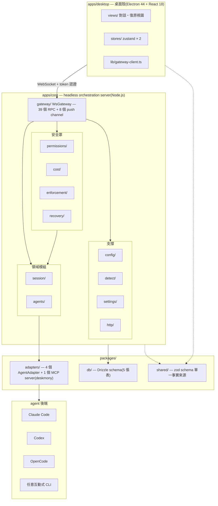
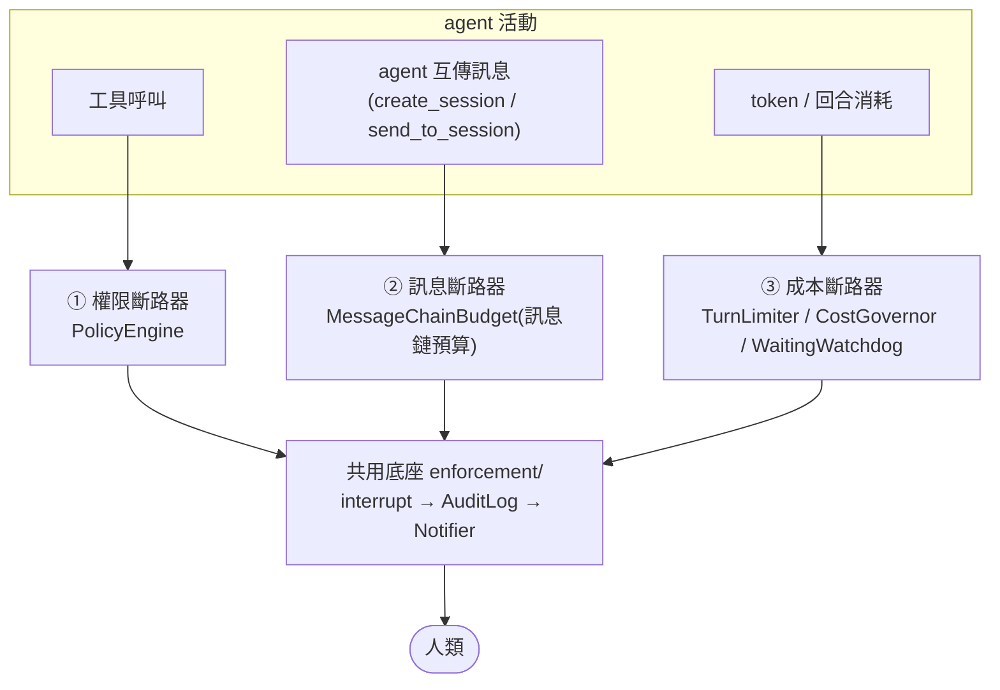
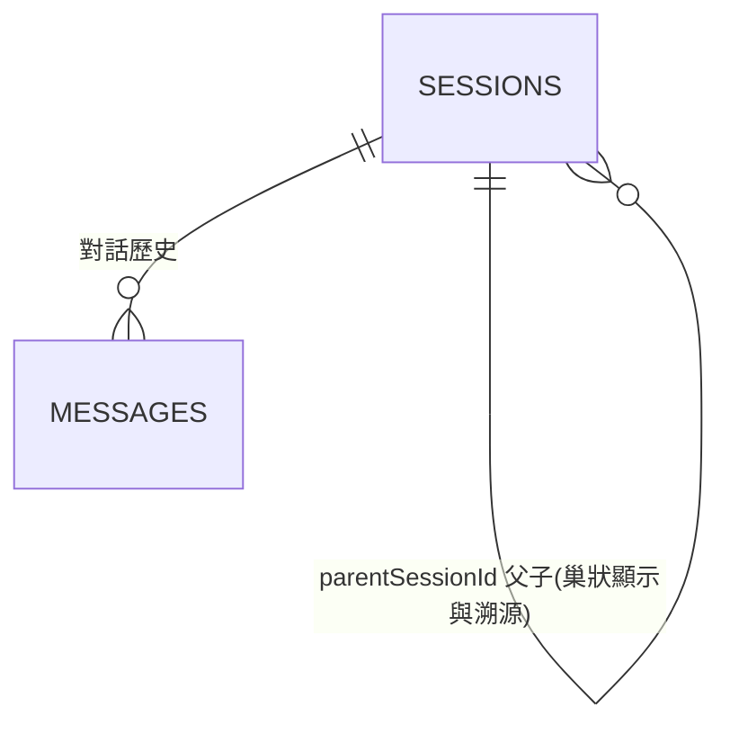

# Deskmony 系統架構

> **文件定位**:這份文件描述 **原始碼目前實際長什麼樣子**,不是願景、不是規劃。
> 每一節都可以在 `apps/`、`packages/` 底下找到對應的檔案;寫不出對應檔案的東西
> 就不寫進來。
>
> | 文件 | 回答什麼 | 權威性 |
> |---|---|---|
> | [`DECISIONS.md`](./DECISIONS.md) | **為什麼**這樣設計(2026-07-24 grilling 定案) | 設計決策的最高權威,與本文件衝突時以它為準 |
> | **本文件** | 程式碼**目前**是什麼形狀 | 實作現況的權威;每次結構性改動應同步更新 |
> | [`LAYER-2-design-spec.md`](./LAYER-2-design-spec.md) → [`LAYER-3-hld/`](./LAYER-3-hld/) → [`LAYER-4-detail-design/`](./LAYER-4-detail-design/) | 逐模組的規格 → 高階設計 → 詳細設計 | 單一模組的細節以對應的 L3/L4 文件為準 |
> | [`DEVLOG.md`](./DEVLOG.md) | 逐輪做了什麼、踩過什麼坑 | 歷史紀錄 |
> | [`ARCHITECTURE-legacy-2026-07.md`](./ARCHITECTURE-legacy-2026-07.md) | 2026-07 的早期概念草圖 | **已封存**,多處與現況不符,見文末附錄 A |
>
> ⚠️ **2026-10-02(簡化重構,P1–P3 已全部完成)**:team / 任務 / 看板 / lead / 驗收閘 /
> message-bus / 任務 worktree(P1)、agent profile(P2)、S12 的子 agent 工具與
> 「子完成 → 結果注入父」(P3)**已整套移除**,由「偵測 agent 直接建 session +
> 全 session 互傳訊息」取代(見 [`DECISIONS.md` §H](./DECISIONS.md)與
> [`simplify-agents-sessions_detail.md`](./LAYER-4-detail-design/simplify-agents-sessions_detail.md))。
> 本文件已改成現況;原本描述被移除功能的章節(§5.2 的舊訊息預算、§9.2、§10)只留
> 說明,章節編號不變(程式碼註解與附錄 B 仍引用這些編號)。

---

## 1. 這個系統在做什麼

Deskmony 讓一隊 AI coding agent **無人值守跑數小時而不失控**。

這句話決定了整個架構的重心。「多 agent 能互聊」只是功能,不是護城河;真正的主軸是
**由三個獨立斷路器組成的安全罩**(見 §5)。專門服務安全罩的四個目錄
(`permissions/`、`cost/`、`enforcement/`、`recovery/`)合計 **1,331 行實際
程式碼(不含空行與註解),佔 `apps/core` 的 26%**(2026-10-03 簡化重構完成後重新
計算,`apps/core/src` 實際程式碼共 5,033 行;2026-10-02 移除 team/任務/訊息匯流
之前是 1,545 行 / 22%,剛移除完是 1,322 行 / 29%,之後 core 多了 `agents/` 與
session 網路而回落);若再算上
`session-permission-coordinator.ts`(`buildExecContext()`、`checkAndExpireYolo()`)、
`session-manager.ts` 的 `resolvePermission()`,以及不在那四個目錄裡的訊息斷路器
`session/message-chain-budget.ts`,實際比重更高。

> ⚠️ 這個數字刻意扣掉註解。這份 codebase 有約三成是註解,算進去會得到比較好看的
> 數字 —— 但註解擋不下任何一次工具呼叫。**行數本身證明不了安全性**,
> 真正的證據是 §5 的決策流程與 `scripts/e2e-hard-deny.mjs` 對四類 hard-deny 的
> 逐條斷言(那支測試是 2026-09-04 新增的,在此之前四類裡有三類零覆蓋)。

任何新功能的設計,都必須回答一個問題:**「這條路徑上,三個斷路器分別擋在哪裡?」**

| 能力 | 落地位置 |
|---|---|
| 對話式操作單一 agent(串流、diff、工具呼叫、權限彈窗、內嵌終端) | `apps/desktop/src/views/`、`apps/core/src/session/` |
| 偵測本機 agent、直接以偵測到的 agent 建 session(沒有 profile) | `apps/core/src/agents/agent-catalog.ts`、`packages/shared/src/provider-catalog.ts` |
| Session 網路(每個 session 都能列出可用 agent / 所有 session、讀取、建立、傳訊息給任一 session;不自動回送) | `apps/core/src/session/`、`packages/adapters/src/session-network-mcp.ts`、`mcp-bridge-server.ts`、`packages/shared/src/session-network.ts` |
| 多種 agent 後端(Claude Code / Codex / OpenCode / Gemini / Aider) | `packages/adapters/` |
| ~~一隊 agent 互相傳訊(團隊)、共用任務看板、任務級 git worktree 隔離~~ | **已於 2026-10-02 移除**,見 [`DECISIONS.md` §H](./DECISIONS.md);改由上面的 session 網路取代 |
| **無人值守安全罩(權限 / 訊息 / 成本三斷路器)** | `apps/core/src/permissions/`、`cost/`、`enforcement/`、`session/message-chain-budget.ts` |
| 崩潰復原(對帳 + 人工分流) | `apps/core/src/recovery/` |
| 遠端存取(瀏覽器/手機)——安全罩機制本身遠端關不掉,但 2026-08-25 起遠端可與本機同權操作 auto/YOLO 與允許清單(見 §5.5) | `apps/core/src/gateway/`、`apps/core/src/http/` |

---

## 2. 三層結構


```mermaid
flowchart TB
    subgraph SHELL["apps/desktop — 桌面殼(Electron 44 + React 18)"]
        direction LR
        Views["views/ 對話・復原視圖"]
        Stores["stores/ zustand × 2"]
        GWC["lib/gateway-client.ts"]
    end

    subgraph CORE["apps/core — headless orchestration server(Node.js)"]
        direction TB
        GW["gateway/ WsGateway — 39 個 RPC + 8 個 push channel"]
        subgraph DOMAIN["領域模組"]
            direction LR
            Sess["session/"]
            Agents["agents/"]
        end
        subgraph SHIELD["安全罩"]
            direction LR
            Perm["permissions/"]
            Cost["cost/"]
            Enf["enforcement/"]
            Rec["recovery/"]
        end
        subgraph SUPPORT["支撐"]
            direction LR
            Cfg["config/"]
            Det["detect/"]
            Set["settings/"]
            Http["http/"]
        end
    end

    subgraph PKG["packages/"]
        Adapters["adapters/ — 4 個 AgentAdapter + 1 個 MCP server(deskmony)"]
        Shared["shared/ — zod schema 單一事實來源"]
        Db["db/ — Drizzle schema(5 張表)"]
    end

    subgraph BACKENDS["agent 後端"]
        direction LR
        CC["Claude Code"]
        CDX["Codex"]
        OCS["OpenCode"]
        ANY["任意互動式 CLI"]
    end

    SHELL -- "WebSocket + token 認證" --> GW
    GW --> DOMAIN
    GW --> SHIELD
    GW --> SUPPORT
    DOMAIN --> Adapters
    SHIELD --> DOMAIN
    CORE --> Db
    Adapters --> BACKENDS
    SHELL -.-> Shared
    CORE -.-> Shared
```

**依賴方向鐵則**:`packages/*` **不得** import `apps/*`。adapter 需要 core 提供的
東西,一律在 `packages/shared` 宣告介面(session 工具用的 `SessionNetworkPort`、
ACP 橋接 scoped token 用的 `McpBridgeTokenPort`),由 `apps/core/src/index.ts` 在
建構時注入實例。(`ClientPresencePort`、`SessionControlPort` 是 `apps/core` 內部
模組之間的介面,分別定義在 `session/session-manager.ts` 與 `enforcement/trip.ts`。)

---

## 3. 執行期形態

同一份 `apps/core` 有三種跑法,`apps/desktop` 的 React 程式碼三種情境完全共用:

| 形態 | 怎麼啟動 | Core 在哪 | UI 從哪來 |
|---|---|---|---|
| **桌面 app** | `Deskmony.exe` / `pnpm dev:electron` | Electron main process `spawn()` 的子程序(`apps/desktop/electron/main.ts` 的 `startCore()`) | Electron `loadFile()` 直接從 asar 載入,不經過 core 的 HTTP server |
| **開發模式** | `pnpm dev:core` + `pnpm dev:desktop` + `pnpm dev:electron` | 獨立 process | Vite dev server(:5173) |
| **headless + 瀏覽器/手機** | `pnpm start:core` | 獨立 process | core 自己的靜態 server,**與 WS 共用同一個 port**(`apps/core/src/http/static-server.ts`) |

打包後的 core 子程序用 `ELECTRON_RUN_AS_NODE=1` 借用 Electron 內建的 Node
執行(`better-sqlite3` 原生模組在打包時已由 `@electron/rebuild` 針對 Electron 的
ABI 重編),**終端使用者機器不需要安裝 Node.js**;dev 模式反過來優先用系統 Node
(dev 的 `node_modules` 是系統 Node 的 ABI)。

桌面殼啟動時依序解析 `DESKMONY_AUTH_TOKEN`:環境變數 → 本機以 Electron
`safeStorage` 加密保存的值 → 現生成的隨機值(三選一,**必有其一**,見
`electron/main.ts` 的 `resolveAuthToken()`)。加密保存那條是 2026-09-02 新增的
(Settings「遠端存取」面板可複製 / 自訂 / 重新產生),讓遠端 client 有一組穩定的
token 可用;它落在獨立的加密檔案,**不會**進 `~/.deskmony/config.json`。
決定出來的 token
同時傳給 core 子程序與 preload,兩端自動對上。

---

## 4. `apps/core` 模組地圖

以下每一列都對應一個真實檔案。**沒有 Scheduler**(舊文件列過,從未實作)。

### 4.1 領域模組

| 模組 | 檔案 | 職責 |
|---|---|---|
| **SessionManager** | `session/session-manager.ts`(~2.1k 行,仍是最大的單一模組) | session 生命週期與狀態機、adapter 事件消費、session 網路(五個工具的後端實作、跨 session 訊息的投遞與佇列、訊息鏈追蹤、UI 轉傳)、啟動對帳、優雅關閉 |
| **SessionPermissionCoordinator** | `session/session-permission-coordinator.ts` | 每個 session 的暫態權限模式(auto / YOLO / 真.無限制)、政策規則 CRUD、`ExecContext` 組裝、YOLO 惰性過期。2026-09-04 從 SessionManager 抽出的第一塊(見該檔案頂端說明);SessionManager 保留同名的薄委派,gateway 呼叫端不受影響 |
| **AgentCatalog** | `agents/agent-catalog.ts` | 「這台電腦上有哪些 agent 可以開 session」的唯一權威:持有偵測結果快取(啟動時背景偵測、不阻塞啟動;`env.detectAgents` 重新偵測)、`resolve()` / `listAvailable()`(`BUILTIN_PROVIDERS` + 偵測結果 + 使用者偏好)、`buildLaunchSpec(providerId, model?, effort?)`(找不到 / 未安裝 / 已停用丟 `DeskmonyError`)、`buildLaunchSpecForSession()`(續接 / 接手一律從 session 自己的資料重建,見下)。取代已移除的 `ProfileStore` |
| **session 信封** | `session/session-envelope.ts` | 純函式:跨 session 訊息送進 adapter 那一刻才組裝的信封(標明來源 session、agent,並說明「這則訊息不會自動得到回覆」);UI 轉傳另有一個樣板 |

> 2026-10-02 已移除:`TeamManager`(`team/`)、`MessageBus`(`bus/`)、`TaskService` 與
> `AcceptanceRunner`(`tasks/`)、`WorkspaceManager`(`workspace/`)、`ProfileStore`
> (`profiles.ts`)——見 [`DECISIONS.md` §H](./DECISIONS.md)。SessionManager 原有的
> persistent 成員 context checkpoint 重啟也因此失去觸發條件,一併移除。
>
> **session 自帶啟動資訊**:`sessions` 表存 `provider_id` / `launch_command` /
> `launch_args`(不存 env;env 每次 spawn 重新從 provider 偏好讀)。`continueSession()`
> 與復原的「接手」等任何重新 spawn 既有 session 的路徑,都先用 `providerId` 走
> `AgentCatalog.buildLaunchSpec()`;provider 已不存在 / 未安裝 / 已停用(或 software
> 對不上 session 的 `adapterType`)時,退回 `adapterType + launch_command +
> launch_args`;連退路都沒有(舊資料回填不出來)才丟明確錯誤。**不得再讀
> `agent_profiles`**。這同時修掉一個舊 bug:以前用 `agentOverride` 建的 session,續接時
> 會讀回 base profile 而換成錯的 agent。舊 session 於 core 啟動時一次、冪等地從
> `agent_profiles` 回填(`packages/db/src/client.ts` 的
> `backfillLegacySessionsProvider()`;表本身只讀不改)。

### 4.2 安全罩模組

| 模組 | 檔案 | 職責 |
|---|---|---|
| **PolicyEngine** | `permissions/policy-engine.ts` | 權限決策的**唯一**判斷點,default-deny |
| **hard-deny** | `permissions/hard-deny.ts` | 四類內建、config 不可關閉的硬性拒絕 |
| **tool-input** | `permissions/tool-input.ts` | 從工具參數萃取指令 / 路徑 / host;realpath 防逃逸 |
| **PermissionGateway** | `permissions/permission-gateway.ts` | 待決請求的登記簿 + 情境相依逾時(**不做政策判斷**) |
| **MessageChainBudget** | `session/message-chain-budget.ts`(不在上面四個目錄裡) | 訊息斷路器:每條訊息鏈的 agent 對 agent 訊息數上限(`messageBudget.maxMessagesPerContext`),超過即熔斷(走 `enforcementTrip()`) |
| **TurnLimiter** | `cost/turn-limiter.ts` | 回合硬上限(時間 / 工具呼叫次數),**不依賴 usage** |
| **CostGovernor** | `cost/cost-governor.ts` | usage 權威聚合 + 每日 kill-switch |
| **WaitingWatchdog** | `cost/waiting-watchdog.ts` | 掛起 session 的 T1 提醒 / T2 資源回收 |
| **AuditLog** | `enforcement/audit-log.ts` | append-only 稽核(`enforcement_audit` 表) |
| **Notifier** | `enforcement/notifier.ts` | 桌面通知 + webhook,批次彙總,靜音時段 |
| **enforcementTrip** | `enforcement/trip.ts` | 三斷路器共用的 trip 流程(interrupt → audit → notify) |
| **RecoveryService** | `recovery/recovery-service.ts` | 崩潰復原的三種人工分流:繼續 / 接手 / 放棄(純組合層,無自動觸發) |

### 4.3 支撐模組

| 模組 | 檔案 | 職責 |
|---|---|---|
| **WsGateway** | `gateway/ws-gateway.ts` | WS 協議、token 認證、rate limiting、`isLocal` 判定、`LOCAL_ONLY_METHODS` 閘門 |
| **static-server** | `http/static-server.ts` | 瀏覽器 UI 靜態檔案(與 WS 共用 port),三層目錄穿越防禦 |
| **loadConfig** | `config/load-config.ts` | 分層合併設定(defaults → config.json → env) |
| **config-file-writer** | `config/config-file-writer.ts` | 安全子集寫回 config.json;`appendPolicyRule()` |
| **AgentDetector** | `detect/agent-detector.ts` | 偵測本機已裝的 agent CLI(固定 allowlist + `execFile` + 逾時);結果由 `AgentCatalog` 快取與消費 |
| **child-registry** | `packages/adapters/src/child-registry.ts` | 跨 core 重啟的孤兒**行程**回收(pid + 建立時間記錄,下次啟動比對後才殺)|
| **SettingsStore** | `settings/settings-store.ts` | per-provider 偏好(啟用 / 排序 / env / model),env 對外一律遮罩 |

---

## 5. 安全罩:三斷路器

這是目前整個系統的設計主軸。三條線各自獨立,任一條都能單獨叫停失控。

> ⚠️ **現況(2026-10-03)**:② 訊息斷路器在 `MessageBus` 隨 team 移除後空缺了一陣,
> 現已以「每條訊息鏈」的預算重建(`session/message-chain-budget.ts`,沿用
> `messageBudget` 設定鍵,見 §5.2 與 [`DECISIONS.md` §H](./DECISIONS.md))。


```mermaid
flowchart TB
    subgraph AGENTS["agent 活動"]
        Tool["工具呼叫"]
        Msg["agent 互傳訊息<br/>(create_session / send_to_session)"]
        Usage["token / 回合消耗"]
    end

    Tool --> P["① 權限斷路器<br/>PolicyEngine"]
    Msg --> M["② 訊息斷路器<br/>MessageChainBudget(訊息鏈預算)"]
    Usage --> C["③ 成本斷路器<br/>TurnLimiter / CostGovernor / WaitingWatchdog"]

    P --> BASE["共用底座 enforcement/<br/>interrupt → AuditLog → Notifier"]
    M --> BASE
    C --> BASE
    BASE --> H(["人類"])
```

### 5.1 權限斷路器 — `PolicyEngine.decide()`

**唯一的判斷點**,優先序不可調換:


```mermaid
flowchart TB
    Req["權限請求<br/>(toolName, input, workingDir, providerId)"] --> TU{"⓪ trueUnrestricted?"}
    TU -- 是 --> Allow0["allow(繞過一切,含 hard-deny)"]
    TU -- 否 --> HD{"① hard-deny 命中?"}
    HD -- 否 --> Rules{"②③ config 規則<br/>依序比對"}
    HD -- "是 + 遠端 或 autoMode" --> Deny["deny(硬地板)"]
    HD -- "是 + 本機 + attended + 非 autoMode" --> Strong["escalate-strong<br/>紅框二次確認<br/>不得「永遠允許」"]
    HD -- "是 + 本機 + 無人在場" --> Deny
    Rules -- "命中 deny" --> Deny2["deny"]
    Rules -- "命中 allow" --> Allow["allow"]
    Rules -- "未命中" --> Auto{"④ autoMode?"}
    Auto -- 是 --> Allow2["allow(中間地帶)"]
    Auto -- 否 --> Esc["⑤ escalate<br/>default-deny"]
```

- **hard-deny 四類**(`hard-deny.ts`,config 永遠不可關閉):worktree 外寫入/刪除、
  讀秘密路徑(`~/.ssh`、`~/.aws`、`~/.deskmony`、`**/.env*`、`**/id_rsa*`、
  `**/credentials`;2026-10-05 起還有桌面殼自己的 Electron userData 目錄樹,裡面有加密保存的遠端存取 token)、
  危險 git(force-push / 刪遠端分支 / `branch -D`)、非白名單外連。
- **agent 子行程的環境不含 Deskmony 憑證**(2026-10-05,[`DECISIONS.md` §J](./DECISIONS.md)):桌面殼一律把
  `DESKMONY_AUTH_TOKEN` 設進 core 的環境,過去四個 adapter 又把整份 `process.env` 傳給 agent,agent 的 bash 讀得到主 token、
  連上 gateway 就能自己核准權限 / 切 YOLO。現在四個 adapter 都經 `packages/adapters/src/agent-env.ts` 的
  `buildAgentChildEnv()` 組環境,最後一步無條件刪除 `DESKMONY_AUTH_TOKEN`、`DESKMONY_MCP_BRIDGE_*` 與繼承來的
  `OPENCODE_SERVER_PASSWORD/USERNAME`(不分大小寫;使用者在 provider env 自己填的也刪)。bridge 需要的值是另外明確
  交給它的,不靠繼承。OpenCode 自己的 bash 工具另由 Deskmony 自帶的 opencode 外掛(`shell.env` hook)把伺服器密碼與設定內容
  濾掉。**擋不住**:同一個 OS 使用者的程序讀其他程序的記憶體、或用 DPAPI 解密本機檔案(沙箱 / OS 隔離的範疇)。
- **YOLO 與 auto 的唯一差別**:YOLO 額外跳過 config 的 `effect:"deny"` 規則。
  **hard-deny 兩者都絕不跳過**。YOLO 30 分鐘後惰性過期(不用計時器)。
- **判不出來一律 escalate**,絕不 allow(`decide()` 最底部的 fallback)。
- **逾時語意情境相依**:有人在場 → 逾時 deny;無人值守 → **不設計時器**,
  session 維持 `waiting` 等人(止損改由 WaitingWatchdog 的 T1/T2 負責)。
- **「永遠允許」的三條紀律**:①寫最窄的規則(`commandEquals` / `pathUnder`)
  ②同時寫進 config.json 與 in-memory(`PolicyEngine.addRule()`),重啟前後行為
  一致 ③escalate-strong 的請求,Core 端**強制忽略** `rememberRule`,即使 client
  硬塞。
- **規則範圍**(2026-10-02,P2):`PolicyRuleScopeSchema` 可帶 `providerId`(精確比對
  `PermissionRequest.providerId` = `session.providerId`)。profile 移除後,舊的
  `scope.profileId` / `scope.role` 欄位仍保留解析(schema 是 `.strict()`,拿掉會讓使用者
  既有 `config.json` 解析失敗、core 起不來),但永遠對不到任何 session,所以
  `PolicyEngine.ruleMatches()` 往安全側處理:帶舊範圍的 `allow` 規則**一律不匹配**
  (原本放行的改成升級給人);帶舊範圍的 `deny` 規則**忽略舊範圍、對所有 session 匹配**
  (否則 deny 靜默失效,在 auto 模式下那個操作會落入「未分類中間地帶」被自動放行,
  等於 fail-open)。core 啟動時對每條這類規則 `console.warn`(規則 id + 處理方式);
  `policy.addRule` 的輸入不再接受 `profileId` / `role`(否則能加一條擋全部 session
  的 deny),只收 `providerId`。
- ⚠️ **2026-08-25 新增第 ⓪ 步**(見 [`DECISIONS.md` §G](./DECISIONS.md)):
  `ctx.trueUnrestricted` 為真時,`decide()` 一開頭就直接 `allow`,連
  `checkHardDeny()` 都不呼叫——這是**唯一**能繞過 hard-deny 的路徑。只有該
  session 已經是 `"auto-accept-all"`(YOLO)且額外經 `session.setTrueUnrestricted`
  顯式開啟時才會是真,本機與遠端皆可觸發,啟用當下強制 UI 打字確認 + 桌面
  通知 + 稽核記錄。

### 5.2 訊息斷路器 — `MessageChainBudget`(2026-10-02 起以「訊息鏈」為單位)

原本的 `MessageBus` 訊息預算(contextId 由 Core 推導、每 task context 的訊息數上限)已隨
team / 任務 / 看板一併移除,見 [`DECISIONS.md` §H](./DECISIONS.md)(A5 改寫)。
現在的實作是 `session/message-chain-budget.ts`,沿用 `config.messageBudget`
(`maxMessagesPerContext` / `warnAtPercent`)設定鍵(鍵名保留以免破壞既有設定檔,
意義改成「每條鏈」),規格見
[`simplify-agents-sessions_detail.md`](./LAYER-4-detail-design/simplify-agents-sessions_detail.md) §P3.4:

- **鏈**:人類輸入的 prompt(gateway `session.sendPrompt`、復原的「接手」)在
  `SessionManager.sendPrompt()` 開一條新鏈(新 `chainId`);agent 經 `create_session` /
  `send_to_session` 送出的訊息沿用「呼叫者**這一輪**是被哪條鏈觸發的」那條鏈
  (每個 session runtime 在 `sendPromptInner()` 記住 `currentChainId`,只存記憶體);
  跨 session 投遞走 `deliverNetworkMessage()`,沿用訊息帶的 `chainId`;UI 轉傳
  (`session.forwardMessage`)也開新鏈。兩條路徑共用同一個 per-session 序列化入口
  `sendPromptSerialized()`。`session.sendPrompt` 的 schema 不收 `origin` / `chainId`
  (client 想偽造會被 zod 丟掉)。
- **計數與熔斷**:`admit(chainId, participants)` 在**送出之前**判斷——第 `max` 則放行、
  第 `max+1` 則起被拒(工具回錯誤給 agent,講明「已熔斷、需要使用者介入」)。
  第一次越線走既有的 `enforcementTrip()`(audit + 桌面通知,`interrupt: false`——
  不打斷任何進行中的回合);同一條鏈之後再被拒只回錯誤、不重複通知。達
  `warnAtPercent` 發一次軟警告(`reminder` / `message` / `message-chain-warning`)。
  `create_session` 在鏈已熔斷時**不會 spawn 新 session**;agent 先驗證(`buildLaunch()`)
  再佔預算。
- **只擋 agent 對 agent**:人類輸入照常、輸入即開新鏈;UI 轉傳是人類操作,不計數、
  不會被擋。
- **不無限成長**:計數只存記憶體(core 重啟歸零),且只保留「還有 session 的
  `currentChainId` 或待送佇列指向」的鏈(新建鏈時與 session 刪除 / 關閉 / 回收時修剪),
  另有 10,000 條硬上限當最後防線。
- **遠端不可停用**:`messageBudget` 不在 `config.setFile` 的安全子集裡。
- 通知分類:`NotificationTripReasonSchema` 的 `"message-chain-budget"`(舊的
  `"message-budget"` 只為相容舊 payload 保留)。

### 5.3 成本斷路器 — 三個獨立元件

| 元件 | 訊號來源 | 觸發時 | halt 粒度 |
|---|---|---|---|
| **TurnLimiter** | `tool-call` 事件 + 時間(**不依賴 usage**) | 單回合超過 30 分鐘 或 200 次工具呼叫 | **立即 interrupt** |
| **CostGovernor**(每日 kill-switch) | `usage` 事件 | 當日總花費超標 | **全部 session interrupt**,且擋後續 prompt |
| **WaitingWatchdog** T1 | `waiting` 狀態時長 | 掛起 > 6 小時 | 只發提醒,**不 halt** |
| **WaitingWatchdog** T2 | 同上 | 掛起 > 72 小時 | `dispose()` 回收子程序;對話紀錄保留 |

> 2026-10-02:原本還有「CostGovernor(任務預算)」一列(任務累計花費超標 → 只擋後續
> prompt),隨 task 移除;`budget.task` 設定鍵一併拿掉(既有 config.json 帶這個
> 鍵時只會得到「未知欄位」警告並被忽略)。

> **TurnLimiter 是最重要的那一個**:實測「Claude Code 經 ACP」**完全不回報
> usage**(連 `used`/`size` 都沒有,是 bridge 的結構性缺口)。對那類後端,
> 任何依賴 usage 的預算都不會生效,回合硬上限是唯一的保護。

### 5.4 共用底座 — `enforcement/`

`enforcementTrip()` 統一處理:(需要時)`await interrupt()` → 寫 `enforcement_audit`
→ `notifier.deliver()`。`interrupt()` 有 10 秒逾時保護,逾時**不假裝已停**——
在 audit 的 `reason` 加上 `-interrupt-unconfirmed` 後綴,讓稽核看得到。

`enforcement_audit` 是系統裡**唯一**的 append-only 表:只 INSERT、永不 UPDATE/
DELETE,記錄權限決策、三斷路器 trip、啟動對帳。**這不是 event sourcing**——
它不記錄 agent 輸出,不能拿來重建狀態(見 DECISIONS D1/D5)。

### 5.5 遠端能力邊界

```
連線建立 → remoteAddress 正規化 → isLocal = 是否 loopback(終生不變)
              ↓
handleMessage() 依序:①schema 驗證 ②認證閘門 ③LOCAL_ONLY_METHODS 檢查
                                                    ↓
    ③ config.setFile / settings.setProviderPrefs
                              → 遠端一律拒絕
```

- ⚠️ **2026-10-02(P2)**:原本同一張清單裡的 `profile.create` / `profile.delete` 隨
  profile 一併移除,清單現在只剩 `config.setFile` 與 `settings.setProviderPrefs`
  兩項。
- ⚠️ **2026-09-04 新增(稽核修補)**:清單另加入 `settings.setProviderPrefs`。它與
  `config.setFile` 同類(都是「改變 core 自己或子程序怎麼被啟動」的設定面操作),但更要
  緊的是它**完全不經過工具呼叫,因此也完全不經過政策引擎**——這與 §G 翻案開放給
  遠端的那些(切 auto/YOLO、編 allowlist)有本質差別:那些操作再寬,每一次執行仍要
  過 `PolicyEngine.decide()`,仍留在稽核紀錄裡。
  - `settings.setProviderPrefs`:`ProviderPrefs.env` 無 key 白名單,會被併進
    **每一個** agent 子程序的環境變數(設一個 `NODE_OPTIONS` 就能在任何工具
    呼叫發生**之前**取得執行權)。
  回歸測試見 `scripts/e2e-auto-mode-yolo.mjs` 的 E-3b-3(同時驗證「遠端被拒」
  與「本機仍可用」)。
  > 同一輪稽核還曾加入 `task.setAcceptance`/`task.runAcceptance`(驗收指令走
  > `shell: true`)與一道**欄位層級**閘門(擋 `task.create` 挾帶 `acceptance`);
  > 這兩者隨 task 於 2026-10-02 一併移除,見 [`DECISIONS.md` §H](./DECISIONS.md)。

- **`isLocal` 只由 Core 依連線本身判定,絕不採信 client 自稱。**
- **隧道連線(Tailscale/WireGuard)不是 loopback,一律視為遠端**——刻意的:
  隧道只解決傳輸安全,不代表操作者在本機。
- ⚠️ **2026-08-25 修訂**(見 [`DECISIONS.md` §G](./DECISIONS.md)):上面這張圖
  原本還列著 `session.setPermissionMode`(已從 `LOCAL_ONLY_METHODS` 移除)與
  一道獨立的「`permission.resolve` 帶 `rememberRule` 遠端一律拒絕」檢查
  (已整條移除)。這是使用者明確決定的翻案,不是疏漏——遠端與本機現在對
  「切 session 的 auto/YOLO 模式」「編輯政策允許清單」完全同權。新增的
  `session.setTrueUnrestricted`/`policy.addRule`/`policy.removeRule`/
  `policy.listRules` 四個方法**刻意不列入** `LOCAL_ONLY_METHODS`。
  `session.setTrueUnrestricted` 改用另一種把關:不看連線類型,而是伺服器端
  檢查該 session 是否已經處於 `"auto-accept-all"`(YOLO)——見 §5.1 第 ⓪ 步。
- `gateway.capabilities` 握手回傳五個布林:`canToggleAuto`/`canEnableYolo`/
  `canEditPolicy`/`canEnableTrueUnrestricted` **恆為 `true`**(2026-08-25 起
  不再等於 `isLocal`);`isRemoteConnection`(`!isLocal`,純顯示用)。原本唯一
  還等於 `isLocal` 的 `canManageProfiles` 已隨 profile 於 2026-10-02 移除。**這些
  欄位只讓 UI 顯示正確,不是安全邊界本身**;真正的保證是每次呼叫時的
  `LOCAL_ONLY_METHODS` 檢查(與 `session.setTrueUnrestricted` 的 session-mode
  前置條件檢查)。
- **Session 網路的五個 gateway 方法**(`agent.listForAgent` / `session.listForAgent` /
  `.readForAgent` / `.createFromAgent` / `.sendFromAgent`)是給 ACP 橋接子行程用的:
  只有 scoped MCP-bridge token(`McpBridgeTokenScope` 現在只剩 `{ sessionId, network:
  true }`)能呼叫,而且**呼叫者 session 從 token 取,方法參數不收**——agent 無法冒名。
  一般連線(master token 或無認證模式)呼叫這五個方法回 `gateway.bridgeTokenRequired`
  (fail-closed);scoped token 反過來只能呼叫這五個方法(呼叫 `session.setPermissionMode`
  之類會被拒)。
- 綁定安全檢查用**合併後**的 `config.daemon.bindHost`:非 loopback 綁定且未設
  `DESKMONY_AUTH_TOKEN` → **拒絕啟動**。改設定檔一樣擋得住。
- token 用 `crypto.timingSafeEqual()` 常數時間比對;認證失敗 5 次 / 30 秒冷卻。
- **`DESKMONY_AUTH_TOKEN` 刻意不是設定檔欄位**,永遠只從環境變數讀。

---

## 6. Adapter 層

### 6.1 真實介面(`packages/adapters/src/types.ts`)

```ts
interface AgentAdapter {
  capabilities(): AdapterCapabilities;
  spawn(launch: AgentLaunchSpec, workspace, resume?: ResumeOptions): Promise<AgentHandle>;
  sendPrompt(handle, prompt: PromptInput): void;
  events(handle): AsyncIterable<AgentEvent>;
  interrupt(handle): Promise<void>;      // resolve = 確實停了(呼叫端必須 await)
  dispose(handle): Promise<void>;
  resolvePermission(handle, requestId, "allow" | "deny"): void;
  setModel(handle, model): Promise<void>;
  setEffort(handle, effort): Promise<void>;
  // 以下為選配 —— 只有特定 adapter 有,不是遺漏
  resolveUserDialog?(handle, requestId, result: DialogAnswer): void;  // Claude SDK、OpenCode
  writeInput?(handle, data): void;                                     // 僅 PTY
  resize?(handle, cols, rows): void;                                   // 僅 PTY
  getBackendSessionId?(handle): string | undefined;                    // 僅 Claude SDK
}
```

### 6.2 註冊的四個 adapter

`AdapterRegistry` 實際註冊(`apps/core/src/index.ts`)只有這四種 —— **沒有
CodexAdapter**,Codex 走 ACP(經 `@agentclientprotocol/codex-acp` 橋接套件,
**不是**本機 codex CLI 原生支援 ACP——OpenAI 官方 `codex` binary 本身不講
ACP,見 `docs/DECISIONS.md` B2):

| software | 檔案 | 對接方式 | 涵蓋後端 |
|---|---|---|---|
| `claude-agent-sdk` | `claude-sdk-adapter.ts` | `@anthropic-ai/claude-agent-sdk` 程式內嵌 | Claude Code |
| `acp` | `acp-adapter.ts` | [ACP](https://agentclientprotocol.com) stdio JSON-RPC | Gemini CLI、Codex(經 `@agentclientprotocol/codex-acp` 橋接套件)、其他 ACP-native agent |
| `opencode` | `opencode-adapter.ts` | OpenCode headless server 的 HTTP + SSE | OpenCode |
| `pty` | `pty-adapter.ts` | `node-pty` 原始直通 | Claude Code CLI、Aider、任意互動式 CLI |

`spawn()` 吃的是 `AgentLaunchSpec`(`packages/shared/src/agent-launch.ts`,取代已移除的
`AgentProfile`):`software`、`providerId`、`model`、`effort`、`env`(provider 層級,
每次 spawn 重新從設定讀)、`systemPrompt`(只放 `.deskmony/notes/` 指路段落),以及
acp / pty / opencode 的 `command` / `args` 設定。它由 `AgentCatalog.buildLaunchSpec()`
組出、只在記憶體傳遞,**不持久化、也不經 gateway 曝露**(session 存的是 `provider_id` +
`launch_command` + `launch_args`,不存 env,見 §4.1、§8)。

**Provider 目錄**(`packages/shared/src/provider-catalog.ts`)是使用者看到的那一層,
七項,每項在型別上保證映射到上面四種之一(2026-10-02 起它是「session 能以哪些 agent
建立」的唯一來源,由 `AgentCatalog` 與偵測結果、使用者偏好合併):

| provider | → software | 備註 |
|---|---|---|
| `claude-agent-sdk` | `claude-agent-sdk` | 內嵌,能力最完整 |
| `claude-cli` | `pty` | 本機安裝的 `claude` CLI |
| `gemini` | `acp` | 固定帶 `--acp` |
| `opencode` | `opencode` | HTTP + SSE;會掛 session 網路工具(bridge 寫進 `OPENCODE_CONFIG_CONTENT` 的 `mcp.deskmony`),能主動傳訊息 |
| `opencode-acp` | `acp` | 同一個 opencode 執行檔,改走 `opencode acp`;會掛 session 網路工具,能主動傳訊息(subagent `task` 工具停用) |
| `codex` | `acp` | 經 `@agentclientprotocol/codex-acp` 橋接套件(非本機 codex CLI 原生支援) |
| `aider` | `pty` | |

2026-10-02(P2)移除了 `custom-pty`(手動輸入 command 的逃生閥):新模型的前提是
「從電腦偵測到的 agent」,而且 gateway 不能有任何接受任意 command 的入口。
e2e 要指定 fake agent 執行檔時,改用只吃 **core 環境變數**的測試掛鉤
`DESKMONY_E2E_EXTRA_PROVIDERS`(JSON 陣列,把額外的 provider 併進 catalog 當成已安裝)——
**不經 gateway**,所以遠端 client 沒有任何辦法讓 core 執行它指定的程式;能設定 core
環境變數的人本來就能直接執行任意程式,這個掛鉤沒有擴大攻擊面(見
`agents/agent-catalog.ts` 的說明)。

### 6.3 能力探測 — 兩個布林 + 三個三態

```ts
{ streaming, toolEvents, permissionRequests, diff, interrupt, terminal: boolean,
  usageReporting, contextReporting, slashCommands: "supported" | "unsupported" | "unknown" }
```

| adapter | streaming | toolEvents | permissionRequests | terminal | usageReporting | slashCommands |
|---|---|---|---|---|---|---|
| claude-agent-sdk | ✅ | ✅ | ✅ | ❌ | `supported` | `supported` |
| acp | ✅ | ✅ | ✅ | ❌ | **`unknown`** | `unknown` |
| opencode | ✅ | ✅ | ✅ | ❌ | `unsupported` | `unknown` |
| pty | ❌ | ❌ | **❌** | ✅ | `unsupported` | `unsupported` |

- **三態存在的理由**:`AcpAdapter` 會正確轉發 `usage_update`,但**送不送由被
  spawn 的那個 agent 決定**——Gemini CLI 可能會送,Claude Code 經 bridge 實測
  一次都不送。靜態布林值表達不了,回報 `true` 是對 UI 說謊。消費端必須靠
  「這條 session 實際收到過沒有」收斂(`resolveCapabilitySupport()`),
  **收斂前不得對使用者宣稱有東西可看**。
- **`permissionRequests: false` 是安全分層,不只是功能缺失**:PTY 是 raw stdin
  直通,**結構上無法被政策引擎管**。在真正的執行沙箱做出來之前,PTY agent
  一律唯讀、不給無人值守的自主權(DECISIONS C7)。刻意**不做** shell 指令攔截
  ——`bash -c` / `$()` / base64 幾秒就能繞過,那是 security theater。

### 6.4 AgentEvent(11 種)

`message-delta` / `tool-call` / `tool-result` / `permission-request` /
`user-dialog-request` / `completed` / `error` / `terminal-data` / `usage` /
`context-usage` / `available-commands`。

`available-commands`(這輪 slash command 新增):adapter 回報後端原生支援的
"/" 指令清單(claude-agent-sdk 的 `supportedCommands()`、ACP 的
`available_commands_update`、OpenCode 的 `GET /command`),**整份取代**語意,
不是增量。

`usage`(累計計數器,可 diff)與 `context-usage`(瞬時計量表,compaction 後會
變小)**刻意拆成兩個型別**——塞進同一個事件,會讓消費端「新值 < 舊值 = 連線
重置」這條規則對 gauge 誤判。

---

## 7. Gateway 協議

`ws://` 上的 request/response + server push。**39 個 RPC 方法**(連同 `auth` 一起
算;2026-08-25 新增 4 個政策/真.無限制相關方法;2026-10-02 移除 team / message /
task / workspace 四組共 24 個方法與三個 `recovery.*` 任務專用方法(P1,合計 27 個)、
`profile.*` 四個與 S12 子 agent 的 `session.spawnChild` / `.listChildren` /
`.sendToChild` / `.spawnChildForSubagent` 四個(P2/P3,合計 8 個),並新增 session 網路的
五個 bridge 方法與 `session.forwardMessage`(共 6 個),見
[`DECISIONS.md` §H](./DECISIONS.md)),分組:

| 分組 | 方法 |
|---|---|
| 連線 | `auth`、`gateway.capabilities` |
| Session | `session.list` / `.create`(`{providerId, model?, effort?, workingDir, title?, parentSessionId?}`,沒有 profile)/ `.sendPrompt` / `.interrupt` / `.history` / `.getSlashCommands` / `.delete` / `.setModel` / `.setEffort` / `.setPermissionMode`(2026-08-25 起遠端可用,已從 🔒 移除)/ `.setTrueUnrestricted`(2026-08-25 新增,遠端可用)/ `.forwardMessage`(UI 轉傳,見 §9.3)/ `.terminalInput` / `.resizeTerminal` |
| Session 網路(bridge 專用,見 §5.5、§9.3) | `agent.listForAgent`、`session.listForAgent` / `.readForAgent` / `.createFromAgent` / `.sendFromAgent`——**只有 scoped MCP-bridge token 能呼叫**,呼叫者 session 從 token 取 |
| 權限 | `permission.resolve`、`dialog.resolve` |
| 政策 | `policy.addRule` / `.removeRule` / `.listRules`(2026-08-25 新增,遠端可用;新規則的範圍只收 `providerId`) |
| 成本 | `cost.getSummary` |
| 復原 | `recovery.list` / `.continue` / `.takeover` / `.abandon` |
| 設定 | `settings.getEnabledModels` / `.setEnabledModels` / `.getProviderPrefs` / `.setProviderPrefs` 🔒、`config.getEffective` / `config.setFile` 🔒、`env.detectAgents`(重新偵測 + 更新 `AgentCatalog` 快取 + 回傳)、`adapter.capabilities` |

🔒 = `LOCAL_ONLY_METHODS`,遠端一律拒絕——目前只有 `config.setFile` 與
`settings.setProviderPrefs` 兩項(2026-08-25 起清單只剩 `config.setFile` /
`profile.create` / `profile.delete`,2026-09-04 稽核修補加入 `settings.setProviderPrefs`,
2026-10-02 profile 移除後 profile 那兩項隨之消失;見 §5.5、
[`DECISIONS.md` §G](./DECISIONS.md))。
`config.setFile` 本身仍**不含**
`policy` 欄位(見 §12「設定系統」),新的 `policy.*` 三個方法是另一條獨立、
較窄、有稽核的通道,不是把 `config.setFile` 的安全子集放寬。

**8 個 push channel**:`session-event`、`session-updated`、`session-list-updated`、
`permission-resolved`、`enforcement-notification`、`session-message`、
`user-dialog-resolved`、`policy-updated`(2026-08-25 新增)。
(2026-10-02 移除 `team-message`、`task-updated`、`task-deleted`;`child-result` 隨
「子完成 → 結果注入父」一併移除,由 `session-message` 取代——別的 session 送來的
訊息〔`origin` 有值的 user 訊息〕寫進歷史時推播 `{sessionId, message}`,讓正在看
那個 session 的 UI 即時顯示「來自 <title>」。)

協議定義在 `packages/shared/src/gateway.ts`,zod discriminated union 是
**單一事實來源**——core 與 desktop 兩端都從這裡取型別,不會漂移。錯誤回應除了
`error` 純文字,額外帶 `errorCode`/`errorParams` 供前端 i18n(舊 core 不帶這兩個
欄位時前端退回顯示純文字,不會壞)。

---

## 8. 資料模型(5 張表)


```mermaid
erDiagram
    SESSIONS ||--o{ MESSAGES : "對話歷史"
    SESSIONS ||--o{ SESSIONS : "parentSessionId 父子(巢狀顯示與溯源)"
```

> **2026-10-02(P1)**:`teams` / `team_members` / `team_messages` / `tasks` /
> `workspaces` 五張表的 drizzle 定義、建表語句與 `ensure*` 遷移已移除。**這些表沒有
> 被 DROP、也沒有任何刪資料的遷移**——使用者既有 SQLite 檔案裡的表與資料原封不動
> 留著,只是不再有程式碼讀寫(`usage_rollup` 裡 scope = `task` 的舊列同理)。
>
> **2026-10-02(P2)**:`agent_profiles` 的 drizzle 定義、建表語句與補欄位遷移也移除了
> (全新安裝不再建立這張表),同樣**不 DROP、不修改**既有資料庫裡的那張表。唯一還會讀它
> 的是啟動時的 `backfillLegacySessionsProvider()`:對 `provider_id IS NULL` 的舊 session
> 列,用 raw SQL 讀對應的 profile 回填 `provider_id` / `launch_command` /
> `launch_args`(冪等;找不到對應 profile 就填 `legacy-unknown` 且不填 launch,續接時
> 明確報錯)。回填多一個邊界:profile 的 software 與 session 的 `adapter_type` 對不上
> (當初用 `agentOverride` 換過 agent)時,不採用 profile 的 provider / launch。
>
> `sessions.agent_profile_id` 在既有 DB 裡是 `NOT NULL`,SQLite 不能直接改約束,所以欄位
> 保留、drizzle 欄位改名 `legacyAgentProfileId`:新 session 寫入 `providerId` 當值
> (只為滿足約束,沒有任何程式碼讀它)。

| 表 | 關鍵欄位 | 備註 |
|---|---|---|
| `sessions` | `providerId`、`launchCommand`、`launchArgs`、`adapterType`、`status`、`model`、`effort`、`parentSessionId`、`interruptedAt`、`lastSeenAt`、`backendSessionId` | status 六態:`idle`/`busy`/`waiting`/`error`/`closed`/`interrupted`;`provider_id` / `launch_command` / `launch_args`(JSON)是 session 自帶的啟動資訊,**不存 env** |
| `messages` | `role`、`content`、`attachments`、`origin` | `attachments` 是圖片附件的 JSON,獨立欄位而非塞進 `content`;`origin` 是跨 session 訊息來源(`{kind: "session" \| "forward", sessionId, title, chainId}`)的 JSON,`content` 存原始訊息本體、信封不落地 |
| `settings` | `key` / `value`(JSON) | 通用 k/v,新增偏好不需要 schema 遷移 |
| `enforcement_audit` | `kind`、`effect`、`reason`、`payload` | **append-only**,唯一 |
| `usage_rollup` | 複合主鍵 `(scope, scopeId)`,scope ∈ session/day | 成本治理的權威持久層 |

**遷移策略**:`CREATE TABLE IF NOT EXISTS` + 逐欄位的冪等 `ensureXxxColumn()`
`ALTER TABLE`(`packages/db/src/client.ts`)——`CREATE TABLE IF NOT EXISTS` 對已
存在的表不會補欄位,所以每個後加的欄位都要有自己的 ensure 函式。

---

## 9. Agent 協作機制

> 2026-10-02:原本的 team-bus 工具(`send_message` / `broadcast` /
> `list_teammates` / `report_status` / `request_review`)與 `MessageBus` 投遞策略、
> 團隊群聊(P1),以及 S12 的子 agent 工具組(`spawn_subagent` / `send_to_subagent` /
> `list_subagents` / `list_profiles`,MCP server 名稱 `subagent`)與「子完成 → 結果注入
> 父」(P3)都已移除,見 [`DECISIONS.md` §H](./DECISIONS.md)。現在的 agent 協作只有
> 一條:**session 網路**(§9.1、§9.3)。

### 9.1 內建 MCP server(目前只有 `deskmony`)

掛在 **`claude-agent-sdk`** 與 **`acp`** 兩種傳輸上:前者由 `ClaudeAgentSdkAdapter`
直接把 in-process 的 SDK MCP server(`session-network-mcp.ts`)放進 `mcpServers`;後者由
`AcpAdapter` 透過 `mcp-bridge-server.ts`(stdio 型 MCP 子行程,以 scoped token 綁定該
session,經 gateway 打回 core)掛進 `session/new`。**兩邊的 MCP server 名稱都是
`deskmony`**(Claude 裡的工具全名是 `mcp__deskmony__<name>`),工具名稱、參數 schema、描述文字與
`instructions` **逐字一致**(刻意複製文字而非抽共用常數;`scripts/e2e-session-network.mjs`
用 MCP client 分別連 in-process server 與真的 spawn 出來的 bridge 子行程,比對 `tools/list`
與 `instructions`,漂移會被抓到)。

**`pty`(純終端位元組直通)沒有掛**——架構上不可能,它沒有任何工具通道;這類 session 只能**收**訊息,
`list_agents` / `list_sessions` 的 `canUseTools`(`softwareCanUseTools()`:`claude-agent-sdk`、`acp`、`opencode`
為 true)讓寄件者知道對方回不了話。

**`opencode`(HTTP server API)2026-10-03 起也掛了**(原本是「只能收」,要主動傳得改用 `opencode-acp`)。
掛法與 ACP 共用 `packages/adapters/src/mcp-bridge-launch.ts` 的 `mintMcpBridgeLaunch()`(同一個 bridge 子行程、
同樣的 scoped token 與環境變數,token 由 `OpenCodeAdapter.dispose()` 撤銷),差別只在怎麼告訴 opencode:ACP 經
`session/new` 的 `mcpServers`,HTTP 則寫進啟動 `opencode serve` 時注入的 `OPENCODE_CONFIG_CONTENT`
(`mcp.deskmony`,`type: "local"`,token 只放 `environment`、不放 `command`)。同一份設定也把**所有工具權限改成 ask**
(opencode 預設全 allow,見 `packages/adapters/src/opencode-config.ts` 檔頭的實測與理由),所以 `create_session` /
`send_to_session` 自然走 Deskmony 的權限流程;三個查詢工具(`deskmony_list_agents` / `deskmony_list_sessions` /
`deskmony_read_session`)在同一份設定裡預先 `allow`,語意等同 Claude SDK 的 `allowedTools`。provider 目錄的
「OpenCode(ACP)」(`opencode-acp`)走 `opencode acp`、經 `software: "acp"` 沿用 ACP 那條橋(2026-08-28 對
opencode 1.18.7 實測:它以 stdio 說 ACP,且確實會啟動 stdio 型 MCP server),兩者差別只剩對接方式。

**opencode 的本機 HTTP 伺服器有 basic auth(2026-10-03,DECISIONS §I-3)**:`opencode serve` 與 `opencode acp`(實測)
都會在 loopback 開 HTTP 伺服器、預設無認證——本機任何程序能替它核准權限請求(繞過政策引擎)、`GET /config` 讀到上面那個
`mcp.deskmony.environment` 的 scoped token。所以兩個 adapter 啟動 opencode 家族子行程時都以環境變數
`OPENCODE_SERVER_PASSWORD` / `OPENCODE_SERVER_USERNAME` 給一組**每次 spawn 都重新隨機**產生的密碼
(`packages/adapters/src/opencode-server-auth.ts`;覆蓋使用者設的同名變數);`OpenCodeAdapter` 對該伺服器的每個請求(含
SSE `/event`、權限與提問回覆、`dispose()` 的清理)都帶 `Authorization: Basic`,密碼只在 adapter 記憶體裡(不寫 log / DB /
事件);`opencode acp` 不打它的 HTTP API,只設密碼。密碼本來會被 opencode 的 bash 工具繼承(擋得住 agent 以外的程序,
擋不住 agent 本身);2026-10-05 起由 Deskmony 自帶的 opencode 外掛(`packages/adapters/src/opencode-shell-env-plugin.ts`)在
opencode 的 `shell.env` hook 把 `OPENCODE_SERVER_PASSWORD` / `OPENCODE_SERVER_USERNAME` / `OPENCODE_CONFIG_CONTENT` 從 agent 的
bash 環境移除(經注入的 `OPENCODE_CONFIG_CONTENT` 的 `plugin` 陣列載入,`opencode` 與 `opencode-acp` 都掛;外掛沒載入時
adapter 警告、session 照常,見 DECISIONS §J)。

| MCP server | 工具 | 進 `allowedTools`(自動放行)? |
|---|---|---|
| **`deskmony`** | `list_agents`、`list_sessions`、`read_session` | ✅ 純查詢(`read_session` 只回 user / assistant 訊息、每則 content 截斷到 4000 字元、附件只標示 `hasAttachments`;預設 20 則、上限 100) |
| | `create_session`、`send_to_session` | ❌ **刻意不放**——會讓某個 session 多跑一輪(新起 session 或讓既有 session 多花一輪 token),走 PolicyEngine 的權限階梯(always-ask 下升級給人) |

### 9.2 投遞策略 — 已於 2026-10-02 移除

原本的 `MessageBus` 投遞策略(idle 立即注入 / busy 進 Mailbox 批次注入 /
`priority=interrupt` 先 `await interrupt()` 再注入 / 長命成員自動上線 / 依收訊者
software 與訊息性質調整的回覆指引 / 廣播旗標持久化)與 `team_messages` Mailbox
隨 team 一併移除。取而代之的是 `SessionManager.deliverNetworkMessage()`(取代更早的
`deliverPromptWhenIdle()`):目標 idle 就立刻送(此刻才組信封)、busy / waiting 就排進
記憶體裡的 `pendingIdleInjection` 佇列(元素是 `{text, origin, chainId}`),等它下一次
`completed` 空檔才送(pty 沒有 `completed` 事件,靜止計時器把它轉回 idle 時也 flush)。
**佇列不持久化**,core 重啟即遺失(不再有 Mailbox)。與舊版的差異:目標 runtime 不在
就**丟錯誤**,不再靜默丟棄。

### 9.3 Session 網路

**所有 session 互相可見、可互傳**,不限父子、不限工作目錄;`sessions.parentSessionId`
只剩 UI 巢狀顯示與溯源的意義(`create_session` 與 UI 的「在這個 session 底下開新
session」都會設它,後者走一般的 `session.create`)。

- **不做任何自動回送**:收到訊息的 agent 自己決定要不要回、回給誰;舊的「子完成 → 結果
  注入父」與 `child-result` push 已整個移除。工具描述與信封都明講這一點。
- **信封與來源**:跨 session 訊息送進 adapter 的 prompt 是
  `session-envelope.ts` 組的信封(`[來自 session「<title>」(id、agent)的訊息]` + 本體 +
  「這則訊息不會自動得到回覆…」提示;UI 轉傳的信封標明「使用者從 session X 轉來」)。
  持久化的 `messages.content` 存**原始本體**,另有 `messages.origin`
  (`{kind: "session" | "forward", sessionId, title, chainId}`);信封只在送進 adapter 那一刻
  組裝。UI 對有 `origin` 的訊息顯示「來自 / 轉傳自 <title>」標籤,並經 push channel
  `session-message` 即時推送。
- **呼叫者身分不可冒名**:in-process 版由 adapter 以自己的 `handle.id` 閉包捕捉;
  ACP 版由 bridge token 綁定(gateway 從 token 取,方法參數不收);**絕不是工具參數**。
  Claude SDK session 續接(`continueSession()`)時沿用既有的 DB session id,所以
  `ResumeOptions` 帶 `sessionId` 讓 `handle.id` 等於它(否則續接後 `isYou`、「不能送給
  自己」與鏈追蹤全部對不上)。
- **`send_to_session` 的驗證順序**:目標是自己 → 找不到 → `closed` / `error` /
  `interrupted` / runtime 不在 → 鏈預算(§5.2),任何一層沒過都明確報錯,不讓 agent 誤以為
  送成功了;全過才投遞(§9.2)。**`create_session`** 先驗 agent(`buildLaunch()`:找不到 /
  未安裝 / 已停用就報錯,不佔預算、不 spawn)→ 鏈預算 → spawn(`parentSessionId` =
  呼叫者,workingDir 預設沿用呼叫者的,一律從 `always-ask` 開始)→ 以信封送出第一則訊息。
- **UI 轉傳**(`session.forwardMessage({sourceSessionId, targetSessionId, text, note?})`):
  使用者把某 session 畫面上一個氣泡的文字(`text`)轉給任一其他 session(附註併進本體);人類操作,
  開新鏈、不計預算。`text` 等同使用者自己貼上,core 只驗證來源/目標存在、目標可送達、不是轉給自己,
  不回頭查原訊息(桌面端的串流訊息 id 對不上 DB 那一筆,過去靠內容比對去猜,ACP 一輪有多個氣泡時會
  轉錯);`text` 上限 100,000 字元,超過由 schema 直接拒絕。
- **權限**:`create_session` / `send_to_session` 不在自動放行清單,走 PolicyEngine 的權限
  階梯(見 §9.1);開了 Auto / YOLO 的 session 它們和其他「未分類」操作一樣會被自動放行,
  那時由 §5.2 的訊息鏈預算兜底。

---

## 10. 任務生命週期 — 已於 2026-10-02 移除

任務狀態機(`backlog → assigned → in-progress → review → merging → done` + `blocked`)、
三道人類把關(機器驗收閘、人類 review 閘、人類批准合併)、任務級 git worktree
隔離(建立 / 合併 / 衝突 abort / 清理)、主幹分支偵測與 ephemeral 成員生命週期,
**全部隨 `TaskService` / `WorkspaceManager` / `AcceptanceRunner` 一併移除**,見
[`DECISIONS.md` §H](./DECISIONS.md)(撤銷 A3 / A4、D3 的任務部分、E2)。收斂決策回到
人類直接在各 session 裡下指示。`tasks` / `workspaces` 兩張表沒有 DROP,見 §8。

---

## 11. 崩潰復原

**核心立場(DECISIONS D1/D3)**:最貴的東西(agent 累積的推理與 context)活在
**後端 agent 行程裡**,不在 DB。replay 重建的是帳本,不是 agent 的腦。所以崩潰
復原的本質是「**對帳 + 人工分流**」,不是 replay。

```
core 啟動
  → reconcileOnStartup()(必須在 gateway.listen() 之前)
  → 上次沒被乾淨關閉的 session 標記 interrupted + 寫 audit
  → 人類打開復原視圖,逐一決定
```

三種分流,**全部要人主動點,RecoveryService 沒有任何背景計時器**:

| 動作 | 語意 | 前提 |
|---|---|---|
| **繼續** | 保有記憶重啟 | 後端真的支援磁碟持久化 session(目前只有 Claude SDK 的 `resume`);Core 端會重新驗證,不採信 client 舊快照 |
| **接手** | 讀摘要重啟 | 一律可用;摘要只讀 DB(最後幾輪對話),不呼叫 LLM |
| **放棄** | session 標 `closed` | 對話紀錄保留(回收 ≠ 丟棄) |

> 2026-10-02:原本的第四種「重跑」與髒 worktree 強制前置流程(`keep` 建 wip 分支 /
> `discard` 需 `confirmDiscard`)、`recovery.gitStatus` 查 worktree/baseDir 都是任務
> worktree 專用,隨 task 移除,見 [`DECISIONS.md` §H](./DECISIONS.md)。
>
> 「繼續」與「接手」重新 spawn 既有 session 時,啟動規格一律從 **session 自己的資料**重建
> (`providerId` → `AgentCatalog`,退路是 session 存的 `launch_command` / `launch_args`),
> 不再讀 profile,見 §4.1。復原視圖顯示的 agent 名稱來自 `AgentCatalog.labelsById()`
> (不等偵測結果)。

優雅關閉 5 秒逾時保護:寧可留下孤兒讓下次啟動對帳抓到,也不卡住不關。

**孤兒有兩種,處理方式不同**(2026-09-04 釐清):

| | 是什麼 | 誰處理 |
|---|---|---|
| 孤兒**紀錄** | DB `sessions` 表裡狀態停在 `busy`/`waiting` 的列 | `reconcileOnStartup()` 標成 `interrupted`,交人分流 |
| 孤兒**行程** | 真的還活著的 agent CLI 與它們再開的 MCP 孫程序 | `packages/adapters/src/child-registry.ts` 在下次啟動時回收 |

第二種過去完全沒人管:子程序沒有被綁進任何 OS 層級的連坐回收單位(沒有 Windows
Job Object,`spawn()` 也沒帶 `detached`),所以 core 被 SIGKILL / 工作管理員結束 /
斷電時,它們會**繼續活著**佔用資源。現在 spawn 時會把 pid 連同該行程的**建立時間**
記進 `<dataDir>/child-pids.json`,下次啟動比對建立時間後才殺 —— 對不上就**不殺**,
pid 重用絕不能誤傷無關行程。正常 `dispose()` 之後會把該筆紀錄移除。

---

## 12. 設定系統

三層合併,**這個專案沒有 CLI flags,不需要第四層**:

```
defaults(packages/shared/src/core-config.ts 的 CoreConfigSchema)
  → <DESKMONY_HOME>/config.json
    → 環境變數
```

區塊:`daemon`(port / bindHost / permissionTimeoutMs / authRateLimit)、
`workspace`、`data`、`features`、`log`、`policy`(rules / allowedHosts;規則範圍可帶
`providerId`,舊的 `profileId` / `role` 仍可解析但已失效,見 §5.1)、
`notification`、`budget`(daily / turn / modelPricing)、`messageBudget`(2026-10-02
起是「每條訊息鏈」的預算,見 §5.2)。(原本的 `budget.task` 與
`workspace.worktreesRoot` 已隨 task / worktree 移除。)

**三條安全線**:

1. **`DESKMONY_AUTH_TOKEN` 完全不是設定檔欄位**——設定檔出現疑似 token 欄位一律
   忽略並警告。
2. **`config.setFile` 只允許安全子集**:`workspace.*` / `features.staticDir` /
   `log.level` / `daemon.permissionTimeoutMs` / `daemon.authRateLimit.*`。
   **刻意不允許 `daemon.port` / `daemon.bindHost`**(決定網路曝露面)與 `policy`
   ——這兩個欄位只能手動編輯設定檔。⚠️ `policy`(政策允許清單)本身 2026-08-25
   起已有另一條獨立的遠端可用通道(`policy.addRule`/`.removeRule`/`.listRules`,
   見 §7、[`DECISIONS.md` §G](./DECISIONS.md))——這裡指的是「不透過
   `config.setFile` 這個通道整批 patch」不變,不是「policy 完全不能遠端碰」。
3. **`validateBindSafety()` 看合併後的值**,防止改設定檔就意外把無認證的 core
   曝露到區網。

寫入後**不做熱重載**,回應明講 `requiresRestart: true`。
`config.getEffective` 回傳每個欄位的來源標記(`default`/`file`/`env`),UI 對
來源是 `env` 的欄位鎖成唯讀(改設定檔不會生效)。

`pnpm generate:config-schema` 由 zod schema 產生 `docs/deskmony.config.v1.json`,
供編輯器自動補全。

**四個獨立的路徑環境變數**(互不連動,本機隔離驗證時必須一起設):
`DESKMONY_HOME`(config.json)、`DESKMONY_DATA_DIR`(SQLite)、
`DESKMONY_WORKSPACE`(預設工作目錄)、`DESKMONY_CORE_PORT`。

---

## 13. 桌面前端

```
apps/desktop/src/
├─ App.tsx              # 單一 session 視圖(2026-10-02 移除團隊群聊 / 任務看板與 ViewMode)
├─ i18n.ts              # i18next,4 語系
├─ locales/{en,zh-Hant,ja,es}/   # 每語系約 22 個 namespace
├─ stores/              # zustand × 2:session / recovery
├─ lib/                 # gateway-client、connection-config、error-i18n、new-session-selection…
├─ ui/                  # 設計系統:Button / Dialog / Field / Badge / Feedback / icons / theme / hotkeys
└─ views/
   ├─ SessionView + ChatView + chat/{MarkdownMessage,DiffHunkView,CodeBlock,
   │                                 TodoListView,ToolImage,AskUserQuestionWidget,
   │                                 ForwardMessageDialog}
   ├─ RecoveryView / TerminalView
   ├─ SessionList(含「在這個 session 底下開新 session」對話框)/ AgentPicker /
   │  CommandPalette(Ctrl+K)/ AutoModeControl
   └─ PermissionModal / SettingsDialog(含 PermissionsSection)
      └─ 全部經 ModalPortal(createPortal 到 document.body)
```

- **新對話的 agent / model / effort / 工作資料夾**由 `AgentPicker`(側欄頂部)選,選擇狀態
  (`lib/new-session-selection.ts`)由 `App.tsx` 持有,側欄下拉、`Ctrl/⌘+N`、命令面板的
  「新對話」三個入口共用,上次的組合存 `localStorage`(讀寫一律包 try/catch)。偵測不到
  任何可用 agent 時顯示說明與「重新偵測」(`env.detectAgents`)。

- **所有全螢幕遮罩彈窗必須經 `ModalPortal`**:CSS 規範下,帶 `transform` 的祖先
  會成為 `position: fixed` 子孫的定位基準——側欄的 `transition-transform` 曾讓
  對話框對齊 256px 寬的側欄而非整個視窗。
- **沒有 Monaco**:diff 是自製的 `DiffHunkView.tsx`,程式碼高亮用
  `react-syntax-highlighter`,markdown 用 `react-markdown` + `remark-gfm`。
- **同一份程式碼跑 Electron 與純瀏覽器**:差別只在連線目標從哪來——Electron 靠
  preload 的 `window.deskmony`,瀏覽器靠 `ConnectScreen` 手動輸入。
- Electron 專屬能力優雅降級:`pickDirectory`(原生選資料夾)、`notify`(原生系統
  通知)、`focusWindow`(OS 層級焦點,`element.focus()` 在 renderer 拿不回被 OS
  拿走的焦點)在瀏覽器一律是 `undefined`,呼叫端已處理。

---

## 14. 建置、打包、測試

| 指令 | 做什麼 |
|---|---|
| `pnpm build` / `pnpm typecheck` | 全 workspace 遞迴 |
| `pnpm dev:core` / `dev:desktop` / `dev:electron` | 開發 |
| `pnpm start:core` | headless 正式啟動 |
| `pnpm package` / `package:dir` | `bundle-core.mjs`(含 `@electron/rebuild`)→ vite build → electron-builder NSIS |

**17 支 e2e 腳本**(`scripts/e2e-*.mjs`;`pnpm test` 的 `run-e2e.mjs` 跑其中 16 支
決定性的,`gateway` 需要真實憑證、只留給人工執行),全部直接對獨立的 core process
打 WS RPC,**從不經過 Electron**:`gateway`(主套件,決定性測試加上少數
model-behavior 檢查點)、`hard-deny`、`policy-engine`(含 `providerId` 範圍與舊
profile 範圍規則的處理)、`auto-mode-yolo`、
`cost-governor`、`crash-recovery`(+ `graceful-bootstrap`)、`notification`、
`agent-lifecycle`(2026-10-02 起只剩 `.deskmony/notes/` 一塊)、
`agent-catalog`(session 以 `providerId` 建立、錯誤碼、重啟後續接 / 接手仍是原本的
adapter、舊 schema 的 `agent_profiles` 遷移)、
`session-network`(五個工具、信封與來源標記、佇列、訊息鏈預算熔斷、UI 轉傳、
bridge token 方法白名單、in-process 與 bridge 的工具描述逐字比對)、
`opencode-question`、`opencode-tool-input`、`opencode-permissions`(OpenCode 的工具呼叫一律進政策引擎:
啟動時注入的 `OPENCODE_CONFIG_CONTENT`、與使用者設定的合併、session 網路 MCP 與 token 撤銷、
subagent 子 session 的權限、hard-deny 端到端、opencode 本機伺服器的 basic auth:fake 伺服器真的檢查認證,
斷言每次 spawn 的隨機密碼、無認證/錯認證一律 401、密碼不外洩、使用者設的同名變數被覆蓋、adapter 的每個請求都帶認證;
以及 Deskmony 自帶的 opencode `shell.env` 外掛:`plugin` 陣列的合併、外掛檔只匯出一個函式、fake 後端的外掛宿主模擬驗證 shell
環境被濾、載入標記檔偵測與「外掛沒載入」警告)、`agent-env`(2026-10-05:core 以設了 `DESKMONY_AUTH_TOKEN` 的環境啟動,fake ACP /
OpenCode / PTY 後端回報環境裡「有沒有」主 token、bridge 憑證與 opencode 伺服器密碼,另有攔截 Claude SDK adapter 實際 spawn 的探針;
bridge 仍拿得到自己的 scoped token)、`child-registry`、
`cli`、`cli-tui`。(2026-10-02 移除 `message-budget` 與 `lead-gate` 兩支;
`session-subagents` 改寫成 `session-network`。)

**三個 fake 後端**讓測試不依賴真實模型也不依賴外部 CLI:`fake-acp-agent.mjs`、
`fake-opencode-server.mjs`、`fake-pty-echo.mjs`。e2e 要指定這些 fake 執行檔時,經只吃
core 環境變數的 `DESKMONY_E2E_EXTRA_PROVIDERS` 掛鉤(見 §6.2);`fake-acp-agent.mjs` 也能依
prompt 內的標記自己呼叫指定的 bridge 工具,用來模擬「agent 收到訊息後自己決定回覆」。
e2e 套件切分成 `deterministic` / `model-behavior` 兩組,前者可無條件在 CI 跑。

`package-smoke.mjs` 是打包迴歸測試(驗證 packaged exe 能解析所有依賴)。

---

## 15. 已知缺口(誠實列出)

| 缺口 | 現況 | 影響 |
|---|---|---|
| **PTY 執行沙箱** | 未實作 | PTY tier 結構上無法執行權限政策,因此一律唯讀、不給無人值守自主權(DECISIONS C7) |
| **mid-turn 成本熔斷** | 未實作 | 目前唯一會發 `usage` 的 adapter 在回合結束前才發一次,沒有可觀測的「回合進行中收到 usage」情境可驗證,強行分岔只是憑空編造行為 |
| **PTY 掛載 MCP** | 未實作 | 只有 Claude SDK session、ACP session(Codex / Gemini / `opencode-acp`)與 OpenCode(HTTP)session(後兩者經 `packages/adapters/src/mcp-bridge-server.ts` 橋接子行程 + scoped token,見 `AcpAdapter.spawn()`/`OpenCodeAdapter.spawn()`)能**主動**呼叫 session 網路工具;但**接收端是跨 software 的**(`send_to_session` 對任何 session 都能送達,只是 HTTP OpenCode 與 PTY 回不了話,`canUseTools: false`)。規格「不做」清單的後續項目:讓 OpenCode HTTP adapter 也掛 MCP |
| **遠端能力矩陣的細粒度版本** | 部分 | `LOCAL_ONLY_METHODS` 現在只擋一般設定(`config.setFile`)與 provider env(`settings.setProviderPrefs`)兩項(profile 管理已隨 profile 移除);2026-08-25 起 auto/YOLO 切換與 policy allowlist 編輯已開放遠端,另加一層本機遠端皆可用、但需先處於 YOLO 才能開的「真.無限制」層(見 [`DECISIONS.md` §G](./DECISIONS.md))。DECISIONS F3 列的其餘項目(改預算上限、改綁定介面)尚未有對應的可遠端呼叫方法,因此暫時無需額外閘門 |
| **跨 session 待送佇列與訊息鏈計數不持久** | 刻意(DECISIONS §H) | 排給忙碌 session 的訊息只在記憶體(core 重啟即遺失,不再有 Mailbox);每條鏈的計數也只在記憶體(重啟歸零,舊鏈本來就該結束) |
| **偵測清單是固定的** | 刻意 | 只偵測 Claude Agent SDK、Claude Code CLI、Gemini CLI、OpenCode、Codex、Aider;手動輸入 command 的入口(`custom-pty`)已移除。支援其他原生 ACP CLI(qwen-code、goose、kimi、copilot 等)只要在 `BUILTIN_PROVIDERS` 與偵測 allowlist 各加一筆,但需要先在實機驗證啟動旗標(本機沒裝,無法依「以實際觀察為準」紀律實測) |
| **provider env 的靜態加密** | 未做 | 對外(gateway)一律遮罩成 `"***"`,但本機 SQLite 檔案本身是明文(與 Paseo 把金鑰寫進 `~/.paseo/config.json` 同一類取捨) |
| **非 Windows 打包** | 未做 | core 與 adapters 是純 Node/TypeScript,主要是打包工程而非程式碼問題 |

---

## 附錄 A:舊版 ARCHITECTURE.md 被更正的宣稱

封存於 [`ARCHITECTURE-legacy-2026-07.md`](./ARCHITECTURE-legacy-2026-07.md)。
以下是它與現況不符之處,列出來避免有人再引用:

| 舊文件的宣稱 | 實際情況 |
|---|---|
| 「Event Sourcing:一切皆事件,可回放、可重建 UI 狀態」 | ❌ 當前狀態 CRUD。唯一的 append-only 是 `enforcement_audit`,只記權限決策/trip/對帳,**不記 agent 輸出、不能重建狀態**(DECISIONS D1/D5) |
| `Scheduler`(排程/自動循環)列在核心模組表與架構圖 | ❌ **從未實作**,沒有任何對應檔案 |
| `CodexAdapter`(`codex proto` / exec JSON) | ❌ 不存在。Codex 走 `acp`(經 `@agentclientprotocol/codex-acp` 橋接套件,非本機 codex CLI 原生支援) |
| 「殼:建議 Tauri 2…或 Electron」 | ✅ 已定案 **Electron 44**(2026-09-04 從 33 升級,見 SECURITY 相關說明),沒有 Tauri 程式碼 |
| 「Monaco Editor — diff 檢視與檔案預覽」 | ❌ 無 Monaco。自製 `DiffHunkView` + `react-syntax-highlighter` |
| 「虛擬列表(聊天串流訊息量大)」 | ❌ 未實作 |
| `read_inbox` MCP 工具 | ❌ 不存在也不需要(投遞是推播式,不是拉取式;而整個團隊訊息機制已於 2026-10-02 移除) |
| 「ACP 優先,一個協議吃多家,省下逐家客製」 | ⚠️ DECISIONS B3 明確推翻:最肥的 adapter(OpenCode)是全客製;ACP 只是剛好覆蓋兩家的其中一個 adapter |
| adapter set 含 Gemini CLI / Antigravity 為核心 | ⚠️ 核心 set 收斂為 {Claude Code, Codex, OpenCode},**放棄 Antigravity**(DECISIONS B1) |
| 「PermissionGateway:UI 彈窗或依 policy 自動核可」 | ⚠️ 職責已拆:`PermissionGateway` 只是待決登記簿 + 逾時(96 行);政策判斷在 `PolicyEngine` |
| SQLite「teams、agent_profiles、sessions、tasks、messages、settings」 | ⚠️ 當時實際 **11 張表**,另有 `team_members`、`team_messages`、`workspaces`、`enforcement_audit`、`usage_rollup`;2026-10-02 起 team / 任務相關五張表與 `agent_profiles` 的程式碼定義已移除(表本身留在既有 DB 檔案裡),現在是 5 張,見 §8 |
| SESSION status「idle/busy/waiting/error」 | ⚠️ 實際六態,另有 `closed`、`interrupted`(S6 崩潰對帳需要) |
| 路線圖只到 M5 | ⚠️ M6 與 S1–S12 系列(安全罩全部)皆已完成 |
| §1「核心能力」表完全沒提安全罩 | ⚠️ 安全罩現在是**主軸**,專屬四個目錄佔 `apps/core` 實際程式碼約 26%(見 §1),再算上散在 session manager 裡的決策編排比重更高 |

---

## 附錄 B:舊章節編號對照表

原始碼裡約有 **99 處註解**引用舊版的章節編號(例如「見 ARCHITECTURE.md 3.3 節」)。
**刻意不去改那 99 處程式碼**——為了一次文件重編號而動生產程式碼,風險遠大於效益。
改用這張對照表:看到舊編號,查這裡即可對應到本文件的新章節。

| 舊編號 | 舊標題 | → 本文件 | 引用次數 |
|---|---|---|---|
| 3.1 節 | UI Layer(桌面殼 + 前端) | [§13 桌面前端](#13-桌面前端) | 4 |
| 3.2 節 | Gateway | [§7 Gateway 協議](#7-gateway-協議) | 9 |
| 3.3 節 | Orchestration Core | [§4 模組地圖](#4-appscore-模組地圖) | 49 |
| 3.4 節 | Agent Adapter Layer | [§6 Adapter 層](#6-adapter-層) | 37 |
| 3.5 節 | Infrastructure | [§8 資料模型](#8-資料模型5-張表) + [§9.1 MCP server](#91-內建-mcp-server目前只有-deskmony) | 6 |
| 4.1 節 | 團隊訊息 MCP 工具清單 | [§9.1 內建 MCP server](#91-內建-mcp-server目前只有-deskmony)(團隊訊息那組已於 2026-10-02 移除,現在只有 `deskmony` session 網路那組) | 28 |
| 4.2 節 | 訊息投遞策略 | [§9.2 投遞策略](#92-投遞策略--已於-2026-10-02-移除)(已移除,只留說明) | 21 |
| 4.3 節 | 訊息流時序圖 / `AgentAdapter` 介面 / `AgentEvent` | [§6.1 真實介面](#61-真實介面packagesadapterssrctypests) + [§6.4 AgentEvent](#64-agentevent10-種) + [§9.2](#92-投遞策略--已於-2026-10-02-移除) | 24 |
| 第 5 節 | 任務協作流程 | [§10 任務生命週期](#10-任務生命週期--已於-2026-10-02-移除)(已移除,只留說明) | 6 |
| 第 6 節 | 資料模型 ERD | [§8 資料模型](#8-資料模型5-張表) | — |
| 第 8 節 | 專案目錄結構 | [§4 模組地圖](#4-appscore-模組地圖) + [§13 桌面前端](#13-桌面前端) | — |
| 第 9 節 | 開發路線圖 | **已移除** —— 路線圖不屬於架構文件,歷史見 [`DEVLOG.md`](./DEVLOG.md) | — |
| 第 10 節 | 關鍵設計決策摘要 | **已移除** —— 設計決策的權威是 [`DECISIONS.md`](./DECISIONS.md),不再在兩處各自表述 | — |

> **新增註解時請直接引用新章節**(例如「見 ARCHITECTURE.md §5.1」),不要沿用舊編號。
